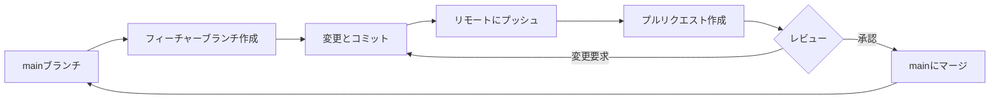
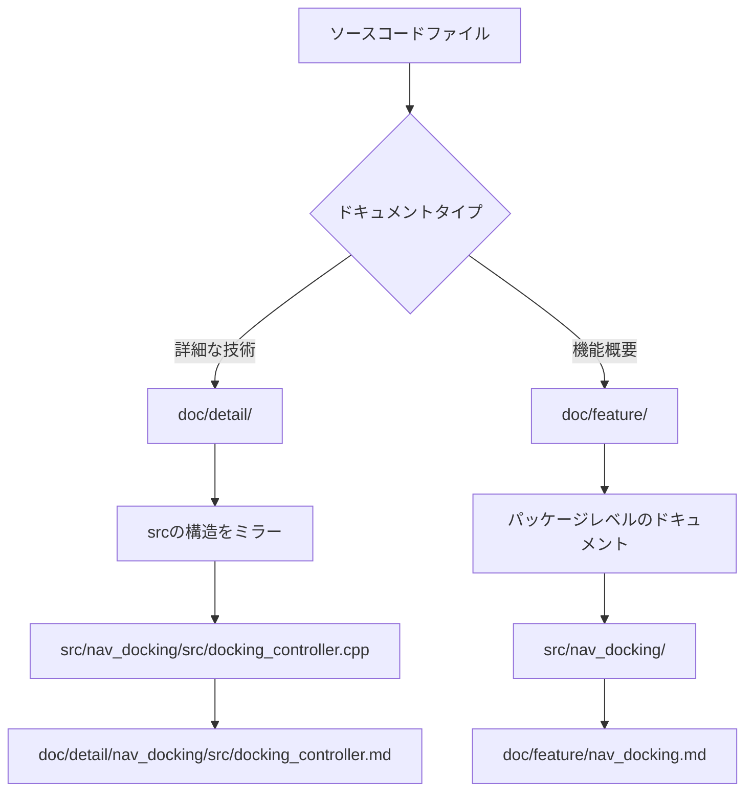
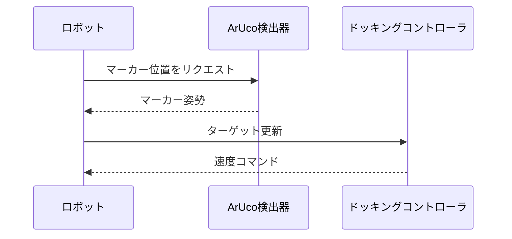

# Multi-Go Navigation 開発ガイドライン

このドキュメントは、Multi-Go 自律ナビゲーションプロジェクトへの貢献に関するガイドラインを提供します。

## 目次
- [Gitワークフロー](#gitワークフロー)
- [リポジトリ構造](#リポジトリ構造)
- [ドキュメント標準](#ドキュメント標準)
- [コードスタイル](#コードスタイル)
- [セットアップコマンド](#セットアップコマンド)

## Gitワークフロー

このプロジェクトは、バージョン管理とコラボレーションに **GitHub Flow** を使用しています。



### ブランチ命名規則
- フィーチャーブランチ: `feature/機能の説明`
- バグ修正: `fix/バグの説明`
- ドキュメント: `docs/ドキュメントの説明`
- Issue対応: `issue-N-簡単な説明` (NはIssue番号)

### ワークフローステップ
1. 作業用のブランチを `main` から**作成**
2. 変更を行い、明確なメッセージで定期的に**コミット**
3. ブランチをリモートリポジトリに**プッシュ**
4. レビュー用の**プルリクエストを作成**
5. レビューコメントがあれば**対応**
6. 承認後に**マージ**(squash mergeを推奨)
7. マージ後、フィーチャーブランチを**削除**

### コミットメッセージ形式
[Conventional Commits](https://www.conventionalcommits.org/) 仕様に従ってください:
```
<type>(<scope>): <subject>

<body>

<footer>
```

**タイプ:**
- `feat`: 新機能
- `fix`: バグ修正
- `docs`: ドキュメントの変更
- `style`: コードスタイルの変更(フォーマット、セミコロン等)
- `refactor`: コードリファクタリング
- `test`: テストの追加・更新
- `chore`: メンテナンス作業

**例:**
```
feat(nav_docking): 精密ドッキング用のPIDコントローラを追加

ArUcoマーカー検出に基づいて速度を調整することで
ドッキング精度を向上させるPID制御アルゴリズムを実装

Closes #42
```

## リポジトリ構造

```
multigo_navigation_claude/
├── .github/
│   └── workflows/          # GitHub Actions CI/CDワークフロー
├── src/                    # ROS2パッケージのソースコード
│   ├── aruco_detect/       # ArUcoマーカー検出パッケージ
│   ├── camera_publisher/   # カメラデータパブリッシャー
│   ├── ego_pcl_filter/     # 点群フィルタリング
│   ├── laserscan_to_pcl/   # LaserScanからPointCloudへの変換
│   ├── mecanum_wheels/     # メカナムホイール制御(Python)
│   ├── nav_control/        # ナビゲーション制御ロジック
│   ├── nav_docking/        # ドッキングナビゲーション
│   ├── nav_goal/           # ゴール管理
│   ├── pcl_merge/          # 点群マージ
│   └── third_party/        # 外部依存関係
│       ├── perception_pcl/
│       ├── rtabmap/
│       └── rtabmap_ros/
├── doc/                    # ドキュメント(必要に応じて作成)
│   ├── detail/             # 詳細な技術ドキュメント
│   │   └── [srcの構造をミラー]
│   └── feature/            # 機能レベルのドキュメント
├── AGENTS.md               # このファイル(開発ガイドライン)
├── CLAUDE.md               # AGENTS.mdへのシンボリックリンク
├── README.md               # プロジェクト概要とセットアップ
└── multigo.repos           # VCSリポジトリ依存関係
```

### パッケージ構造
`src/` 内の各ROS2パッケージは通常、以下を含みます:
- `CMakeLists.txt` または `setup.py`: ビルド設定
- `package.xml`: パッケージメタデータと依存関係
- `src/`: C++ソースファイル
- `include/`: C++ヘッダーファイル
- `scripts/`: Pythonスクリプト
- `launch/`: launchファイル
- `config/`: 設定ファイル(YAML等)
- `test/`: ユニットテスト

## ドキュメント標準

### 言語要件
ドキュメントの言語要件はタイプによって異なります:

**機能ドキュメント** (`doc/feature/`):
- **必須**: 英語と日本語の両方
- **英語**: 主要ドキュメント(例: `feature.md`)
- **日本語**: `-ja` サフィックス付きの翻訳(例: `feature-ja.md`)

**詳細技術ドキュメント** (`doc/detail/`):
- **必須**: 英語と日本語の両方
- **英語**: 主要ドキュメント(例: `implementation.md`)
- **日本語**: `-ja` サフィックス付きの翻訳(例: `implementation-ja.md`)

**プロジェクトレベルドキュメント** (例: `AGENTS.md`, `README.md`):
- **必須**: 英語と日本語の両方
- 同じ `-ja` サフィックス規則に従います

### ファイル命名規則
```
document.md         # 英語版
document-ja.md      # 日本語版
```

### 文字エンコーディング
- **全てのドキュメントとソースコードは、特に指定がない限り UTF-8 エンコーディングを使用する必要があります**
- ファイルを保存する際は、UTF-8 (BOM無し)を使用してください
- エディタの設定でデフォルトエンコーディングをUTF-8に設定することを推奨します

### ドキュメントファイル編成



### ドキュメント配置ルール

1. **詳細な技術ドキュメント** (`doc/detail/`)
   - `src/` ディレクトリ構造をミラー
   - 特定の実装ファイルをドキュメント化
   - マッピング例:
     ```
     src/nav_docking/src/docking_controller.cpp
     → doc/detail/nav_docking/src/docking_controller.md
     → doc/detail/nav_docking/src/docking_controller-ja.md
     ```

2. **機能ドキュメント** (`doc/feature/`)
   - パッケージまたはモジュールレベルのドキュメント
   - 高レベルの機能説明
   - マッピング例:
     ```
     src/nav_docking/
     → doc/feature/nav_docking.md
     → doc/feature/nav_docking-ja.md
     ```

### ドキュメント内容ガイドライン

#### 1行目の要件
すべてのドキュメントファイルの1行目には、ドキュメント化する**対象/主題**を明確に記載する必要があります:

**例:**
```markdown
# ナビゲーションドッキングコントローラ (nav_docking/src/docking_controller.cpp)

[ドキュメントの続き...]
```

#### 図解と可視化
- **可能な限りMermaid記法を使用**してください
- MermaidはGitHubマークダウンでサポートされており、以下を提供します:
  - バージョン管理に適したテキスト形式
  - 簡単な編集とレビュー
  - GitHubでの自動レンダリング

**サポートされているMermaid図の種類:**
- フローチャート: プロセスフローとアルゴリズム
- シーケンス図: メッセージパッシングとインタラクション
- クラス図: オブジェクト関係
- 状態図: 状態マシン
- ガントチャート: プロジェクトタイムライン

**Mermaid図の例:**
````markdown

````

**Mermaidを使用しない場合:**
- カスタムレイアウトが必要な複雑なアーキテクチャ図
- 写真やスクリーンショット
- 外部ツール固有の図(例: RViz可視化図)

これらの場合、画像を `doc/images/` に保存して参照してください:
```markdown

```

## コードスタイル

### C++コードスタイル
このプロジェクトは[ROS2 Developer Guide](https://docs.ros.org/en/humble/Contributing/Developer-Guide.html)に基づくROS2 C++コーディング標準を使用します。

**主要な規則:**
- **インデント**: 2スペース(タブ不可)
- **行の長さ**: 最大100文字
- **命名規則**:
  - クラス: `PascalCase` (例: `DockingController`)
  - 関数/メソッド: `camelCase` (例: `calculateVelocity`)
  - 変数: `snake_case` (例: `target_pose`)
  - 定数: `UPPER_SNAKE_CASE` (例: `MAX_VELOCITY`)
  - プライベートメンバー: 末尾に `_` (例: `node_`)
- **ヘッダーガード**: パッケージ名付きの `#ifndef/#define` を使用
  ```cpp
  #ifndef NAV_DOCKING__DOCKING_CONTROLLER_HPP_
  #define NAV_DOCKING__DOCKING_CONTROLLER_HPP_
  ```

**例:**
```cpp
namespace nav_docking
{

class DockingController : public rclcpp::Node
{
public:
  explicit DockingController(const rclcpp::NodeOptions & options);

  void calculateVelocity(const geometry_msgs::msg::Pose & target_pose);

private:
  double max_linear_velocity_;
  rclcpp::Publisher<geometry_msgs::msg::Twist>::SharedPtr cmd_vel_pub_;
};

}  // namespace nav_docking
```

### Pythonコードスタイル
[PEP 8](https://pep8.org/) スタイルガイドに従ってください。

**主要な規則:**
- **インデント**: 4スペース
- **行の長さ**: 最大100文字
- **命名規則**:
  - クラス: `PascalCase`
  - 関数/メソッド: `snake_case`
  - 定数: `UPPER_SNAKE_CASE`
- **インポート**: 順序: 標準ライブラリ、サードパーティ、ローカル
- **Docstrings**: すべての公開モジュール、クラス、関数にトリプルクォートを使用

**例:**
```python
import rclpy
from rclpy.node import Node
from geometry_msgs.msg import Twist

class MecanumController(Node):
    """メカナムホイール駆動システムのコントローラ"""

    def __init__(self):
        super().__init__('mecanum_controller')
        self.max_velocity = 1.0

    def calculate_wheel_velocities(self, cmd_vel):
        """指令ツイストから各ホイールの速度を計算"""
        # 実装
        pass
```

### ROS2固有の規則
- `rclcpp` と `rclpy` の標準パターンを使用
- ノードには継承よりコンポジションを優先
- 動的再構成にはパラメータコールバックを使用
- ROS2パッケージ命名規則に従う: 小文字とアンダースコア(例: `nav_docking`)

## セットアップコマンド

### 前提条件
以下がインストールされていることを確認してください:
- Ubuntu 22.04
- ROS2 Humble
- Python 3.10+
- Git

### 初期セットアップ
```bash
# ROS2 Humbleのインストール
echo 'source /opt/ros/humble/setup.bash' >> ~/.bashrc
source ~/.bashrc

# 依存関係のインストール
sudo apt update
sudo apt install -y \
  python3-pip \
  python3-colcon-common-extensions \
  python3-serial \
  ros-humble-gazebo-* \
  ros-humble-gazebo-ros-pkgs \
  ros-humble-navigation2 \
  ros-humble-nav2-bringup \
  ros-humble-turtlebot3* \
  ros-humble-pointcloud-to-laserscan \
  ros-humble-laser-filters \
  ros-humble-pcl-ros

# Python依存関係のインストール
pip3 install pyyaml pyserial
```

### リポジトリのクローン
```bash
# サブモジュール用のgit設定
git config --global submodule.recurse true

# リポジトリのクローン
git clone --recurse-submodules git@github.com:Futu-reADS/multigo_navigation_claude.git
cd multigo_navigation_claude

# 追加リポジトリのインポート
vcs import src < multigo.repos --recursive
vcs pull src
```

### プロジェクトのビルド
```bash
# rosdepの更新
rosdep update
rosdep install --from-paths src --ignore-src -r -y

# 全パッケージのビルド
colcon build --symlink-install --cmake-args -DCMAKE_POLICY_VERSION_MINIMUM=3.5

# ワークスペースのソース
source install/setup.bash
```

### テストの実行
```bash
# 全テストを実行
colcon test

# 特定パッケージのテストを実行
colcon test --packages-select nav_docking

# テスト結果の表示
colcon test-result --all
```

### 環境設定
```bash
# 永続的な設定のため ~/.bashrc に追加
echo 'export ROS_DOMAIN_ID=30' >> ~/.bashrc
echo 'source /usr/share/gazebo/setup.sh' >> ~/.bashrc
source ~/.bashrc
```

## 貢献方法

### プルリクエスト作成前のチェックリスト
1. ✅ すべてのテストを実行し、合格を確認
2. ✅ コードスタイルガイドラインに従う
3. ✅ ドキュメントを更新または作成(英語と日本語の両方)
4. ✅ 明確なコミットメッセージを記述
5. ✅ PR説明で関連Issueを参照

### CI/CD
このプロジェクトは継続的インテグレーションにGitHub Actionsを使用しています:
- **Linting**: コードスタイルチェック
- **Building**: すべてのパッケージのビルド成功を検証
- **Testing**: 自動テストスイートの実行
- **Claude Code Review**: 自動コードレビュー支援

ワークフローファイルは `.github/workflows/` にあります。

## 質問や問題がある場合

- GitHubでIssueを作成してください
- ディスカッションでこのドキュメントを参照してください
- アクセシビリティのため、英語と日本語の両方のドキュメントを維持してください
