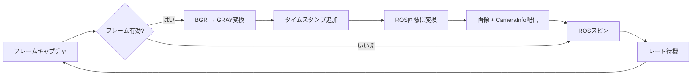
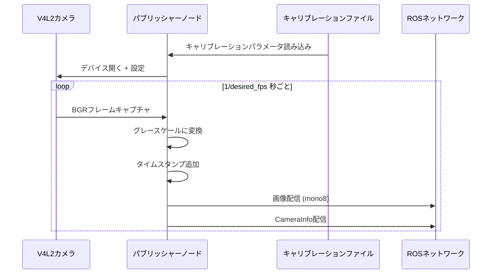

# カメラパブリッシャー実装 (src/camera_publisher/src/publisher_from_video.cpp)

## 概要

このファイルは、カメラデバイス(V4L2経由)からビデオをキャプチャし、グレースケール画像とカメラキャリブレーション情報を配信するROS2ノードを実装します。YAMLファイルからカメラの内部パラメータを読み込み、同期された画像とCameraInfoメッセージを配信します。

## 主要関数

### load_yaml_file()

**位置:** 13-51行

**目的:** YAMLファイルからカメラキャリブレーションパラメータを読み込む

**パラメータ:**
- `calib_file_path` (string): キャリブレーションYAMLファイルへのパス

**戻り値:** キャリブレーションデータを含む`shared_ptr<sensor_msgs::msg::CameraInfo>`

**主な処理:**

1. **YAMLパース** (20-33行)
```cpp
YAML::Node config = YAML::LoadFile(calib_file_path);
std::string frame_id = config["frame_id"].as<std::string>();
int image_height = config["image_height"].as<int>();
int image_width = config["image_width"].as<int>();
```

2. **歪み係数** (25-28行)
```cpp
std::vector<double> distortion_coefficients(5);
for (size_t i = 0; i < distortion_coefficients.size(); ++i) {
    distortion_coefficients[i] = config["distortion_coefficients"]["data"][i].as<double>();
}
```
5パラメータ歪みモデル(k1, k2, p1, p2, k3)を読み込み

3. **カメラマトリックス** (30-33行)
```cpp
std::array<double, 9> camera_matrix;
for (size_t i = 0; i < camera_matrix.size(); ++i) {
    camera_matrix[i] = config["camera_matrix"]["data"][i].as<double>();
}
```
3x3内部マトリックス [fx, 0, cx, 0, fy, cy, 0, 0, 1] を読み込み

4. **CameraInfo設定** (34-41行)
```cpp
camera_info_msg->header.frame_id = frame_id;
camera_info_msg->height = image_height;
camera_info_msg->width = image_width;
camera_info_msg->k = camera_matrix;
camera_info_msg->d = distortion_coefficients;
camera_info_msg->distortion_model = "plumb_bob";
camera_info_msg->p = {1000.0, 0.0, 640.0, 0.0, 0.0, 1000.0, 360.0, 0.0, 0.0, 0.0, 1.0, 0.0};
```

**注意:** 投影マトリックス(P)はハードコードされており、YAMLから読み込まれていません

## メイン関数

**位置:** 53-143行

### 初期化フェーズ

#### 1. ROS2セットアップ (55-59行)
```cpp
rclcpp::init(argc, argv);
std::shared_ptr<rclcpp::Node> node = rclcpp::Node::make_shared("image_publisher");
std::string package_path = ament_index_cpp::get_package_share_directory("camera_publisher");
std::string calib_file_path = package_path + "/config/calib.yaml";
```

#### 2. パラメータ宣言 (68-83行)
```cpp
node->declare_parameter<std::string>("camera_calib_file", calib_file_path);
node->declare_parameter<int>("camera_index", 0);
node->declare_parameter<std::string>("frame_id", "/default_frame_id");
node->declare_parameter<std::string>("camera_topic", "/default_camera_topic");
node->declare_parameter<std::string>("camera_info_topic", "/default_camera_info");
node->declare_parameter<int>("desired_fps", 5);
node->declare_parameter<bool>("force_desired_fps", false);
```

**パラメータ:**
- `camera_calib_file`: キャリブレーションYAMLへのパス
- `camera_index`: V4L2デバイスインデックス (デフォルト: 0 = /dev/video0)
- `frame_id`: カメラのTFフレーム
- `camera_topic`: 画像トピック名
- `camera_info_topic`: CameraInfoトピック名
- `desired_fps`: 配信レート(Hz)
- `force_desired_fps`: フレームレート強制 (現在未使用)

#### 3. カメラデバイスセットアップ (88-102行)
```cpp
cv::VideoCapture cap(video_source, cv::CAP_V4L2);
cap.set(cv::CAP_PROP_FRAME_WIDTH, camera_info_msg->width);
cap.set(cv::CAP_PROP_FRAME_HEIGHT, camera_info_msg->height);
cap.set(cv::CAP_PROP_BUFFERSIZE, 1);
cap.set(cv::CAP_PROP_FOCUS, focus_value);
cap.set(cv::CAP_PROP_FOURCC, cv::VideoWriter::fourcc('M', 'J', 'P', 'G'));
```

**主要設定:**
- `CAP_V4L2`: Video4Linux2バックエンドを使用(Linux固有)
- `BUFFERSIZE = 1`: 内部バッファを減らして遅延を最小化
- `FOURCC = MJPG`: 効率的な転送のためMotion JPEGコーデックを使用
- `FOCUS = -1`: オートフォーカス有効(ハードウェア依存)

#### 4. パブリッシャーセットアップ (109-112行)
```cpp
image_transport::TransportHints transport_hints(node.get(), "compressed");
image_transport::ImageTransport it(node);
auto image_pub = it.advertise(camera_topic, 1);
auto camera_info_pub = node->create_publisher<sensor_msgs::msg::CameraInfo>(camera_info_topic, 1);
```

圧縮サポート付きの効率的な画像配信のため`image_transport`を使用

### 配信ループ

**位置:** 119-137行

#### 処理パイプライン



#### フレーム処理 (121-129行)
```cpp
cap >> frame;
if (!frame.empty()) {
    cv::cvtColor(frame, gray_frame, cv::COLOR_BGR2GRAY);
    hdr.stamp = node->get_clock()->now();
    camera_info_msg->header.stamp = hdr.stamp;
    msg = cv_bridge::CvImage(hdr, "mono8", gray_frame).toImageMsg();
    image_pub.publish(msg);
    camera_info_pub->publish(*camera_info_msg);
}
```

**主なポイント:**
1. カメラからBGRフレームをキャプチャ
2. グレースケールに変換(mono8エンコーディング)
3. 画像とcamera_info間のタイムスタンプを同期
4. OpenCVからROSへの変換に`cv_bridge`を使用

#### レート制御 (116、136行)
```cpp
rclcpp::WallRate loop_rate(desired_fps);
loop_rate.sleep();
```

カメラのフレームレートとは独立して配信周波数を制御

## データフロー図



## 実装の詳細

### 色変換の理由
- **入力:** BGR (24ビットカラー)
- **出力:** GRAY (8ビットモノ)
- **理由:** ArUcoマーカー検出は通常グレースケール画像でより良く動作し、帯域幅と処理オーバーヘッドを削減

### キャリブレーションファイル形式
期待されるYAML構造:
```yaml
frame_id: "camera_frame"
image_width: 1280
image_height: 720
camera_matrix:
  data: [fx, 0, cx, 0, fy, cy, 0, 0, 1]  # 3x3マトリックス行優先
distortion_coefficients:
  data: [k1, k2, p1, p2, k3]  # 5パラメータ
```

### パフォーマンス特性
- **レイテンシ:** 約1フレームバッファ遅延 (BUFFERSIZE=1)
- **メモリ:** 最小、単一フレームバッファリング
- **CPU:** 低、グレースケール変換のみ
- **帯域幅:** image_transport圧縮により削減

## 既知の制限事項

1. **投影マトリックスのハードコード** (41行)
   - Pマトリックスはキャリブレーションファイルから読み込まれない
   - 値はプレースホルダーのデフォルトと思われる

2. **未使用パラメータ** (66、75行)
   - `force_desired_fps`が宣言されているが使用されていない
   - フレームレート強制ロジックがない

3. **フォーカス制御** (67、100行)
   - `focus_value`が-1にハードコード
   - 設定可能なパラメータとして公開されていない

4. **エラーハンドリング** (90-94行)
   - カメラオープン失敗で即座に終了
   - 再試行メカニズムやフォールバックデバイスがない

## 依存関係

**ROS2パッケージ:**
- `rclcpp`: ROS2 C++クライアントライブラリ
- `sensor_msgs`: ImageとCameraInfoメッセージ型
- `cv_bridge`: OpenCV-ROS変換
- `image_transport`: 効率的な画像配信

**外部ライブラリ:**
- `opencv2`: ビデオキャプチャと画像処理
- `yaml-cpp`: YAMLファイルパース
- `ament_index_cpp`: パッケージリソース位置

## 使用上の注意

### 典型的な起動設定
```python
Node(
    package='camera_publisher',
    executable='publisher_from_video',
    parameters=[{
        'camera_index': 0,
        'frame_id': 'camera_rgb_frame',
        'camera_topic': '/camera/image_raw',
        'camera_info_topic': '/camera/camera_info',
        'desired_fps': 10
    }]
)
```

### トラブルシューティング

**カメラが開かない:**
- デバイスパーミッションを確認: `ls -l /dev/video*`
- V4L2サポートを検証: `v4l2-ctl --list-devices`
- 他のプロセスがカメラを使用していないことを確認

**キャリブレーションエラー:**
- YAMLファイルパスが存在することを確認
- YAML構文と必須フィールドを確認
- 画像サイズがキャリブレーションと一致することを確認

**低フレームレート:**
- `desired_fps`パラメータを確認
- CPU使用率を監視
- カメラハードウェア機能を検証
