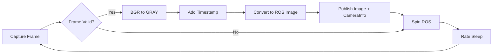
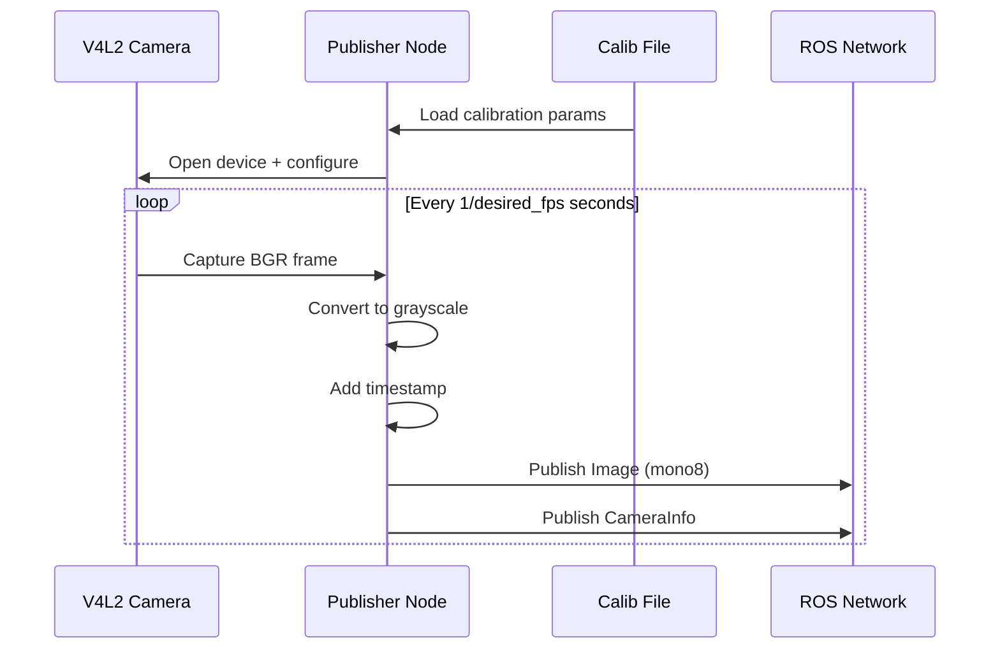

# Camera Publisher Implementation (src/camera_publisher/src/publisher_from_video.cpp)

## Overview

This file implements a ROS2 node that captures video from a camera device (via V4L2) and publishes grayscale images along with camera calibration information. It loads camera intrinsic parameters from a YAML file and publishes synchronized image and CameraInfo messages.

## Key Functions

### load_yaml_file()

**Location:** Lines 13-51

**Purpose:** Load camera calibration parameters from a YAML file

**Parameters:**
- `calib_file_path` (string): Path to the calibration YAML file

**Returns:** `shared_ptr<sensor_msgs::msg::CameraInfo>` with calibration data

**Key Operations:**

1. **YAML Parsing** (Lines 20-33)
```cpp
YAML::Node config = YAML::LoadFile(calib_file_path);
std::string frame_id = config["frame_id"].as<std::string>();
int image_height = config["image_height"].as<int>();
int image_width = config["image_width"].as<int>();
```

2. **Distortion Coefficients** (Lines 25-28)
```cpp
std::vector<double> distortion_coefficients(5);
for (size_t i = 0; i < distortion_coefficients.size(); ++i) {
    distortion_coefficients[i] = config["distortion_coefficients"]["data"][i].as<double>();
}
```
Loads 5-parameter distortion model (k1, k2, p1, p2, k3)

3. **Camera Matrix** (Lines 30-33)
```cpp
std::array<double, 9> camera_matrix;
for (size_t i = 0; i < camera_matrix.size(); ++i) {
    camera_matrix[i] = config["camera_matrix"]["data"][i].as<double>();
}
```
Loads 3x3 intrinsic matrix [fx, 0, cx, 0, fy, cy, 0, 0, 1]

4. **CameraInfo Population** (Lines 34-41)
```cpp
camera_info_msg->header.frame_id = frame_id;
camera_info_msg->height = image_height;
camera_info_msg->width = image_width;
camera_info_msg->k = camera_matrix;
camera_info_msg->d = distortion_coefficients;
camera_info_msg->distortion_model = "plumb_bob";
camera_info_msg->p = {1000.0, 0.0, 640.0, 0.0, 0.0, 1000.0, 360.0, 0.0, 0.0, 0.0, 1.0, 0.0};
```

**Note:** Projection matrix (P) is hardcoded, not loaded from YAML

## Main Function

**Location:** Lines 53-143

### Initialization Phase

#### 1. ROS2 Setup (Lines 55-59)
```cpp
rclcpp::init(argc, argv);
std::shared_ptr<rclcpp::Node> node = rclcpp::Node::make_shared("image_publisher");
std::string package_path = ament_index_cpp::get_package_share_directory("camera_publisher");
std::string calib_file_path = package_path + "/config/calib.yaml";
```

#### 2. Parameter Declaration (Lines 68-83)
```cpp
node->declare_parameter<std::string>("camera_calib_file", calib_file_path);
node->declare_parameter<int>("camera_index", 0);
node->declare_parameter<std::string>("frame_id", "/default_frame_id");
node->declare_parameter<std::string>("camera_topic", "/default_camera_topic");
node->declare_parameter<std::string>("camera_info_topic", "/default_camera_info");
node->declare_parameter<int>("desired_fps", 5);
node->declare_parameter<bool>("force_desired_fps", false);
```

**Parameters:**
- `camera_calib_file`: Path to calibration YAML
- `camera_index`: V4L2 device index (default: 0 = /dev/video0)
- `frame_id`: TF frame for camera
- `camera_topic`: Image topic name
- `camera_info_topic`: CameraInfo topic name
- `desired_fps`: Publishing rate in Hz
- `force_desired_fps`: Force frame rate (currently unused)

#### 3. Camera Device Setup (Lines 88-102)
```cpp
cv::VideoCapture cap(video_source, cv::CAP_V4L2);
cap.set(cv::CAP_PROP_FRAME_WIDTH, camera_info_msg->width);
cap.set(cv::CAP_PROP_FRAME_HEIGHT, camera_info_msg->height);
cap.set(cv::CAP_PROP_BUFFERSIZE, 1);
cap.set(cv::CAP_PROP_FOCUS, focus_value);
cap.set(cv::CAP_PROP_FOURCC, cv::VideoWriter::fourcc('M', 'J', 'P', 'G'));
```

**Key Settings:**
- `CAP_V4L2`: Use Video4Linux2 backend (Linux-specific)
- `BUFFERSIZE = 1`: Minimize latency by reducing internal buffer
- `FOURCC = MJPG`: Use Motion JPEG codec for efficient transmission
- `FOCUS = -1`: Auto-focus enabled (hardware-dependent)

#### 4. Publisher Setup (Lines 109-112)
```cpp
image_transport::TransportHints transport_hints(node.get(), "compressed");
image_transport::ImageTransport it(node);
auto image_pub = it.advertise(camera_topic, 1);
auto camera_info_pub = node->create_publisher<sensor_msgs::msg::CameraInfo>(camera_info_topic, 1);
```

Uses `image_transport` for efficient image publishing with compression support

### Publishing Loop

**Location:** Lines 119-137

#### Processing Pipeline



#### Frame Processing (Lines 121-129)
```cpp
cap >> frame;
if (!frame.empty()) {
    cv::cvtColor(frame, gray_frame, cv::COLOR_BGR2GRAY);
    hdr.stamp = node->get_clock()->now();
    camera_info_msg->header.stamp = hdr.stamp;
    msg = cv_bridge::CvImage(hdr, "mono8", gray_frame).toImageMsg();
    image_pub.publish(msg);
    camera_info_pub->publish(*camera_info_msg);
}
```

**Key Points:**
1. Captures BGR frame from camera
2. Converts to grayscale (mono8 encoding)
3. Synchronizes timestamps between image and camera_info
4. Uses `cv_bridge` for OpenCV to ROS conversion

#### Rate Control (Line 116, 136)
```cpp
rclcpp::WallRate loop_rate(desired_fps);
loop_rate.sleep();
```

Controls publishing frequency independently of camera frame rate

## Data Flow Diagram



## Implementation Details

### Color Conversion Rationale
- **Input:** BGR (24-bit color)
- **Output:** GRAY (8-bit mono)
- **Reason:** ArUco marker detection typically works better with grayscale images, reducing bandwidth and processing overhead

### Calibration File Format
Expected YAML structure:
```yaml
frame_id: "camera_frame"
image_width: 1280
image_height: 720
camera_matrix:
  data: [fx, 0, cx, 0, fy, cy, 0, 0, 1]  # 3x3 matrix row-major
distortion_coefficients:
  data: [k1, k2, p1, p2, k3]  # 5 parameters
```

### Performance Characteristics
- **Latency:** ~1 frame buffer delay (BUFFERSIZE=1)
- **Memory:** Minimal, single frame buffering
- **CPU:** Low, grayscale conversion only
- **Bandwidth:** Reduced via image_transport compression

## Known Limitations

1. **Hardcoded Projection Matrix** (Line 41)
   - P matrix not read from calibration file
   - Values appear to be placeholder defaults

2. **Unused Parameter** (Line 66, 75)
   - `force_desired_fps` declared but never used
   - No frame rate enforcement logic

3. **Focus Control** (Line 67, 100)
   - `focus_value` hardcoded to -1
   - Not exposed as configurable parameter

4. **Error Handling** (Lines 90-94)
   - Camera open failure exits immediately
   - No retry mechanism or fallback device

## Dependencies

**ROS2 Packages:**
- `rclcpp`: ROS2 C++ client library
- `sensor_msgs`: Image and CameraInfo message types
- `cv_bridge`: OpenCV-ROS conversion
- `image_transport`: Efficient image publishing

**External Libraries:**
- `opencv2`: Video capture and image processing
- `yaml-cpp`: YAML file parsing
- `ament_index_cpp`: Package resource location

## Usage Notes

### Typical Launch Configuration
```python
Node(
    package='camera_publisher',
    executable='publisher_from_video',
    parameters=[{
        'camera_index': 0,
        'frame_id': 'camera_rgb_frame',
        'camera_topic': '/camera/image_raw',
        'camera_info_topic': '/camera/camera_info',
        'desired_fps': 10
    }]
)
```

### Troubleshooting

**Camera not opening:**
- Check device permissions: `ls -l /dev/video*`
- Verify V4L2 support: `v4l2-ctl --list-devices`
- Ensure camera is not in use by another process

**Calibration errors:**
- Verify YAML file path exists
- Check YAML syntax and required fields
- Ensure image dimensions match calibration

**Low frame rate:**
- Check `desired_fps` parameter
- Monitor CPU usage
- Verify camera hardware capabilities
