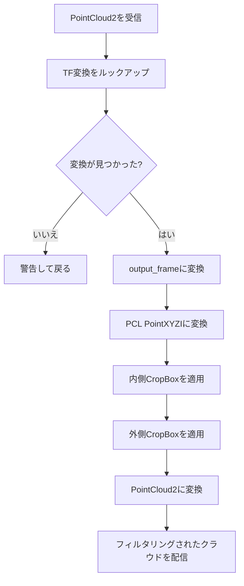
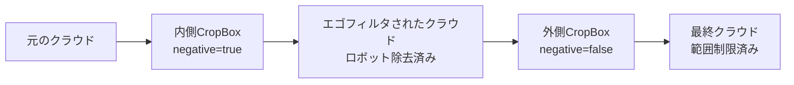

# エゴセントリック点群フィルタの実装 (src/ego_pcl_filter/src/ego_pcl_filter.cpp)

## 概要

このファイルは、ロボット自身の自己遮蔽を除去し、点群の観測範囲を制限するためのデュアルCropBoxフィルタを実装しています。点群をベースフレーム(通常は`base_link`)に変換し、内側ボックスフィルタを適用してロボット本体を除去し、外側ボックスフィルタを適用して観測範囲を制限します。

## クラス: CropBoxFilterNode

### コンストラクタ

**位置:** 3-57行

**目的:** パラメータ、TFリスナー、およびROS2通信の初期化

#### パラメータ宣言 (5-44行)

**内側ボックスパラメータ** (6-11行):
```cpp
this->declare_parameter("inner_min_x", -0.0);
this->declare_parameter("inner_max_x", 0.0);
this->declare_parameter("inner_min_y", -0.0);
this->declare_parameter("inner_max_y", 0.0);
this->declare_parameter("inner_min_z", -0.0);
this->declare_parameter("inner_max_z", 0.0);
```
ロボットの自己遮蔽体積(除去するエゴスペース)を定義します

**外側ボックスパラメータ** (13-18行):
```cpp
this->declare_parameter("outer_min_x", -50.0);
this->declare_parameter("outer_max_x", 50.0);
this->declare_parameter("outer_min_y", 50.0);
this->declare_parameter("outer_max_y", 50.0);
this->declare_parameter("outer_min_z", 0.0);
this->declare_parameter("outer_max_z", 5.5);
```
最大観測範囲を定義します(このボックス内の点のみを保持)

**フィルタオプション** (20-24行):
```cpp
this->declare_parameter("keep_organized", false);
this->declare_parameter("negative", true);
this->declare_parameter("output_frame", "base_link");
this->declare_parameter("input_topic", "input");
this->declare_parameter("output_topic", "output");
```

**主要パラメータ:**
- `keep_organized`: クラウド構造を維持(除去された点にはNaN) vs 密なクラウド
- `negative`: 内側ボックス用 - `true`はボックス内の点を除去(外側の点を保持)
- `output_frame`: すべての操作のターゲット座標フレーム

#### TF2セットアップ (54-56行)
```cpp
tf_buffer_ = std::make_shared<tf2_ros::Buffer>(this->get_clock());
tf_listener_ = std::make_shared<tf2_ros::TransformListener>(*tf_buffer_);
```

センサフレームから`output_frame`への変換を可能にします

#### 購読/配信 (48-52行)
```cpp
sub_ = this->create_subscription<sensor_msgs::msg::PointCloud2>(
    input_topic, 10, std::bind(&CropBoxFilterNode::pointCloudCallback, this, std::placeholders::_1));

pub_ = this->create_publisher<sensor_msgs::msg::PointCloud2>(output_topic, 10);
```

## 点群コールバック

**位置:** 59-113行

**目的:** 点群の変換、フィルタリング、および配信

### 処理パイプライン



### ステップ別の詳細

#### 1. 入力フレームの抽出 (62行)
```cpp
std::string input_frame = msg->header.frame_id;
```

#### 2. TF変換のルックアップ (65-71行)
```cpp
try {
    transform = tf_buffer_->lookupTransform(output_frame_, input_frame, rclcpp::Time(0));
} catch (tf2::TransformException &ex) {
    RCLCPP_WARN(this->get_logger(), "Could not transform point cloud: %s", ex.what());
    return;
}
```

**変換パラメータ:**
- `output_frame_`: ターゲットフレーム(通常は"base_link")
- `input_frame`: メッセージヘッダーからのソースフレーム
- `rclcpp::Time(0)`: 利用可能な最新の変換

**エラーハンドリング:** 変換が利用できない場合は警告をログに記録し、クラウドを破棄します

#### 3. 点群の変換 (74-80行)
```cpp
sensor_msgs::msg::PointCloud2 transformed_pc;
try {
    pcl_ros::transformPointCloud(output_frame_, transform, *msg, transformed_pc);
} catch (const std::exception &e) {
    RCLCPP_ERROR(this->get_logger(), "Error transforming point cloud: %s", e.what());
    return;
}
```

効率的な変換のために`pcl_ros`を使用します

#### 4. データ構造のセットアップ (84-87行)
```cpp
pcl::PointCloud<pcl::PointXYZI>::Ptr cloud(new pcl::PointCloud<pcl::PointXYZI>);
pcl::fromROSMsg(transformed_pc, *cloud);
pcl::PointCloud<pcl::PointXYZI>::Ptr ego_filtered_cloud(new pcl::PointCloud<pcl::PointXYZI>);
pcl::PointCloud<pcl::PointXYZI>::Ptr outer_filtered_cloud(new pcl::PointCloud<pcl::PointXYZI>);
```

**点タイプ:** `PointXYZI` (X、Y、Z座標 + 強度)

#### 5. 内側CropBoxフィルタ (89-97行)

**目的:** ロボット本体の点を除去(自己遮蔽)

```cpp
pcl::CropBox<pcl::PointXYZI> crop_box_filter;
crop_box_filter.setMin(Eigen::Vector4f(inner_min_x_, inner_min_y_, inner_min_z_, 1.0));
crop_box_filter.setMax(Eigen::Vector4f(inner_max_x_, inner_max_y_, inner_max_z_, 1.0));
crop_box_filter.setNegative(negative_);  // true = ボックス外の点を保持
crop_box_filter.setKeepOrganized(keep_organized_);
crop_box_filter.setInputCloud(cloud);
crop_box_filter.filter(*ego_filtered_cloud);
```

**ネガティブモード:**
- `negative_ = true`: 内側ボックス**外**の点を保持(ロボットを除去)
- `negative_ = false`: 内側ボックス**内**の点を保持(通常ではない)

**Eigen::Vector4f:** 4番目の成分(1.0)は同次座標を有効にします

#### 6. 外側CropBoxフィルタ (99-105行)

**目的:** 観測範囲を制限

```cpp
pcl::CropBox<pcl::PointXYZI> crop_outer_filter;
crop_outer_filter.setMin(Eigen::Vector4f(outer_min_x_, outer_min_y_, outer_min_z_, 1.0));
crop_outer_filter.setMax(Eigen::Vector4f(outer_max_x_, outer_max_y_, outer_max_z_, 1.0));
crop_outer_filter.setNegative(false);  // 外側ボックス内の点を保持
crop_outer_filter.setKeepOrganized(keep_organized_);
crop_outer_filter.setInputCloud(ego_filtered_cloud);
crop_outer_filter.filter(*outer_filtered_cloud);
```

**常にNegative=false:** 観測範囲**内**の点を保持します

#### 7. 結果の配信 (108-112行)
```cpp
sensor_msgs::msg::PointCloud2 filtered_pc_msg;
pcl::toROSMsg(*outer_filtered_cloud, filtered_pc_msg);
pub_->publish(filtered_pc_msg);
```

## デュアルフィルタロジック



**設定例:**
```yaml
inner_min_x: -0.3  # ロボット中心周りの
inner_max_x: 0.3   # 30cmボックスを除去
inner_min_y: -0.2
inner_max_y: 0.2
inner_min_z: 0.0
inner_max_z: 0.5

outer_min_x: -10.0  # 10m x 10m x 5.5m内の
outer_max_x: 10.0   # 点のみを保持
outer_min_y: -10.0
outer_max_y: 10.0
outer_min_z: 0.0
outer_max_z: 5.5
```

## メイン関数

**位置:** 115-121行

```cpp
int main(int argc, char **argv)
{
    rclcpp::init(argc, argv);
    rclcpp::spin(std::make_shared<CropBoxFilterNode>());
    rclcpp::shutdown();
    return 0;
}
```

標準的なROS2ノードライフサイクル: init、spin、shutdown

## パフォーマンスに関する考慮事項

### 計算量
- **TFルックアップ:** O(1) - キャッシュされた変換
- **点群変換:** O(n) ここでn = 点の数
- **内側CropBox:** O(n) - 1パス
- **外側CropBox:** O(m) ここでm ≤ n (内側フィルタ後)
- **合計:** O(n) 線形計算量

### メモリ使用量
- 3つのフルサイズ点群バッファ(元、エゴフィルタ済み、外側フィルタ済み)
- インプレースフィルタリングでバッファを再利用することで削減可能

### 最適化の機会
1. **keep_organized = false:** 出力クラウドサイズを削減
2. **積極的な外側ボックス:** 処理体積を早期に制限
3. **フィルタの結合:** 複雑なジオメトリを持つ単一CropBox(サポートされている場合)

## 典型的な使用例

### 1. 移動ロボットナビゲーション
```yaml
# ロボットシャーシを除去 (0.6m x 0.4m x 0.3m)
inner_min_x: -0.3
inner_max_x: 0.3
inner_min_y: -0.2
inner_max_y: 0.2
inner_min_z: 0.0
inner_max_z: 0.3
negative: true

# ナビゲーション範囲に制限 (前方5m、側方2m)
outer_min_x: -0.5
outer_max_x: 5.0
outer_min_y: -2.0
outer_max_y: 2.0
outer_min_z: 0.0
outer_max_z: 2.0
```

### 2. マニピュレーションロボット
```yaml
# アームワークスペース体積を除去
inner_min_x: -0.5
inner_max_x: 0.5
inner_min_y: -0.5
inner_max_y: 0.5
inner_min_z: 0.0
inner_max_z: 1.0
negative: true

# 完全な観測範囲
outer_min_x: -50.0
outer_max_x: 50.0
outer_min_y: -50.0
outer_max_y: 50.0
outer_min_z: 0.0
outer_max_z: 5.0
```

## 依存関係

**ROS2パッケージ:**
- `rclcpp`: ROS2 C++クライアントライブラリ
- `sensor_msgs`: PointCloud2メッセージ型
- `tf2_ros`: 変換リスナー
- `pcl_ros`: 点群変換ユーティリティ

**外部ライブラリ:**
- `PCL`: Point Cloud Library (CropBoxフィルタ)
- `Eigen`: ベクトル演算

## トラブルシューティング

**出力に点がない:**
- 内側/外側ボックスパラメータの重複を確認
- `negative`パラメータが正しいか確認
- 入力クラウドが空でないことを確認
- 変換の可用性を確認

**高レイテンシ:**
- 上流で入力クラウドサイズを削減
- `keep_organized = false`に設定
- 外側ボックスサイズを制限

**変換エラー:**
- `output_frame`がTFツリーに存在することを確認
- センサフレームが配信されているか確認
- `ros2 run tf2_tools view_frames.py`を使用してデバッグ

## 既知の制限事項

1. **軸平行ボックスのみ**
   - 回転した体積をフィルタできない
   - ロボットの回転には動的なパラメータ更新が必要

2. **地面平面の除去なし**
   - 範囲内の地面点は通過する
   - Z軸のPassThroughフィルタの追加を検討

3. **単一フィルタタイプ**
   - CropBoxのみサポート
   - 半径、条件付き、または統計的フィルタリングなし
