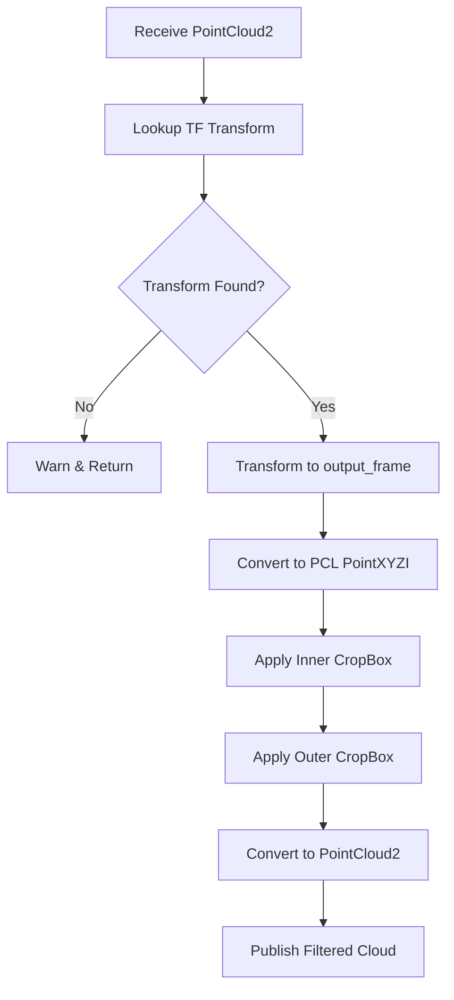

# Egocentric Point Cloud Filter Implementation (src/ego_pcl_filter/src/ego_pcl_filter.cpp)

## Overview

This file implements a dual CropBox filter for removing robot self-occlusion and limiting the observation range in point clouds. It transforms point clouds to a base frame (typically `base_link`), applies an inner box filter to remove the robot body, and an outer box filter to limit the observation range.

## Class: CropBoxFilterNode

### Constructor

**Location:** Lines 3-57

**Purpose:** Initialize parameters, TF listener, and ROS2 communication

#### Parameter Declaration (Lines 5-44)

**Inner Box Parameters** (Lines 6-11):
```cpp
this->declare_parameter("inner_min_x", -0.0);
this->declare_parameter("inner_max_x", 0.0);
this->declare_parameter("inner_min_y", -0.0);
this->declare_parameter("inner_max_y", 0.0);
this->declare_parameter("inner_min_z", -0.0);
this->declare_parameter("inner_max_z", 0.0);
```
Defines the robot's self-occlusion volume (ego-space to remove)

**Outer Box Parameters** (Lines 13-18):
```cpp
this->declare_parameter("outer_min_x", -50.0);
this->declare_parameter("outer_max_x", 50.0);
this->declare_parameter("outer_min_y", 50.0);
this->declare_parameter("outer_max_y", 50.0);
this->declare_parameter("outer_min_z", 0.0);
this->declare_parameter("outer_max_z", 5.5);
```
Defines the maximum observation range (keeps only points inside this box)

**Filter Options** (Lines 20-24):
```cpp
this->declare_parameter("keep_organized", false);
this->declare_parameter("negative", true);
this->declare_parameter("output_frame", "base_link");
this->declare_parameter("input_topic", "input");
this->declare_parameter("output_topic", "output");
```

**Key Parameters:**
- `keep_organized`: Maintain cloud structure (NaN for removed points) vs dense cloud
- `negative`: For inner box - `true` means REMOVE points inside (keep points outside)
- `output_frame`: Target coordinate frame for all operations

#### TF2 Setup (Lines 54-56)
```cpp
tf_buffer_ = std::make_shared<tf2_ros::Buffer>(this->get_clock());
tf_listener_ = std::make_shared<tf2_ros::TransformListener>(*tf_buffer_);
```

Enables transformation from sensor frames to `output_frame`

#### Subscription/Publication (Lines 48-52)
```cpp
sub_ = this->create_subscription<sensor_msgs::msg::PointCloud2>(
    input_topic, 10, std::bind(&CropBoxFilterNode::pointCloudCallback, this, std::placeholders::_1));

pub_ = this->create_publisher<sensor_msgs::msg::PointCloud2>(output_topic, 10);
```

## Point Cloud Callback

**Location:** Lines 59-113

**Purpose:** Transform, filter, and publish point clouds

### Processing Pipeline



### Step-by-Step Breakdown

#### 1. Input Frame Extraction (Lines 62)
```cpp
std::string input_frame = msg->header.frame_id;
```

#### 2. TF Transform Lookup (Lines 65-71)
```cpp
try {
    transform = tf_buffer_->lookupTransform(output_frame_, input_frame, rclcpp::Time(0));
} catch (tf2::TransformException &ex) {
    RCLCPP_WARN(this->get_logger(), "Could not transform point cloud: %s", ex.what());
    return;
}
```

**Transform Parameters:**
- `output_frame_`: Target frame (typically "base_link")
- `input_frame`: Source frame from message header
- `rclcpp::Time(0)`: Latest available transform

**Error Handling:** Logs warning and discards cloud if transform unavailable

#### 3. Point Cloud Transformation (Lines 74-80)
```cpp
sensor_msgs::msg::PointCloud2 transformed_pc;
try {
    pcl_ros::transformPointCloud(output_frame_, transform, *msg, transformed_pc);
} catch (const std::exception &e) {
    RCLCPP_ERROR(this->get_logger(), "Error transforming point cloud: %s", e.what());
    return;
}
```

Uses `pcl_ros` for efficient transformation

#### 4. Data Structure Setup (Lines 84-87)
```cpp
pcl::PointCloud<pcl::PointXYZI>::Ptr cloud(new pcl::PointCloud<pcl::PointXYZI>);
pcl::fromROSMsg(transformed_pc, *cloud);
pcl::PointCloud<pcl::PointXYZI>::Ptr ego_filtered_cloud(new pcl::PointCloud<pcl::PointXYZI>);
pcl::PointCloud<pcl::PointXYZI>::Ptr outer_filtered_cloud(new pcl::PointCloud<pcl::PointXYZI>);
```

**Point Type:** `PointXYZI` (X, Y, Z coordinates + Intensity)

#### 5. Inner CropBox Filter (Lines 89-97)

**Purpose:** Remove robot body points (self-occlusion)

```cpp
pcl::CropBox<pcl::PointXYZI> crop_box_filter;
crop_box_filter.setMin(Eigen::Vector4f(inner_min_x_, inner_min_y_, inner_min_z_, 1.0));
crop_box_filter.setMax(Eigen::Vector4f(inner_max_x_, inner_max_y_, inner_max_z_, 1.0));
crop_box_filter.setNegative(negative_);  // true = keep points OUTSIDE box
crop_box_filter.setKeepOrganized(keep_organized_);
crop_box_filter.setInputCloud(cloud);
crop_box_filter.filter(*ego_filtered_cloud);
```

**Negative Mode:**
- `negative_ = true`: Keep points **outside** inner box (remove robot)
- `negative_ = false`: Keep points **inside** inner box (unusual)

**Eigen::Vector4f:** 4th component (1.0) enables homogeneous coordinates

#### 6. Outer CropBox Filter (Lines 99-105)

**Purpose:** Limit observation range

```cpp
pcl::CropBox<pcl::PointXYZI> crop_outer_filter;
crop_outer_filter.setMin(Eigen::Vector4f(outer_min_x_, outer_min_y_, outer_min_z_, 1.0));
crop_outer_filter.setMax(Eigen::Vector4f(outer_max_x_, outer_max_y_, outer_max_z_, 1.0));
crop_outer_filter.setNegative(false);  // Keep points INSIDE outer box
crop_outer_filter.setKeepOrganized(keep_organized_);
crop_outer_filter.setInputCloud(ego_filtered_cloud);
crop_outer_filter.filter(*outer_filtered_cloud);
```

**Always Negative=false:** Keep points **inside** observation range

#### 7. Publish Result (Lines 108-112)
```cpp
sensor_msgs::msg::PointCloud2 filtered_pc_msg;
pcl::toROSMsg(*outer_filtered_cloud, filtered_pc_msg);
pub_->publish(filtered_pc_msg);
```

## Dual Filter Logic


**Example Configuration:**
```yaml
inner_min_x: -0.3  # Remove 30cm box
inner_max_x: 0.3   # around robot center
inner_min_y: -0.2
inner_max_y: 0.2
inner_min_z: 0.0
inner_max_z: 0.5

outer_min_x: -10.0  # Keep only points
outer_max_x: 10.0   # within 10m x 10m x 5.5m
outer_min_y: -10.0
outer_max_y: 10.0
outer_min_z: 0.0
outer_max_z: 5.5
```

## Main Function

**Location:** Lines 115-121

```cpp
int main(int argc, char **argv)
{
    rclcpp::init(argc, argv);
    rclcpp::spin(std::make_shared<CropBoxFilterNode>());
    rclcpp::shutdown();
    return 0;
}
```

Standard ROS2 node lifecycle: init, spin, shutdown

## Performance Considerations

### Computational Complexity
- **TF Lookup:** O(1) - cached transforms
- **Point Cloud Transform:** O(n) where n = number of points
- **Inner CropBox:** O(n) - single pass
- **Outer CropBox:** O(m) where m ≤ n (after inner filter)
- **Total:** O(n) linear complexity

### Memory Usage
- Three full-size point cloud buffers (original, ego-filtered, outer-filtered)
- Can be reduced by reusing buffers with in-place filtering

### Optimization Opportunities
1. **keep_organized = false:** Reduces output cloud size
2. **Aggressive outer box:** Limits processing volume early
3. **Combine filters:** Single CropBox with complex geometry (if supported)

## Typical Use Cases

### 1. Mobile Robot Navigation
```yaml
# Remove robot chassis (0.6m x 0.4m x 0.3m)
inner_min_x: -0.3
inner_max_x: 0.3
inner_min_y: -0.2
inner_max_y: 0.2
inner_min_z: 0.0
inner_max_z: 0.3
negative: true

# Limit to navigation range (5m forward, 2m sides)
outer_min_x: -0.5
outer_max_x: 5.0
outer_min_y: -2.0
outer_max_y: 2.0
outer_min_z: 0.0
outer_max_z: 2.0
```

### 2. Manipulation Robot
```yaml
# Remove arm workspace volume
inner_min_x: -0.5
inner_max_x: 0.5
inner_min_y: -0.5
inner_max_y: 0.5
inner_min_z: 0.0
inner_max_z: 1.0
negative: true

# Full observation range
outer_min_x: -50.0
outer_max_x: 50.0
outer_min_y: -50.0
outer_max_y: 50.0
outer_min_z: 0.0
outer_max_z: 5.0
```

## Dependencies

**ROS2 Packages:**
- `rclcpp`: ROS2 C++ client library
- `sensor_msgs`: PointCloud2 message type
- `tf2_ros`: Transform listener
- `pcl_ros`: Point cloud transformation utilities

**External Libraries:**
- `PCL`: Point Cloud Library (CropBox filter)
- `Eigen`: Vector mathematics

## Troubleshooting

**No points in output:**
- Check inner/outer box parameters overlap
- Verify `negative` parameter is correct
- Ensure input cloud is not empty
- Check transform availability

**High latency:**
- Reduce input cloud size upstream
- Set `keep_organized = false`
- Limit outer box size

**Transform errors:**
- Verify `output_frame` exists in TF tree
- Check sensor frame is published
- Use `ros2 run tf2_tools view_frames.py` to debug

## Known Limitations

1. **Axis-Aligned Boxes Only**
   - Cannot filter rotated volumes
   - Robot rotation requires dynamic parameter updates

2. **No Ground Plane Removal**
   - Ground points pass through if in range
   - Consider adding PassThrough filter on Z-axis

3. **Single Filter Type**
   - Only CropBox supported
   - No radius, conditional, or statistical filtering
