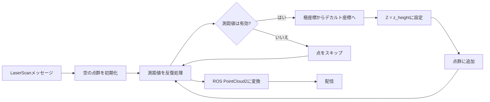
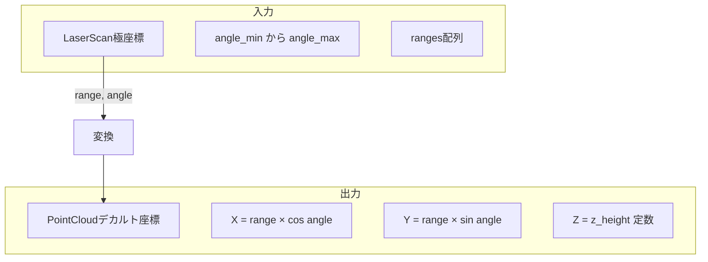

# LaserScan→PointCloud変換器実装 (src/laserscan_to_pcl/src/laserscan_to_pcl.cpp)

## 概要

このファイルは、2D LaserScanメッセージを3D PointCloud2メッセージに変換するROS2ノードを実装しています。設定可能な高さでレーザ点を3D空間に投影することで、2D LIDARデータと深度カメラからの3D点群との融合を可能にします。

## クラス: LaserScanToPCLNode

### コンストラクタ

**場所:** 3-21行目

**目的:** パラメータとROS2通信を初期化

#### パラメータ宣言 (5-13行目)
```cpp
this->declare_parameter("input_topic", "/scan");
this->declare_parameter("output_topic", "/scan_pointcloud");
this->declare_parameter("z_height", 0.2);  // Default z height is 0.2 meters
```

**パラメータ:**
- `input_topic`: LaserScan購読トピック(デフォルト: "/scan")
- `output_topic`: PointCloud2配信トピック(デフォルト: "/scan_pointcloud")
- `z_height`: すべてのレーザ点の固定Z座標(メートル単位、デフォルト: 0.2m)

#### 購読/配信 (16-20行目)
```cpp
auto qos = rclcpp::SensorDataQoS();
scan_sub_ = this->create_subscription<sensor_msgs::msg::LaserScan>(
    input_topic_, qos, std::bind(&LaserScanToPCLNode::scan_callback, this, std::placeholders::_1));

cloud_pub_ = this->create_publisher<sensor_msgs::msg::PointCloud2>(output_topic_, 10);
```

**QoS:** リアルタイムセンサデータ用に`SensorDataQoS`(ベストエフォート、Volatile)を使用

## スキャンコールバック

**場所:** 23-56行目

**目的:** 2Dレーザスキャンを3D点群に変換

### 処理パイプライン



### ステップごとの詳細

#### 1. 点群の初期化 (25行目)
```cpp
pcl::PointCloud<pcl::PointXYZI>::Ptr cloud(new pcl::PointCloud<pcl::PointXYZI>);
```

`PointXYZI`型(X, Y, Z座標 + 強度)を使用

#### 2. 測距値の反復処理 (27-40行目)
```cpp
float angle = scan->angle_min;
for (const auto &range : scan->ranges)
{
    if (std::isfinite(range))
    {
        pcl::PointXYZI pt;
        pt.x = range * std::cos(angle);
        pt.y = range * std::sin(angle);
        pt.z = z_height_;
        pt.intensity = 1.0f;  // Default intensity value
        cloud->points.push_back(pt);
    }
    angle += scan->angle_increment;
}
```

**極座標からデカルト座標への変換:**
- 入力: 極座標での`(range, angle)`
- 出力: デカルト座標での`(x, y)`
- 公式:
  - `x = range × cos(angle)`
  - `y = range × sin(angle)`
  - `z = z_height`(定数)

**有効性チェック:**
- `std::isfinite(range)`: `inf`(戻り値なし)および`nan`(無効)値をフィルタリング
- 有効な戻り値のみを点群に追加

**強度:**
- すべての点に対して定数`1.0`に設定
- 利用可能な場合、レーザ強度を使用するように拡張可能

#### 3. 点群メタデータ (42-44行目)
```cpp
cloud->width = cloud->points.size();
cloud->height = 1;
cloud->is_dense = true;
```

**PCL点群構造:**
- `width`: 点の数(非組織化点群)
- `height = 1`: 非組織化点群(画像状ではない)
- `is_dense = true`: NaN/inf点なし(フィルタリング後)

#### 4. ROSメッセージ変換 (47-52行目)
```cpp
sensor_msgs::msg::PointCloud2 ros_cloud;
pcl::toROSMsg(*cloud, ros_cloud);

ros_cloud.header.frame_id = scan->header.frame_id;
ros_cloud.header.stamp = scan->header.stamp;
```

**ヘッダーの保持:**
- LaserScanから元のframe_idを維持(例: "laser_frame")
- TF同期のためにタイムスタンプを保持

#### 5. 配信 (55行目)
```cpp
cloud_pub_->publish(ros_cloud);
```

## 座標系



**例:**
```
LaserScan:
  angle_min: -π/2   (-90°)
  angle_max: +π/2   (+90°)
  angle_increment: π/360  (0.5°)
  ranges: [inf, 2.5, 2.4, ..., inf]

PointCloud (z_height=0.2):
  点1: スキップ(inf)
  点2: (2.5×cos(-89.5°), 2.5×sin(-89.5°), 0.2) ≈ (0.02, -2.5, 0.2)
  点3: (2.4×cos(-89.0°), 2.4×sin(-89.0°), 0.2) ≈ (0.04, -2.4, 0.2)
  ...
```

## メイン関数

**場所:** 59-65行目

```cpp
int main(int argc, char **argv)
{
    rclcpp::init(argc, argv);
    rclcpp::spin(std::make_shared<LaserScanToPCLNode>());
    rclcpp::shutdown();
    return 0;
}
```

標準的なROS2ノードライフサイクル

## ユースケース

### 1. マルチセンサ融合
ナビゲーション用に2D LIDARと3D深度カメラを組み合わせ:
```yaml
# ロボットベースのレーザ (z=0.15m)
z_height: 0.15
input_topic: /scan
output_topic: /scan_pointcloud
```

その後、`pcl_merge`パッケージを使用して深度カメラ点と統合

### 2. 高さベースの障害物検出
障害物回避のために検出高さに点を配置:
```yaml
# レーザは30cm高さで障害物を検出
z_height: 0.30
```

### 3. SLAM統合
点群入力を必要とする3D SLAMアルゴリズム用にレーザスキャンを変換

## パフォーマンス特性

### 計算量
- **時間:** O(n) ここでn = レーザ光線の数
- **空間:** O(m) ここでm = 有効な戻り値の数 (m ≤ n)

**典型的な値:**
- 360本の光線を持つLIDAR、80%の有効な戻り値
- 処理時間: スキャンあたり1ms未満
- 出力点群サイズ: 約290点 × 16バイト = 4.6 KB

### レイテンシ
- 最小限の処理オーバーヘッド
- 主なレイテンシはROS2メッセージのシリアル化/転送から発生

## 依存関係

**ROS2パッケージ:**
- `rclcpp`: ROS2 C++クライアントライブラリ
- `sensor_msgs`: LaserScanとPointCloud2メッセージ型

**外部ライブラリ:**
- `PCL`: Point Cloud Library(PointXYZI型、変換)

## 設定例

### 背の高いロボット(ヘッドマウントLIDAR)
```yaml
laser_to_pcl:
  ros__parameters:
    input_topic: "/scan"
    output_topic: "/scan_pointcloud"
    z_height: 1.2  # 地上1.2m
```

### 地面レベルLIDAR
```yaml
laser_to_pcl:
  ros__parameters:
    input_topic: "/base_scan"
    output_topic: "/base_scan_cloud"
    z_height: 0.05  # ほぼ地面レベル
```

### 複数のLIDAR
```yaml
# 前方LIDAR
front_laser_to_pcl:
  ros__parameters:
    input_topic: "/front/scan"
    output_topic: "/front/scan_cloud"
    z_height: 0.2

# 後方LIDAR
rear_laser_to_pcl:
  ros__parameters:
    input_topic: "/rear/scan"
    output_topic: "/rear/scan_cloud"
    z_height: 0.2
```

## 既知の制限事項

1. **固定Z高さ**
   - 地形に関係なくすべての点が同じ高さ
   - 地面の輪郭追従なし
   - 解決策: 3D LIDARまたは傾斜メカニズムを使用

2. **強度マッピングなし**
   - LaserScan強度(利用可能な場合)が保持されない
   - すべての点がintensity=1.0を取得
   - 解決策: `scan->intensities[i]`を`pt.intensity`にマッピング

3. **フレームの仮定**
   - レーザが水平(地面と平行)であると仮定
   - 傾斜したレーザには追加の回転変換が必要

4. **非組織化点群**
   - 出力は非組織化(height=1)
   - 一部のアルゴリズムは組織化点群から恩恵を受ける
   - height=1、width=nで角度構造を維持可能

## 潜在的な機能拡張

### 1. 強度の保持
```cpp
if (!scan->intensities.empty()) {
    pt.intensity = scan->intensities[i];
} else {
    pt.intensity = 1.0f;
}
```

### 2. 測距フィルタリング
```cpp
if (std::isfinite(range) && range >= min_range_ && range <= max_range_) {
    // 点を追加
}
```

### 3. マルチエコー対応
```cpp
// 異なるエコーに対してscan->rangesまたはscan->ranges_maxを使用
```

### 4. 動的Z高さ
```cpp
// IMUからのロボットのピッチ/ロールに基づいてz_heightを調整
```

## トラブルシューティング

**出力点群に点がない:**
- すべてのrangesが`inf`または`nan`であることを確認
- `z_height`が妥当であることを確認
- LaserScanメッセージの有効性を確認

**点の位置が正しくない:**
- LaserScanの`angle_min`、`angle_max`、`angle_increment`を確認
- 座標フレームが期待と一致することを確認
- RVizを使用してLaserScanとPointCloud2の両方を可視化

**特定の角度で点が欠落:**
- inf戻り値の場合は正常(障害物が検出されなかった)
- レーザの視野角制限を確認

**下流ノードでのTFエラー:**
- frame_idが正しく保持されていることを確認
- レーザフレームがTFツリーに存在することを確認
