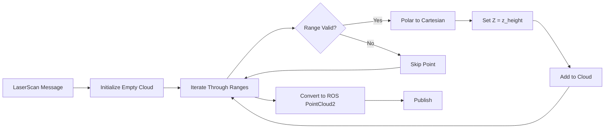
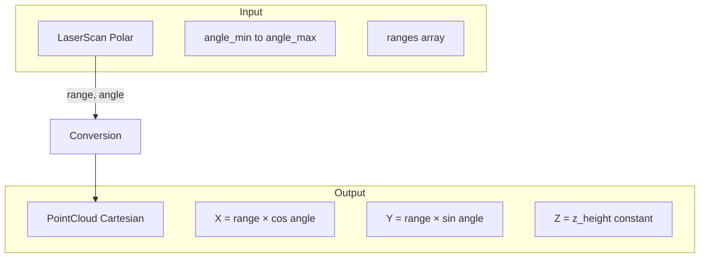

# LaserScan to PointCloud Converter Implementation (src/laserscan_to_pcl/src/laserscan_to_pcl.cpp)

## Overview

This file implements a ROS2 node that converts 2D LaserScan messages to 3D PointCloud2 messages by projecting laser points into 3D space at a configurable height. This enables fusion of 2D lidar data with 3D point clouds from depth cameras.

## Class: LaserScanToPCLNode

### Constructor

**Location:** Lines 3-21

**Purpose:** Initialize parameters and ROS2 communication

#### Parameter Declaration (Lines 5-13)
```cpp
this->declare_parameter("input_topic", "/scan");
this->declare_parameter("output_topic", "/scan_pointcloud");
this->declare_parameter("z_height", 0.2);  // Default z height is 0.2 meters
```

**Parameters:**
- `input_topic`: LaserScan subscription topic (default: "/scan")
- `output_topic`: PointCloud2 publication topic (default: "/scan_pointcloud")
- `z_height`: Fixed Z-coordinate for all laser points in meters (default: 0.2m)

#### Subscription/Publication (Lines 16-20)
```cpp
auto qos = rclcpp::SensorDataQoS();
scan_sub_ = this->create_subscription<sensor_msgs::msg::LaserScan>(
    input_topic_, qos, std::bind(&LaserScanToPCLNode::scan_callback, this, std::placeholders::_1));

cloud_pub_ = this->create_publisher<sensor_msgs::msg::PointCloud2>(output_topic_, 10);
```

**QoS:** Uses `SensorDataQoS` (Best Effort, Volatile) for real-time sensor data

## Scan Callback

**Location:** Lines 23-56

**Purpose:** Convert 2D laser scan to 3D point cloud

### Processing Pipeline



### Step-by-Step Breakdown

#### 1. Point Cloud Initialization (Line 25)
```cpp
pcl::PointCloud<pcl::PointXYZI>::Ptr cloud(new pcl::PointCloud<pcl::PointXYZI>);
```

Uses `PointXYZI` type (X, Y, Z coordinates + Intensity)

#### 2. Range Iteration (Lines 27-40)
```cpp
float angle = scan->angle_min;
for (const auto &range : scan->ranges)
{
    if (std::isfinite(range))
    {
        pcl::PointXYZI pt;
        pt.x = range * std::cos(angle);
        pt.y = range * std::sin(angle);
        pt.z = z_height_;
        pt.intensity = 1.0f;  // Default intensity value
        cloud->points.push_back(pt);
    }
    angle += scan->angle_increment;
}
```

**Polar to Cartesian Conversion:**
- Input: `(range, angle)` in polar coordinates
- Output: `(x, y)` in Cartesian coordinates
- Formula:
  - `x = range × cos(angle)`
  - `y = range × sin(angle)`
  - `z = z_height` (constant)

**Validity Check:**
- `std::isfinite(range)`: Filters out `inf` (no return) and `nan` (invalid) values
- Only valid returns are added to point cloud

**Intensity:**
- Set to constant `1.0` for all points
- Could be extended to use laser intensity if available

#### 3. Cloud Metadata (Lines 42-44)
```cpp
cloud->width = cloud->points.size();
cloud->height = 1;
cloud->is_dense = true;
```

**PCL Cloud Structure:**
- `width`: Number of points (unorganized cloud)
- `height = 1`: Unorganized point cloud (not image-like)
- `is_dense = true`: No NaN/inf points (after filtering)

#### 4. ROS Message Conversion (Lines 47-52)
```cpp
sensor_msgs::msg::PointCloud2 ros_cloud;
pcl::toROSMsg(*cloud, ros_cloud);

ros_cloud.header.frame_id = scan->header.frame_id;
ros_cloud.header.stamp = scan->header.stamp;
```

**Header Preservation:**
- Maintains original frame_id from LaserScan (e.g., "laser_frame")
- Preserves timestamp for TF synchronization

#### 5. Publish (Line 55)
```cpp
cloud_pub_->publish(ros_cloud);
```

## Coordinate System



**Example:**
```
LaserScan:
  angle_min: -π/2   (-90°)
  angle_max: +π/2   (+90°)
  angle_increment: π/360  (0.5°)
  ranges: [inf, 2.5, 2.4, ..., inf]

PointCloud (z_height=0.2):
  Point 1: skipped (inf)
  Point 2: (2.5×cos(-89.5°), 2.5×sin(-89.5°), 0.2) ≈ (0.02, -2.5, 0.2)
  Point 3: (2.4×cos(-89.0°), 2.4×sin(-89.0°), 0.2) ≈ (0.04, -2.4, 0.2)
  ...
```

## Main Function

**Location:** Lines 59-65

```cpp
int main(int argc, char **argv)
{
    rclcpp::init(argc, argv);
    rclcpp::spin(std::make_shared<LaserScanToPCLNode>());
    rclcpp::shutdown();
    return 0;
}
```

Standard ROS2 node lifecycle

## Use Cases

### 1. Multi-Sensor Fusion
Combine 2D lidar with 3D depth camera for navigation:
```yaml
# Laser at robot base (z=0.15m)
z_height: 0.15
input_topic: /scan
output_topic: /scan_pointcloud
```

Then merge with depth camera points using `pcl_merge` package

### 2. Height-Based Obstacle Detection
Place points at detection height for obstacle avoidance:
```yaml
# Laser detects obstacles at 30cm height
z_height: 0.30
```

### 3. SLAM Integration
Convert laser scans for 3D SLAM algorithms requiring point cloud input

## Performance Characteristics

### Computational Complexity
- **Time:** O(n) where n = number of laser rays
- **Space:** O(m) where m = number of valid returns (m ≤ n)

**Typical Values:**
- Lidar with 360 rays, 80% valid returns
- Processing time: < 1ms per scan
- Output cloud size: ~290 points × 16 bytes = 4.6 KB

### Latency
- Minimal processing overhead
- Main latency from ROS2 message serialization/transport

## Dependencies

**ROS2 Packages:**
- `rclcpp`: ROS2 C++ client library
- `sensor_msgs`: LaserScan and PointCloud2 message types

**External Libraries:**
- `PCL`: Point Cloud Library (PointXYZI type, conversion)

## Configuration Examples

### Tall Robot (Head-Mounted Lidar)
```yaml
laser_to_pcl:
  ros__parameters:
    input_topic: "/scan"
    output_topic: "/scan_pointcloud"
    z_height: 1.2  # 1.2m above ground
```

### Ground-Level Lidar
```yaml
laser_to_pcl:
  ros__parameters:
    input_topic: "/base_scan"
    output_topic: "/base_scan_cloud"
    z_height: 0.05  # Nearly ground level
```

### Multiple Lidars
```yaml
# Front lidar
front_laser_to_pcl:
  ros__parameters:
    input_topic: "/front/scan"
    output_topic: "/front/scan_cloud"
    z_height: 0.2

# Rear lidar
rear_laser_to_pcl:
  ros__parameters:
    input_topic: "/rear/scan"
    output_topic: "/rear/scan_cloud"
    z_height: 0.2
```

## Known Limitations

1. **Fixed Z-Height**
   - All points at same height regardless of terrain
   - No ground contour following
   - Solution: Use 3D lidar or tilting mechanism

2. **No Intensity Mapping**
   - LaserScan intensity (if available) not preserved
   - All points get intensity=1.0
   - Solution: Map `scan->intensities[i]` to `pt.intensity`

3. **Frame Assumption**
   - Assumes laser is horizontal (parallel to ground)
   - Tilted laser requires additional rotation transformation

4. **Unorganized Cloud**
   - Output is unorganized (height=1)
   - Some algorithms benefit from organized clouds
   - Could maintain angular structure with height=1, width=n

## Potential Enhancements

### 1. Intensity Preservation
```cpp
if (!scan->intensities.empty()) {
    pt.intensity = scan->intensities[i];
} else {
    pt.intensity = 1.0f;
}
```

### 2. Range Filtering
```cpp
if (std::isfinite(range) && range >= min_range_ && range <= max_range_) {
    // Add point
}
```

### 3. Multi-Echo Support
```cpp
// Use scan->ranges or scan->ranges_max for different echoes
```

### 4. Dynamic Z-Height
```cpp
// Adjust z_height based on robot pitch/roll from IMU
```

## Troubleshooting

**No points in output cloud:**
- Check all ranges are `inf` or `nan`
- Verify `z_height` is reasonable
- Check LaserScan message validity

**Incorrect point positions:**
- Verify `angle_min`, `angle_max`, `angle_increment` in LaserScan
- Check coordinate frame matches expectations
- Use RViz to visualize both LaserScan and PointCloud2

**Missing points at certain angles:**
- Normal for inf returns (no obstacle detected)
- Check laser's field of view limits

**TF errors in downstream nodes:**
- Ensure frame_id is correctly preserved
- Verify laser frame exists in TF tree
