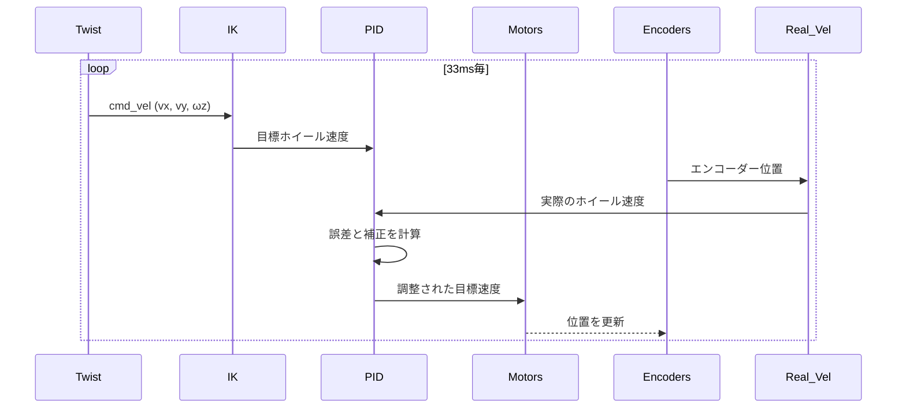

# メカナムホイールPhidgetsコントローラー (src/mecanum_wheels/mecanum_wheels/phidgets_control.py)

## 概要

このファイルは、Phidgets BLDCモーターコントローラーを使用したメカナムホイールロボットの閉ループPID速度制御を実装します。逆運動学、PID計算、ハードウェア通信を処理します。

## ハードウェア定数

**場所:** 20-26行目

```python
WHEEL_SEPARATION_WIDTH = 0.40   # 左右ホイール間の距離40cm
WHEEL_SEPARATION_LENGTH = 0.30  # 前後ホイール間の距離30cm
WHEEL_GEOMETRY = 0.35           # (WIDTH + LENGTH) / 2
WHEEL_RADIUS = 0.0762           # 7.62cm (3インチ)
CONSTANT = 33.5                 # 変換: 320 RPM = 33.5 rad/s
```

**WHEEL_GEOMETRY の導出:**
```
R = (L_w + L_l) / 2 = (0.40 + 0.30) / 2 = 0.35m
```

メカナム運動学における回転半径計算に使用されます。

## 設定フラグ

**場所:** 28-46行目

```python
ON_LINE_HUB = True          # Phidgetsハードウェアを有効化
CLOSED_LOOP = True          # PID制御を有効化
REAL_SPEED_PUBLISH = True   # オドメトリフィードバックを配信
ENABLE_I = True             # 積分項
ENABLE_D = True             # 微分項
STAND_ALONE = 0             # 駆動モード定数
COMBINE_CHAIR = 1
```

**開発モード:** ハードウェアなしのシミュレーションには `ON_LINE_HUB = False` を設定

## モーター接続

### connect_motor()

**場所:** 51-60行目

**目的:** リトライロジックを持つPhidgetsモーターへの接続を確立

```python
def connect_motor(motor, name):
    status = False
    while not status:
        status = True
        try:
            motor.openWaitForAttachment(5000)  # 5秒タイムアウト
        except:
            status = False
            rclpy.logging.get_logger("Motor Connection").warn(
                f"Failed to connect {name} Motor. Trying again...")
            time.sleep(1)
```

**リトライ動作:** 接続が成功するまで無限ループ

### init_motor()

**場所:** 62-66行目

**設定:**
```python
motor.setTargetVelocity(0)      # 停止状態で開始
motor.setAcceleration(1.5)      # スムーズな加速
motor.setDataInterval(100)      # 100ms更新レート
motor.setDataRate(10)           # 10 Hz
```

## 実速度計算

### ControlLoopRealVelocityComputation

**場所:** 68-87行目

**目的:** エンコーダーフィードバックから実際のロボット速度を計算

#### update_wheels_vel()

**アルゴリズム:**
```python
delta_pos[0] = new_r_pos[0] - self.r_pos[0]    # 前左
delta_pos[1] = self.r_pos[1] - new_r_pos[1]    # 前右 (反転)
delta_pos[2] = new_r_pos[2] - self.r_pos[2]    # 後左
delta_pos[3] = self.r_pos[3] - new_r_pos[3]    # 後右 (反転)

self.r_vel = delta_pos / dt
return self.r_vel * 2 * 2 * 3.14 / 360 / CONSTANT
```

**符号反転:** モーターの取り付け方向を考慮

**単位変換:**
```
encoder_delta → 度 → ラジアン → rad/s → duty_ratio
```

## PIDコントローラー

### ControlLoopPid

**場所:** 89-126行目

**状態変数:**
```python
self.error = np.array([0.0, 0.0, 0.0, 0.0])
self.error_sum = np.array([0.0, 0.0, 0.0, 0.0])
self.last_real_wheel_vel = np.array([0.0, 0.0, 0.0, 0.0])
```

**デフォルトゲイン:**
```python
self.kp = 0.2   # 比例
self.ki = 4.2   # 積分
self.kd = 0.1   # 微分
```

### compute_pid()

**場所:** 101-126行目

**完全なPID方程式:**
```python
error = cmd_wheel_vel - real_wheel_vel
self.error_sum += error * dt

diff_real_wheel_vel = self.last_real_wheel_vel - real_wheel_vel

# アンチワインドアップ飽和
norm = np.linalg.norm(self.error_sum)
if ERROR_SUM_NORM_MAX < norm:
    self.error_sum = self.error_sum * ERROR_SUM_NORM_MAX / norm

return error * kp + self.error_sum * ki + diff_real_wheel_vel * kd
```

**アンチワインドアップメカニズム:**
```
if ||integral_error|| > 0.5:
    integral_error = integral_error * (0.5 / ||integral_error||)
```

飽和時に積分項が際限なく成長することを防ぎます。

**条件付き項:**
- `ENABLE_D = True`: 完全なPID
- `ENABLE_D = False, ENABLE_I = True`: PIのみ
- 両方False: Pのみ

## 運動学ユーティリティ

### ControlLoopUtils

**場所:** 129-150行目

#### 逆運動学

**場所:** 138-148行目

```python
@staticmethod
def compute_inverse_kinematic(linear_velocity, angular_velocity):
    front_left = ((linear_velocity.x - linear_velocity.y -
                   angular_velocity.z * WHEEL_GEOMETRY) / WHEEL_RADIUS) / CONSTANT

    front_right = ((linear_velocity.x + linear_velocity.y +
                    angular_velocity.z * WHEEL_GEOMETRY) / WHEEL_RADIUS) / CONSTANT

    back_left = ((linear_velocity.x + linear_velocity.y -
                  angular_velocity.z * WHEEL_GEOMETRY) / WHEEL_RADIUS) / CONSTANT

    back_right = ((linear_velocity.x - linear_velocity.y +
                   angular_velocity.z * WHEEL_GEOMETRY) / WHEEL_RADIUS) / CONSTANT

    return np.array([front_left, front_right, back_left, back_right])
```

**メカナムホイール方程式:**
```
ω_FL = (v_x - v_y - ω_z * R) / r
ω_FR = (v_x + v_y + ω_z * R) / r
ω_BL = (v_x + v_y - ω_z * R) / r
ω_BR = (v_x - v_y + ω_z * R) / r
```

ここで:
- `v_x`: 前進速度 (m/s)
- `v_y`: 横移動速度 (m/s)
- `ω_z`: 角速度 (rad/s)
- `R`: WHEEL_GEOMETRY (0.35m)
- `r`: WHEEL_RADIUS (0.0762m)

**符号パターン:**
| ホイール | v_x | v_y | ω_z |
|-------|-----|-----|-----|
| FL    | +   | -   | -   |
| FR    | +   | +   | +   |
| BL    | +   | +   | -   |
| BR    | +   | -   | +   |

## メイン制御ノード

メインのROS2ノード(抜粋には完全には示されていません)は以下を実装します:

1. **Twist購読者:** 速度コマンドを受信
2. **制御ループタイマー:** 30 Hz (33.33ms周期)
3. **逆運動学:** Twist → ホイール速度に変換
4. **エンコーダー読み取り:** 実際のホイール位置を取得
5. **速度計算:** 実速度を計算
6. **PID制御:** 補正を計算
7. **モーターコマンド:** 目標速度を設定
8. **フィードバック配信:** 実速度を配信

## 制御フロー



## 性能特性

### 制御周波数
- **タイマー:** 30 Hz (phidgets_control.py:49)
- **モーターデータレート:** 10 Hz (phidgets_control.py:66)
- **モーターデータ間隔:** 100ms (phidgets_control.py:65)

**周波数のミスマッチに関する説明:** 制御ループは30 Hz(タイマーコールバック周波数)で実行されますが、モーターエンコーダーデータは10 Hzで更新されます。この設計により、PIDコントローラーはセンサー更新レートよりも高い周波数で実行でき、よりスムーズな制御出力を提供します。30 Hzで実行されるPID計算は、100ms毎(10 Hz)に更新される最新のエンコーダー読み取り値を使用します。このオーバーサンプリングアプローチは、制御のジッターを軽減し、応答時間を改善します。

### レイテンシー
- **センサーからアクチュエーター:** 約40ms (モーターデータ間隔 + 処理)
- **コマンドから応答:** 約70-100ms (1制御サイクル)

### 安定性
- **P項:** 即座の応答
- **I項:** 定常状態誤差を除去
- **D項:** 減衰、オーバーシュートを軽減
- **アンチワインドアップ:** 積分飽和を防止

## チューニングガイドライン

### 比例ゲイン (kp)
- **低すぎる:** 緩慢な応答
- **高すぎる:** 振動
- **現在:** 0.2 (保守的)

### 積分ゲイン (ki)
- **低すぎる:** 定常状態誤差が持続
- **高すぎる:** ワインドアップ、不安定
- **現在:** 4.2 (積極的な誤差除去)

### 微分ゲイン (kd)
- **低すぎる:** オーバーシュート
- **高すぎる:** ノイズ増幅
- **現在:** 0.1 (中程度の減衰)

## 依存関係

- **Phidget22:** モーターハードウェアインターフェース
- **NumPy:** 配列演算
- **rclpy:** ROS2 Pythonクライアント
- **geometry_msgs:** Twistメッセージ
- **std_srvs:** サービス定義

## エラーハンドリング

- **接続失敗:** バックオフ付き自動リトライ
- **ゼロ除算:** `if dt == 0: return self.r_vel`
- **積分飽和:** アンチワインドアップ正規化
- **ハードウェア例外:** ログ記録とリトライ

## 安全機能

1. **初期ゼロ速度:** モーターは停止状態で開始
2. **加速制限:** `setAcceleration(1.5)`
3. **積分飽和:** 暴走を防止
4. **緊急停止サービス:** 即座の停止機能
