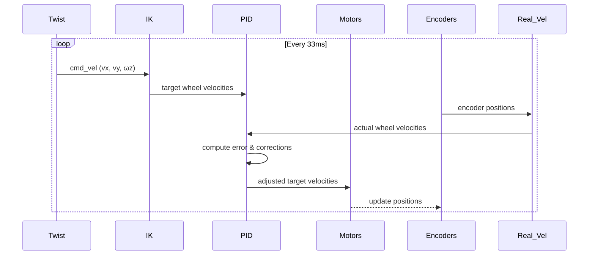

# Mecanum Wheel Phidgets Controller (src/mecanum_wheels/mecanum_wheels/phidgets_control.py)

## Overview

This file implements closed-loop PID velocity control for a mecanum wheel robot using Phidgets BLDC motor controllers. It handles inverse kinematics, PID computation, and hardware communication.

## Hardware Constants

**Location:** Lines 20-26

```python
WHEEL_SEPARATION_WIDTH = 0.40   # 40cm between left and right wheels
WHEEL_SEPARATION_LENGTH = 0.30  # 30cm between front and rear wheels
WHEEL_GEOMETRY = 0.35           # (WIDTH + LENGTH) / 2
WHEEL_RADIUS = 0.0762           # 7.62cm (3 inches)
CONSTANT = 33.5                 # Conversion: 320 RPM = 33.5 rad/s
```

**WHEEL_GEOMETRY derivation:**
```
R = (L_w + L_l) / 2 = (0.40 + 0.30) / 2 = 0.35m
```

Used in mecanum kinematics for rotation radius calculation.

## Configuration Flags

**Location:** Lines 28-46

```python
ON_LINE_HUB = True          # Enable Phidgets hardware
CLOSED_LOOP = True          # Enable PID control
REAL_SPEED_PUBLISH = True   # Publish odometry feedback
ENABLE_I = True             # Integral term
ENABLE_D = True             # Derivative term
STAND_ALONE = 0             # Drive mode constants
COMBINE_CHAIR = 1
```

**Development mode:** Set `ON_LINE_HUB = False` for simulation without hardware

## Motor Connection

### connect_motor()

**Location:** Lines 51-60

**Purpose:** Establish connection to Phidgets motor with retry logic

```python
def connect_motor(motor, name):
    status = False
    while not status:
        status = True
        try:
            motor.openWaitForAttachment(5000)  # 5s timeout
        except:
            status = False
            rclpy.logging.get_logger("Motor Connection").warn(
                f"Failed to connect {name} Motor. Trying again...")
            time.sleep(1)
```

**Retry behavior:** Infinite loop until connection succeeds

### init_motor()

**Location:** Lines 62-66

**Configuration:**
```python
motor.setTargetVelocity(0)      # Start stopped
motor.setAcceleration(1.5)      # Smooth acceleration
motor.setDataInterval(100)      # 100ms update rate
motor.setDataRate(10)           # 10 Hz
```

## Real Velocity Computation

### ControlLoopRealVelocityComputation

**Location:** Lines 68-87

**Purpose:** Calculate actual robot velocity from encoder feedback

#### update_wheels_vel()

**Algorithm:**
```python
delta_pos[0] = new_r_pos[0] - self.r_pos[0]    # Front left
delta_pos[1] = self.r_pos[1] - new_r_pos[1]    # Front right (inverted)
delta_pos[2] = new_r_pos[2] - self.r_pos[2]    # Back left
delta_pos[3] = self.r_pos[3] - new_r_pos[3]    # Back right (inverted)

self.r_vel = delta_pos / dt
return self.r_vel * 2 * 2 * 3.14 / 360 / CONSTANT
```

**Sign inversions:** Account for motor mounting orientations

**Unit conversion:**
```
encoder_delta → degrees → radians → rad/s → duty_ratio
```

## PID Controller

### ControlLoopPid

**Location:** Lines 89-126

**State variables:**
```python
self.error = np.array([0.0, 0.0, 0.0, 0.0])
self.error_sum = np.array([0.0, 0.0, 0.0, 0.0])
self.last_real_wheel_vel = np.array([0.0, 0.0, 0.0, 0.0])
```

**Default gains:**
```python
self.kp = 0.2   # Proportional
self.ki = 4.2   # Integral
self.kd = 0.1   # Derivative
```

### compute_pid()

**Location:** Lines 101-126

**Full PID equation:**
```python
error = cmd_wheel_vel - real_wheel_vel
self.error_sum += error * dt

diff_real_wheel_vel = self.last_real_wheel_vel - real_wheel_vel

# Anti-windup saturation
norm = np.linalg.norm(self.error_sum)
if ERROR_SUM_NORM_MAX < norm:
    self.error_sum = self.error_sum * ERROR_SUM_NORM_MAX / norm

return error * kp + self.error_sum * ki + diff_real_wheel_vel * kd
```

**Anti-windup mechanism:**
```
if ||integral_error|| > 0.5:
    integral_error = integral_error * (0.5 / ||integral_error||)
```

Prevents integral term from growing unbounded during saturation.

**Conditional terms:**
- `ENABLE_D = True`: Full PID
- `ENABLE_D = False, ENABLE_I = True`: PI only
- Both False: P only

## Kinematic Utilities

### ControlLoopUtils

**Location:** Lines 129-150

#### Inverse Kinematics

**Location:** Lines 138-148

```python
@staticmethod
def compute_inverse_kinematic(linear_velocity, angular_velocity):
    front_left = ((linear_velocity.x - linear_velocity.y -
                   angular_velocity.z * WHEEL_GEOMETRY) / WHEEL_RADIUS) / CONSTANT

    front_right = ((linear_velocity.x + linear_velocity.y +
                    angular_velocity.z * WHEEL_GEOMETRY) / WHEEL_RADIUS) / CONSTANT

    back_left = ((linear_velocity.x + linear_velocity.y -
                  angular_velocity.z * WHEEL_GEOMETRY) / WHEEL_RADIUS) / CONSTANT

    back_right = ((linear_velocity.x - linear_velocity.y +
                   angular_velocity.z * WHEEL_GEOMETRY) / WHEEL_RADIUS) / CONSTANT

    return np.array([front_left, front_right, back_left, back_right])
```

**Mecanum wheel equations:**
```
ω_FL = (v_x - v_y - ω_z * R) / r
ω_FR = (v_x + v_y + ω_z * R) / r
ω_BL = (v_x + v_y - ω_z * R) / r
ω_BR = (v_x - v_y + ω_z * R) / r
```

Where:
- `v_x`: Forward velocity (m/s)
- `v_y`: Lateral velocity (m/s)
- `ω_z`: Angular velocity (rad/s)
- `R`: WHEEL_GEOMETRY (0.35m)
- `r`: WHEEL_RADIUS (0.0762m)

**Sign patterns:**
| Wheel | v_x | v_y | ω_z |
|-------|-----|-----|-----|
| FL    | +   | -   | -   |
| FR    | +   | +   | +   |
| BL    | +   | +   | -   |
| BR    | +   | -   | +   |

## Main Control Node

The main ROS2 node (not fully shown in excerpt) would implement:

1. **Twist subscriber:** Receive velocity commands
2. **Control loop timer:** 30 Hz (33.33ms period)
3. **Inverse kinematics:** Convert Twist → wheel velocities
4. **Encoder reading:** Get actual wheel positions
5. **Velocity computation:** Calculate real velocities
6. **PID control:** Compute corrections
7. **Motor commands:** Set target velocities
8. **Feedback publishing:** Publish real velocities

## Control Flow



## Performance Characteristics

### Control Frequency
- **Timer:** 30 Hz
- **Motor data rate:** 10 Hz
- **Motor data interval:** 100ms

### Latency
- **Sensor-to-actuator:** ~40ms (motor data interval + processing)
- **Command-to-response:** ~70-100ms (one control cycle)

### Stability
- **P-term:** Immediate response
- **I-term:** Eliminates steady-state error
- **D-term:** Damping, reduces overshoot
- **Anti-windup:** Prevents integral saturation

## Tuning Guidelines

### Proportional Gain (kp)
- **Too low:** Sluggish response
- **Too high:** Oscillation
- **Current:** 0.2 (conservative)

### Integral Gain (ki)
- **Too low:** Steady-state error persists
- **Too high:** Windup, instability
- **Current:** 4.2 (aggressive error elimination)

### Derivative Gain (kd)
- **Too low:** Overshoot
- **Too high:** Noise amplification
- **Current:** 0.1 (moderate damping)

## Dependencies

- **Phidget22:** Motor hardware interface
- **NumPy:** Array operations
- **rclpy:** ROS2 Python client
- **geometry_msgs:** Twist messages
- **std_srvs:** Service definitions

## Error Handling

- **Connection failure:** Automatic retry with backoff
- **Division by zero:** `if dt == 0: return self.r_vel`
- **Integral saturation:** Anti-windup normalization
- **Hardware exceptions:** Logged and retried

## Safety Features

1. **Initial zero velocity:** Motors start stopped
2. **Acceleration limiting:** `setAcceleration(1.5)`
3. **Integral saturation:** Prevents runaway
4. **Emergency stop service:** Immediate halt capability
