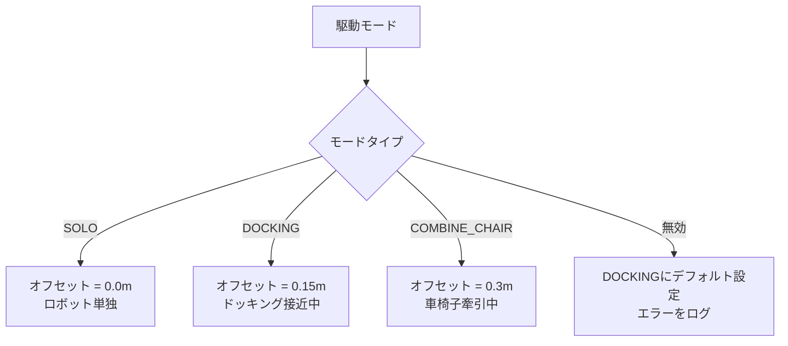
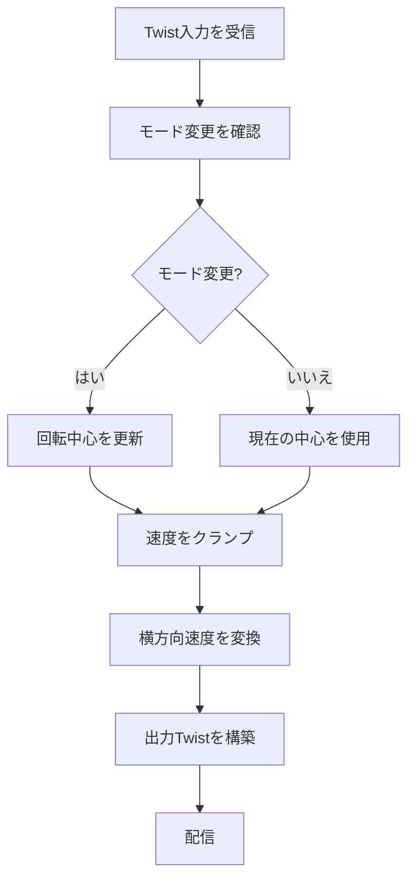

# ナビゲーション制御変換実装 (src/nav_control/src/nav_control.cpp)

## 概要

このファイルは、メカナムホイールロボットの異なる駆動モードに対する速度変換を実装します。現在の駆動構成(SOLO、DOCKING、COMBINE_CHAIR)に基づいて横方向速度を変更することで回転中心を調整し、様々な動作状態での正確な制御を可能にします。

## クラス: Nav_control

**名前空間:** `nav_control`

### コンストラクタ

**場所:** 5-30行目

**目的:** パラメータ、モード設定、およびROS2通信を初期化

#### パラメータ宣言 (8-21行目)
```cpp
this->declare_parameter<std::string>("input_topic", "input_topic");
this->declare_parameter<std::string>("output_topic", "output_topic");
this->declare_parameter<std::string>("mode_drive", "DOCKING");
this->declare_parameter<float>("LENGTH_ROTATION_CENTER_SOLO", 0.0);
this->declare_parameter<float>("LENGTH_ROTATION_CENTER_DOCKING", 0.15);
this->declare_parameter<float>("LENGTH_ROTATION_CENTER_COMBINE_CHAIR", 0.3);
```

**パラメータ:**
- `input_topic`: 入力速度コマンドトピック
- `output_topic`: 変換された速度出力トピック
- `mode_drive`: 現在の駆動モード (SOLO、DOCKING、COMBINE_CHAIR)
- `LENGTH_ROTATION_CENTER_SOLO`: SOLOモードの回転中心オフセット (デフォルト: 0.0m)
- `LENGTH_ROTATION_CENTER_DOCKING`: DOCKINGモードの回転中心オフセット (デフォルト: 0.15m)
- `LENGTH_ROTATION_CENTER_COMBINE_CHAIR`: COMBINE_CHAIRモードの回転中心オフセット (デフォルト: 0.3m)

#### 購読/配信 (25-28行目)
```cpp
cmd_vel_sub = this->create_subscription<geometry_msgs::msg::Twist>(input_topic, 1,
                    std::bind(&Nav_control::cmd_velCallback, this, std::placeholders::_1));

cmd_vel_pub = this->create_publisher<geometry_msgs::msg::Twist>(output_topic, 1);
```

## 回転中心計算

### rotationCenter()

**場所:** 32-47行目

**目的:** 駆動モードに基づいて回転中心オフセットを決定

```cpp
float Nav_control::rotationCenter(std::string mode_drive)
{
    if (mode_drive== "SOLO")
        LENGTH_ROTATION_CENTER = LENGTH_ROTATION_CENTER_SOLO;
    else if (mode_drive== "DOCKING")
        LENGTH_ROTATION_CENTER = LENGTH_ROTATION_CENTER_DOCKING;
    else if (mode_drive== "COMBINE_CHAIR")
        LENGTH_ROTATION_CENTER = LENGTH_ROTATION_CENTER_COMBINE_CHAIR;
    else
    {
        LENGTH_ROTATION_CENTER = LENGTH_ROTATION_CENTER_DOCKING;
        RCLCPP_ERROR_STREAM(rclcpp::get_logger("ERROR"), "Drive mode invalid.");
    }

    return LENGTH_ROTATION_CENTER;
}
```

**駆動モード:**



**回転中心オフセットの説明:**
- **SOLO (0.0m):** ロボットの幾何学的中心で回転
- **DOCKING (0.15m):** ドッキング接近のために回転中心をシフト
- **COMBINE_CHAIR (0.3m):** 取り付けられた車椅子に対応するために回転中心をシフト

## 速度クランプ

### clamp_velocity()

**場所:** 50-54行目

**目的:** 速度を最大安全速度に制限

```cpp
double Nav_control::clamp_velocity(double value)
{
    if (value == 0.0) return 0.0;
    return std::max(-max_speed, std::min(max_speed, value));
}
```

**動作:**
- ゼロ速度は変更せずに通過
- 非ゼロ値は `[-max_speed, max_speed]` にクランプ
- ハードウェアを損傷する可能性のある過度な速度を防止

## 速度コマンドコールバック

### cmd_velCallback()

**場所:** 56-88行目

**目的:** 駆動モードに基づいて入力速度コマンドを変換

### 処理パイプライン



### ステップバイステップの内訳

#### 1. モード更新チェック (62-70行目)
```cpp
this->get_parameter("mode_drive", mode_drive);
// mode_driveが変更されたか確認
if (previous_mode_drive != mode_drive)
{
    LENGTH_ROTATION_CENTER = Nav_control::rotationCenter(mode_drive);
    previous_mode_drive = mode_drive;

    RCLCPP_INFO_STREAM(rclcpp::get_logger("LENGTH_ROTATION_CENTER: "), mode_drive << ": " << LENGTH_ROTATION_CENTER);
}
```

**動的モード切り替え:**
- モードパラメータは各コールバックで読み取られる
- 回転中心はモード変更時のみ更新される
- デバッグ用に新しい構成をログに記録

#### 2. 速度クランプ (72-74行目)
```cpp
double x = clamp_velocity(msg->linear.x);
double y = clamp_velocity(msg->linear.y);
double z = clamp_velocity(msg->angular.z);
```

入力速度が安全な制限内にあることを保証

#### 3. 速度変換 (76-78行目)
```cpp
linear_vel_msg.x = x;
linear_vel_msg.y = (-z * LENGTH_ROTATION_CENTER) + y;
linear_vel_msg.z = 0.0;
```

**主要な変換:**
```
y_out = y_in + (-ω × L)
```

ここで:
- `y_out`: 変換された横方向速度
- `y_in`: 入力横方向速度
- `ω`: 角速度 (z)
- `L`: 回転中心オフセット (LENGTH_ROTATION_CENTER)

**物理的解釈:**


回転時、回転中心からオフセットされた点は追加の横方向速度を経験します:
- 時計回りの回転 (ω > 0) を前方で行うと → 左への横方向速度 (-ω × L)
- 反時計回りの回転 (ω < 0) → 右への横方向速度

#### 4. 角速度のパススルー (80-82行目)
```cpp
angular_vel_msg.x = 0.0;
angular_vel_msg.y = 0.0;
angular_vel_msg.z = z;
```

ヨー回転のみサポート (Z軸)

#### 5. 変換されたコマンドを配信 (84-87行目)
```cpp
vel_msg.linear = linear_vel_msg;
vel_msg.angular = angular_vel_msg;

cmd_vel_pub->publish(vel_msg);
```

## 速度変換の数学

### 計算例

**入力:**
```
線速度 X: 0.5 m/s  (前進)
線速度 Y: 0.2 m/s  (左)
角速度 Z: 0.3 rad/s  (反時計回り)
モード: DOCKING (L = 0.15m)
```

**変換:**
```
x_out = 0.5 m/s  (変更なし)
y_out = 0.2 + (-0.3 × 0.15) = 0.2 - 0.045 = 0.155 m/s
z_out = 0.3 rad/s  (変更なし)
```

**結果:** 回転中心が15cm前方にシフトし、左方向への速度が減少

### 回転中心の視覚化

```
        SOLO (L=0.0m)         DOCKING (L=0.15m)    COMBINE_CHAIR (L=0.3m)
              ↓                      ↓                        ↓
        ┌─────────┐            ┌─────────┐              ┌─────────┐
        │  ロボット  │            │  ロボット  │              │  ロボット  │──┐
        │    ×    │            │         │              │         │  │
        └─────────┘            └────×────┘              └─────────×──┤
                                    ↑                              │  │
                               (前方にオフセット)              ┌─────────┤
                                                             │  車椅子  │
                                                             └──────────┘
```

## メイン関数

**場所:** 92-98行目

```cpp
int main(int argc, char *argv[])
{
    rclcpp::init(argc, argv);
    rclcpp::spin(std::make_shared<nav_control::Nav_control>());
    rclcpp::shutdown();
    return 0;
}
```

## ユースケース

### 1. 自律ドッキング
```yaml
nav_control:
  ros__parameters:
    mode_drive: "DOCKING"
    LENGTH_ROTATION_CENTER_DOCKING: 0.15
    input_topic: "cmd_vel_nav"
    output_topic: "cmd_vel"
```

正確なドッキング位置合わせのために回転中心を前方にシフト

### 2. 単独ナビゲーション
```yaml
nav_control:
  ros__parameters:
    mode_drive: "SOLO"
    LENGTH_ROTATION_CENTER_SOLO: 0.0
    input_topic: "cmd_vel_nav"
    output_topic: "cmd_vel"
```

ロボット中心での通常の回転

### 3. 車椅子輸送
```yaml
nav_control:
  ros__parameters:
    mode_drive: "COMBINE_CHAIR"
    LENGTH_ROTATION_CENTER_COMBINE_CHAIR: 0.3
    input_topic: "cmd_vel_nav"
    output_topic: "cmd_vel"
```

安定した旋回のために車椅子取り付け点の後方に回転中心を設定

## パフォーマンス特性

### 計算量
- O(1) - 定数時間演算
- 単純な算術変換
- CPU オーバーヘッドは無視できるレベル

### レイテンシ
- < 0.1ms の処理時間
- 主なレイテンシはROS2メッセージ転送による

## 依存関係

**ROS2パッケージ:**
- `rclcpp`: ROS2 C++クライアントライブラリ
- `geometry_msgs`: Twistメッセージ型

## 設定のベストプラクティス

### 回転中心オフセットの決定

1. **ロボットの幾何学形状を測定**
   - 取り付け点を特定
   - ロボット中心からの距離を測定

2. **回転をテスト**
   - 純粋な回転をコマンド (x=0, y=0, z≠0)
   - 実際の回転中心を観察
   - 望ましい動作に合うように `LENGTH_ROTATION_CENTER` を調整

3. **軌道を検証**
   - 並進と回転の組み合わせをテスト
   - 過度なスリップなしでスムーズな動きを確認

### 安全性の考慮事項

- 以下に基づいて `max_speed` を保守的に設定:
  - ロボットの重量と慣性
  - メカナムホイールのグリップ限界
  - 障害物検出の反応時間
  - 人間の安全要件

## 既知の制限

1. **ハードコードされた max_speed**
   - `max_speed` メンバは可視コード内で宣言または初期化されていない
   - おそらくヘッダーファイルで定義されている
   - 設定可能なパラメータであるべき

2. **2D動作のみ**
   - ピッチ/ロール補償なし
   - 平坦な地面を仮定

3. **加速度制限なし**
   - 瞬時の速度変更が許可される
   - 急なコマンドでホイールスリップを引き起こす可能性
   - 加速度ランプの追加を検討

4. **動作中のモード変更**
   - 瞬時のモード変更がぎくしゃくした動きを引き起こす可能性
   - 遷移の平滑化の追加を検討

## トラブルシューティング

**ロボットが間違った点を中心に回転する:**
- `LENGTH_ROTATION_CENTER_*` パラメータを調整
- モードが正しく設定されているか確認
- 入力トピックが正しいコマンドを受信しているか確認

**過度なホイールスリップ:**
- `max_speed` を減少
- 加速度制限を追加
- 床面とホイールの状態を確認

**モードが変更されない:**
- 実行時のパラメータ更新を確認
- previous_mode_drive の初期化を確認
- モード変更のログメッセージを監視

**回転中の予期しない横方向ドリフト:**
- `LENGTH_ROTATION_CENTER` の符号を確認 (前方オフセットの場合は正であるべき)
- メカナムホイール運動学が期待されるモデルと一致するか確認
- ホイールパラメータを較正
