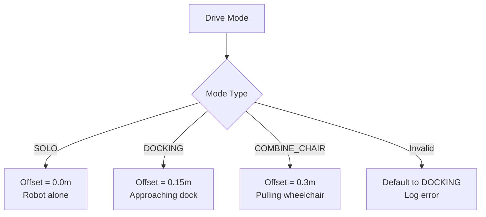
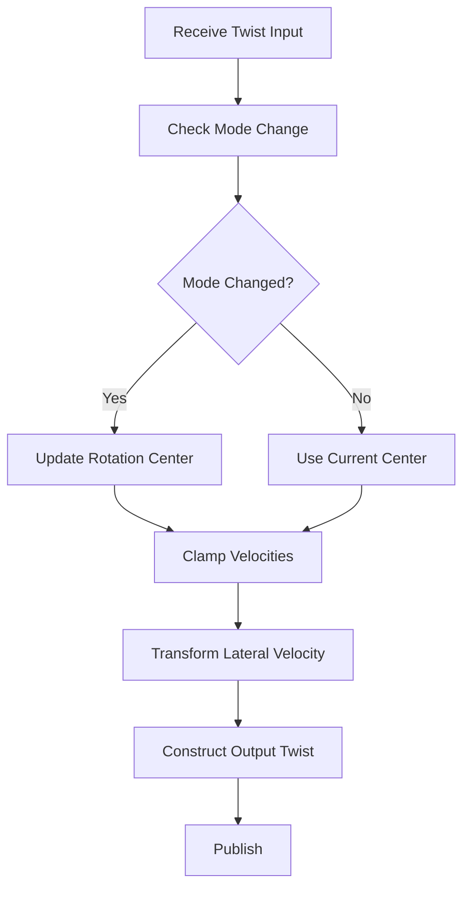
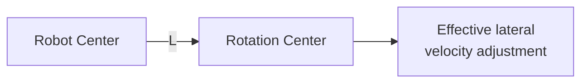

# Navigation Control Transform Implementation (src/nav_control/src/nav_control.cpp)

## Overview

This file implements velocity transformation for different drive modes of a mecanum-wheel robot. It adjusts the rotation center by modifying lateral velocity based on the current drive configuration (SOLO, DOCKING, COMBINE_CHAIR), enabling precise control during various operational states.

## Class: Nav_control

**Namespace:** `nav_control`

### Constructor

**Location:** Lines 5-30

**Purpose:** Initialize parameters, mode configuration, and ROS2 communication

#### Parameter Declaration (Lines 8-21)
```cpp
this->declare_parameter<std::string>("input_topic", "input_topic");
this->declare_parameter<std::string>("output_topic", "output_topic");
this->declare_parameter<std::string>("mode_drive", "DOCKING");
this->declare_parameter<float>("LENGTH_ROTATION_CENTER_SOLO", 0.0);
this->declare_parameter<float>("LENGTH_ROTATION_CENTER_DOCKING", 0.15);
this->declare_parameter<float>("LENGTH_ROTATION_CENTER_COMBINE_CHAIR", 0.3);
```

**Parameters:**
- `input_topic`: Input velocity command topic
- `output_topic`: Transformed velocity output topic
- `mode_drive`: Current drive mode (SOLO, DOCKING, COMBINE_CHAIR)
- `LENGTH_ROTATION_CENTER_SOLO`: Rotation center offset for solo mode (default: 0.0m)
- `LENGTH_ROTATION_CENTER_DOCKING`: Rotation center offset for docking mode (default: 0.15m)
- `LENGTH_ROTATION_CENTER_COMBINE_CHAIR`: Rotation center offset for combined chair mode (default: 0.3m)

#### Subscription/Publication (Lines 25-28)
```cpp
cmd_vel_sub = this->create_subscription<geometry_msgs::msg::Twist>(input_topic, 1,
                    std::bind(&Nav_control::cmd_velCallback, this, std::placeholders::_1));

cmd_vel_pub = this->create_publisher<geometry_msgs::msg::Twist>(output_topic, 1);
```

## Rotation Center Calculation

### rotationCenter()

**Location:** Lines 32-47

**Purpose:** Determine rotation center offset based on drive mode

```cpp
float Nav_control::rotationCenter(std::string mode_drive)
{
    if (mode_drive== "SOLO")
        LENGTH_ROTATION_CENTER = LENGTH_ROTATION_CENTER_SOLO;
    else if (mode_drive== "DOCKING")
        LENGTH_ROTATION_CENTER = LENGTH_ROTATION_CENTER_DOCKING;
    else if (mode_drive== "COMBINE_CHAIR")
        LENGTH_ROTATION_CENTER = LENGTH_ROTATION_CENTER_COMBINE_CHAIR;
    else
    {
        LENGTH_ROTATION_CENTER = LENGTH_ROTATION_CENTER_DOCKING;
        RCLCPP_ERROR_STREAM(rclcpp::get_logger("ERROR"), "Drive mode invalid.");
    }

    return LENGTH_ROTATION_CENTER;
}
```

**Drive Modes:**



**Rotation Center Offset Explanation:**
- **SOLO (0.0m):** Rotation at robot's geometric center
- **DOCKING (0.15m):** Rotation center shifted for docking approach
- **COMBINE_CHAIR (0.3m):** Rotation center shifted to accommodate attached wheelchair

## Velocity Clamping

### clamp_velocity()

**Location:** Lines 50-54

**Purpose:** Limit velocity to maximum safe speed

```cpp
double Nav_control::clamp_velocity(double value)
{
    if (value == 0.0) return 0.0;
    return std::max(-max_speed, std::min(max_speed, value));
}
```

**Behavior:**
- Zero velocities pass through unchanged
- Non-zero values clamped to `[-max_speed, max_speed]`
- Prevents excessive velocities that could damage hardware

## Velocity Command Callback

### cmd_velCallback()

**Location:** Lines 56-88

**Purpose:** Transform input velocity commands based on drive mode

### Processing Pipeline



### Step-by-Step Breakdown

#### 1. Mode Update Check (Lines 62-70)
```cpp
this->get_parameter("mode_drive", mode_drive);
// Check if mode_drive changed
if (previous_mode_drive != mode_drive)
{
    LENGTH_ROTATION_CENTER = Nav_control::rotationCenter(mode_drive);
    previous_mode_drive = mode_drive;

    RCLCPP_INFO_STREAM(rclcpp::get_logger("LENGTH_ROTATION_CENTER: "), mode_drive << ": " << LENGTH_ROTATION_CENTER);
}
```

**Dynamic Mode Switching:**
- Mode parameter read on every callback
- Rotation center updated only when mode changes
- Logs new configuration for debugging

#### 2. Velocity Clamping (Lines 72-74)
```cpp
double x = clamp_velocity(msg->linear.x);
double y = clamp_velocity(msg->linear.y);
double z = clamp_velocity(msg->angular.z);
```

Ensures input velocities are within safe limits

#### 3. Velocity Transformation (Lines 76-78)
```cpp
linear_vel_msg.x = x;
linear_vel_msg.y = (-z * LENGTH_ROTATION_CENTER) + y;
linear_vel_msg.z = 0.0;
```

**Key Transform:**
```
y_out = y_in + (-ω × L)
```

Where:
- `y_out`: Transformed lateral velocity
- `y_in`: Input lateral velocity
- `ω`: Angular velocity (z)
- `L`: Rotation center offset (LENGTH_ROTATION_CENTER)

**Physical Interpretation:**



When rotating, a point offset from the rotation center experiences additional lateral velocity:
- Clockwise rotation (ω > 0) at front → lateral velocity to left (-ω × L)
- Counter-clockwise rotation (ω < 0) → lateral velocity to right

#### 4. Angular Velocity Pass-Through (Lines 80-82)
```cpp
angular_vel_msg.x = 0.0;
angular_vel_msg.y = 0.0;
angular_vel_msg.z = z;
```

Only yaw rotation supported (Z-axis)

#### 5. Publish Transformed Command (Lines 84-87)
```cpp
vel_msg.linear = linear_vel_msg;
vel_msg.angular = angular_vel_msg;

cmd_vel_pub->publish(vel_msg);
```

## Velocity Transform Mathematics

### Example Calculation

**Input:**
```
Linear X: 0.5 m/s  (forward)
Linear Y: 0.2 m/s  (left)
Angular Z: 0.3 rad/s  (counter-clockwise)
Mode: DOCKING (L = 0.15m)
```

**Transform:**
```
x_out = 0.5 m/s  (unchanged)
y_out = 0.2 + (-0.3 × 0.15) = 0.2 - 0.045 = 0.155 m/s
z_out = 0.3 rad/s  (unchanged)
```

**Result:** Rotation center shifted 15cm forward, resulting in reduced leftward velocity

### Rotation Center Visualization

```
        SOLO (L=0.0m)         DOCKING (L=0.15m)    COMBINE_CHAIR (L=0.3m)
              ↓                      ↓                        ↓
        ┌─────────┐            ┌─────────┐              ┌─────────┐
        │  Robot  │            │  Robot  │              │  Robot  │──┐
        │    ×    │            │         │              │         │  │
        └─────────┘            └────×────┘              └─────────×──┤
                                    ↑                              │  │
                               (offset forward)              ┌─────────┤
                                                             │Wheelchair│
                                                             └──────────┘
```

## Main Function

**Location:** Lines 92-98

```cpp
int main(int argc, char *argv[])
{
    rclcpp::init(argc, argv);
    rclcpp::spin(std::make_shared<nav_control::Nav_control>());
    rclcpp::shutdown();
    return 0;
}
```

## Use Cases

### 1. Autonomous Docking
```yaml
nav_control:
  ros__parameters:
    mode_drive: "DOCKING"
    LENGTH_ROTATION_CENTER_DOCKING: 0.15
    input_topic: "cmd_vel_nav"
    output_topic: "cmd_vel"
```

Rotation center shifted forward for precise docking alignment

### 2. Solo Navigation
```yaml
nav_control:
  ros__parameters:
    mode_drive: "SOLO"
    LENGTH_ROTATION_CENTER_SOLO: 0.0
    input_topic: "cmd_vel_nav"
    output_topic: "cmd_vel"
```

Normal rotation at robot center

### 3. Wheelchair Transport
```yaml
nav_control:
  ros__parameters:
    mode_drive: "COMBINE_CHAIR"
    LENGTH_ROTATION_CENTER_COMBINE_CHAIR: 0.3
    input_topic: "cmd_vel_nav"
    output_topic: "cmd_vel"
```

Rotation center behind wheelchair attachment point for stable turning

## Performance Characteristics

### Computational Complexity
- O(1) - constant time operations
- Simple arithmetic transformations
- Negligible CPU overhead

### Latency
- < 0.1ms processing time
- Main latency from ROS2 message transport

## Dependencies

**ROS2 Packages:**
- `rclcpp`: ROS2 C++ client library
- `geometry_msgs`: Twist message type

## Configuration Best Practices

### Determining Rotation Center Offsets

1. **Measure Robot Geometry**
   - Identify attachment points
   - Measure distance from robot center

2. **Test Rotations**
   - Command pure rotation (x=0, y=0, z≠0)
   - Observe actual rotation center
   - Adjust `LENGTH_ROTATION_CENTER` to match desired behavior

3. **Validate Trajectories**
   - Test combined translation and rotation
   - Verify smooth motion without excessive slip

### Safety Considerations

- Set `max_speed` conservatively based on:
  - Robot weight and momentum
  - Mecanum wheel grip limits
  - Obstacle detection reaction time
  - Human safety requirements

## Known Limitations

1. **Hardcoded max_speed**
   - `max_speed` member not declared or initialized in visible code
   - Likely defined in header file
   - Should be configurable parameter

2. **2D Motion Only**
   - No pitch/roll compensation
   - Assumes flat ground

3. **No Acceleration Limiting**
   - Instant velocity changes allowed
   - Could cause wheel slip on sudden commands
   - Consider adding acceleration ramps

4. **Mode Changes During Motion**
   - Instantaneous mode changes may cause jerky motion
   - Consider adding transition smoothing

## Troubleshooting

**Robot rotates around wrong point:**
- Adjust `LENGTH_ROTATION_CENTER_*` parameters
- Verify mode is set correctly
- Check input topic receives correct commands

**Excessive wheel slip:**
- Reduce `max_speed`
- Add acceleration limiting
- Check floor surface and wheel condition

**Mode not changing:**
- Verify parameter updates during runtime
- Check previous_mode_drive initialization
- Monitor log messages for mode changes

**Unexpected lateral drift during rotation:**
- Verify `LENGTH_ROTATION_CENTER` sign (should be positive for forward offset)
- Check mecanum wheel kinematics match expected model
- Calibrate wheel parameters
