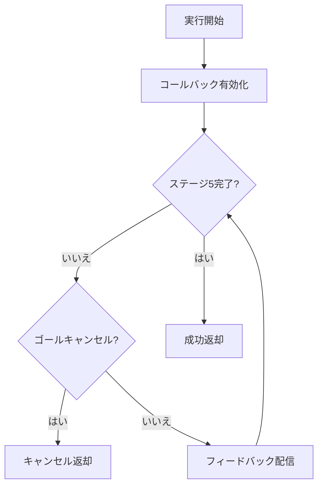
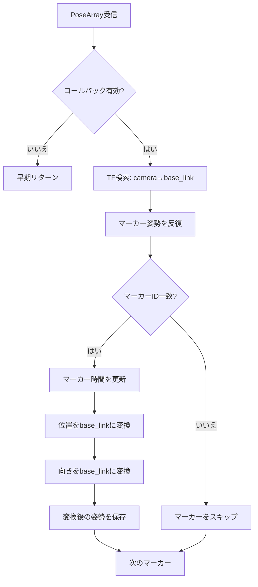
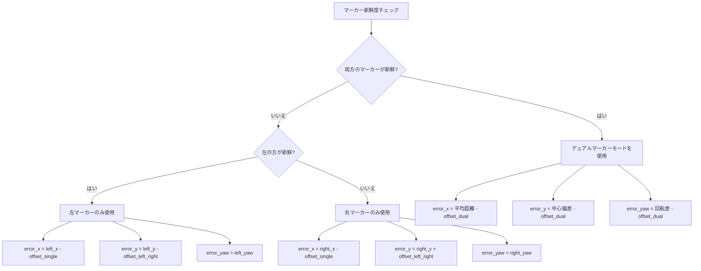
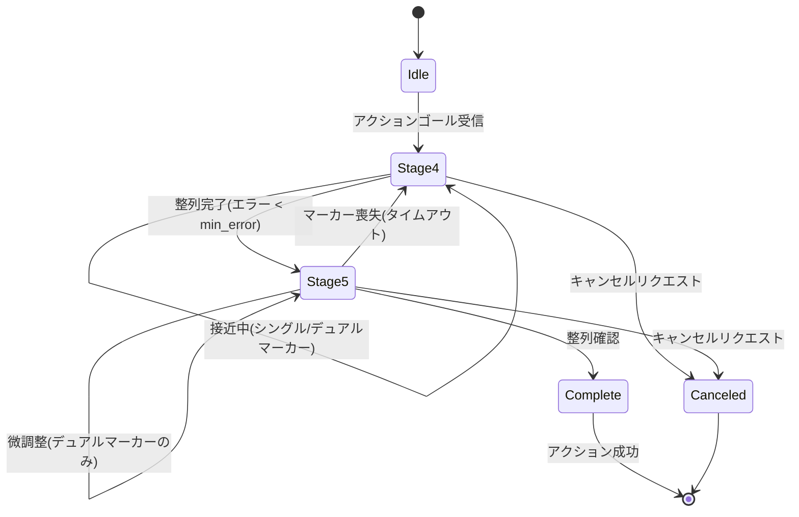

# ナビゲーションドッキング実装 (src/nav_docking/src/nav_docking.cpp)

## 概要

このファイルは、ArUcoマーカー検出を使用した自律ドッキングのためのROS2アクションサーバーを実装します。精度向上のため、単一マーカーと二重マーカー追跡モードの両方をサポートし、PIDフィードバックを使用してターゲットに接近およびドッキングするロボットを制御します。

## クラス: Nav_docking

**名前空間:** `nav_docking`

### コンストラクタ

**位置:** 5~107行目

**目的:** アクションサーバー、パラメータ、TFリスナー、および制御タイマーを初期化

#### アクションサーバー設定 (9~14行目)
```cpp
action_server_ = rclcpp_action::create_server<Dock>(
    this,
    "dock",
    std::bind(&Nav_docking::handle_goal, this, std::placeholders::_1, std::placeholders::_2),
    std::bind(&Nav_docking::handle_cancel, this, std::placeholders::_1),
    std::bind(&Nav_docking::handle_accepted, this, std::placeholders::_1));
```

**アクションタイプ:** `Dock` (カスタムアクションインターフェース)

#### 主要パラメータ (19~83行目)

**フレーム設定:**
```cpp
this->declare_parameter<std::string>("base_frame", "base_link");
this->declare_parameter<std::string>("camera_left_frame", "camera_left_frame");
this->declare_parameter<std::string>("camera_right_frame", "camera_right_frame");
```

**ArUcoマーカーID:**
```cpp
this->declare_parameter<int>("desired_aruco_marker_id_left", -1);
this->declare_parameter<int>("desired_aruco_marker_id_right", -1);
```

**ドッキングオフセット:**
```cpp
this->declare_parameter<float>("aruco_distance_offset", -0.5);          // シングルマーカーモード
this->declare_parameter<float>("aruco_left_right_offset_single", 0);
this->declare_parameter<float>("aruco_distance_offset_dual", 0);        // デュアルマーカーモード
this->declare_parameter<float>("aruco_center_offset_dual", 0);
this->declare_parameter<float>("aruco_rotation_offset_dual", 0);
```

**PIDパラメータ (53~70行目):**
```cpp
this->declare_parameter("pid_parameters.kp_x", 0.00);  // X軸(前後)
this->declare_parameter("pid_parameters.ki_x", 0.00);
this->declare_parameter("pid_parameters.kd_x", 0.00);
this->declare_parameter("pid_parameters.kp_y", 0.00);  // Y軸(左右)
this->declare_parameter("pid_parameters.ki_y", 0.00);
this->declare_parameter("pid_parameters.kd_y", 0.00);
this->declare_parameter("pid_parameters.kp_z", 0.00);  // Z軸(回転)
this->declare_parameter("pid_parameters.ki_z", 0.00);
this->declare_parameter("pid_parameters.kd_z", 0.00);
```

#### タイマー (98~106行目)
```cpp
front_timer_ = this->create_wall_timer(
    period,
    std::bind(&Nav_docking::frontMarkerCmdVelPublisher, this));

dual_timer_ = this->create_wall_timer(
    period,
    std::bind(&Nav_docking::dualMarkerCmdVelPublisher, this));
```

**目的:**
- `front_timer_`: ステージ4ドッキング(接近フェーズ)
- `dual_timer_`: ステージ5ドッキング(精密な二重マーカー整列)

## アクションサーバーハンドラー

### handle_goal()

**位置:** 111~129行目

**目的:** ドッキングリクエストの検証と受け入れ/拒否

```cpp
if (goal->dock_request)
{
    RCLCPP_INFO(this->get_logger(), "Goal accepted.");
    return rclcpp_action::GoalResponse::ACCEPT_AND_EXECUTE;
}
```

### handle_cancel()

**位置:** 131~136行目

**目的:** ゴールのキャンセルを許可

### handle_accepted()

**位置:** 138~142行目

**目的:** 受け入れられたゴールの実行スレッドを生成

```cpp
std::thread{std::bind(&Nav_docking::execute, this, goal_handle)}.detach();
```

### execute()

**位置:** 144~183行目

**目的:** ドッキング進行を監視し、フィードバックを提供



**フィードバックループ (159~173行目):**
```cpp
while (stage_5_docking_status == false){
    if (goal_handle->is_canceling())
    {
        goal_handle->canceled(result);
        Nav_docking::enable_callback = false;
        return;
    }

    feedback->distance = static_cast<double>(feedback_distance);
    goal_handle->publish_feedback(feedback);
}
```

## PIDコントローラ

### calculate()

**位置:** 187~219行目

**目的:** エラー補正のためのPID制御出力を計算

```cpp
double Nav_docking::calculate(double error, double& prev_error,
                           double kp, double ki, double kd, double callback_duration,
                           double max_output, double min_output, double min_error)
```

**アルゴリズム:**

```mermaid
flowchart LR
    A[エラー入力] --> B{|エラー| ≤ min_error?}
    B -->|はい| C[0を返却]
    B -->|いいえ| D[P = kp × エラー]
    D --> E[I = ki × エラー × dt]
    E --> F[D = kd × (エラー - 前回エラー) / dt]
    F --> G[出力 = P + I + D]
    G --> H[±max_outputにクランプ]
    H --> I{|出力| < min_output?}
    I -->|はい| J[±min_outputに設定]
    I -->|いいえ| K[出力を返却]
    J --> K
```

**主要機能:**
1. **デッドゾーン (192~194行目):** エラーが`min_error`閾値内の場合は0を返却
2. **積分項 (197行目):** `error × dt` (アンチワインドアップなし、潜在的な問題)
3. **微分項 (200行目):** `(error - prev_error) / dt`
4. **出力クランプ (206~211行目):** `[-max_output, max_output]`に制限
5. **最小出力 (214~216行目):** 静止摩擦を克服するための最小駆動を保証

## マーカー処理

### extractMarkerIds()

**位置:** 221~238行目

**目的:** 正規表現を使用してframe_idからマーカーIDを解析

```cpp
std::regex marker_id_regex("aruco_marker_(\\d+)");
std::smatch match;

if (std::regex_search(frame_id, match, marker_id_regex) && match.size() > 1)
{
    marker_id = std::stoi(match[1].str());
}
```

**例:** `"aruco_marker_23"` → `23`

### arucoPoseLeftCallback() / arucoPoseRightCallback()

**位置:** 240~297行目(左)、299~356行目(右)

**目的:** 左右カメラからのArUcoマーカー検出を処理

#### 処理パイプライン



#### 変換計算 (例: 左カメラ、266~286行目)

```cpp
// camera-to-base_link変換を取得
cameraToBase_link = tf_buffer_->lookupTransform(base_frame, camera_left_frame, ...);

// カメラ変換コンポーネントを抽出
tf2::Quaternion camera_q(...)
tf2::Transform camera_transform(camera_q, tf2::Vector3(...));

// マーカー位置を変換
tf2::Vector3 marker_t(marker_tx, marker_ty, marker_tz);
left_transformed_marker_t = camera_transform * marker_t;

// 向きを結合
tf2::Quaternion marker_q(marker_rx, marker_ry, marker_rz, marker_rw);
tf2::Quaternion combined_q = camera_q * marker_q;
tf2::Matrix3x3(final_q).getRPY(left_roll, left_pitch, left_yaw);
```

**保存データ:**
- `left_transformed_marker_t`: base_linkフレームでの位置
- `left_yaw`: マーカーの向き(ヨー角)
- `marker_time_left`: 新鮮度チェック用のタイムスタンプ

## ドッキング制御

### frontMarkerCmdVelPublisher()

**位置:** 358~474行目

**目的:** ステージ4ドッキング - 単一または二重マーカーを使用してターゲットに接近

#### マーカー選択ロジック (379~425行目)



**デュアルマーカー計算 (381~392行目):**
```cpp
double distance = (left_marker_x) + (right_marker_x) / 2;        // 平均距離
double rotation = (right_marker_x - left_marker_x);              // X差分からの回転
double center = (left_marker_y - -right_marker_y);               // 横方向中心

error_x = distance - aruco_distance_offset;
error_y = center - aruco_center_offset_dual;
error_yaw = rotation - aruco_rotation_offset_dual;
```

#### 整列戦略 (430~446行目)

```cpp
if (fabs(error_y) < min_y_error)  // ロボット整列?
{
    // 前進 + 横調整 + 回転
    twist_msg.linear.x = calculate(error_x, ...);
    twist_msg.linear.y = calculate(error_y, ...);
    twist_msg.angular.z = calculate(error_yaw, ...);
}
else  // 非整列
{
    // 前進停止、整列のみ
    twist_msg.linear.x = 0;
    twist_msg.linear.y = calculate(error_y, ...);
    twist_msg.angular.z = calculate(error_yaw, ...);
}
```

**安全性:** 横方向と回転の整列が達成されるまで前進動作を停止

#### ステージ遷移 (449~461行目)

```cpp
if (fabs(error_x) > min_error || fabs(error_y) > min_y_error || fabs(error_yaw > min_error))
{
    cmd_vel_pub->publish(twist_msg);
    stage_4_docking_status = false;  // まだ接近中
}
else
{
    // すべてのエラーが閾値内
    twist_msg = {0, 0, 0};
    cmd_vel_pub->publish(twist_msg);
    stage_4_docking_status = true;  // ステージ5に進む
}
```

### dualMarkerCmdVelPublisher()

**位置:** 476~563行目

**目的:** ステージ5ドッキング - 二重マーカー必須の精密最終位置決め

#### 要件 (490行目)
```cpp
if (stage_4_docking_status == true)  // ステージ4完了後のみ実行
```

#### リセット条件 (493~494行目)
```cpp
if (callback_duration_dual > docking_reset_threshold_sec)
    stage_4_docking_status = false;  // マーカー喪失、ステージ4に戻る
```

#### デュアルマーカー処理 (497~509行目)

**ステージ4と同じ二重マーカーエラー計算**

#### 完了確認 (534~553行目)

```cpp
if (fabs(error_dist) > min_docking_error || ...)
{
    // まだ調整中
    cmd_vel_pub->publish(twist_msg);
    stage_5_docking_status = false;
    confirmed_docking_status = false;
}
else
{
    // すべてのエラーが厳密な閾値内
    twist_msg = {0, 0, 0};
    cmd_vel_pub->publish(twist_msg);

    if (confirmed_docking_status == true)
    {
        stage_5_docking_status = true;  // ドッキング完了
    }
    else
    {
        confirmed_docking_status = true;
        rate.sleep();  // 確認のため0.5秒待機
    }
}
```

**2回チェック確認:** 偽陽性を防ぐため、2回連続の成功反復を要求

## ドッキングステートマシン



## メイン関数

**位置:** 566~572行目

```cpp
int main(int argc, char *argv[])
{
    rclcpp::init(argc, argv);
    rclcpp::spin(std::make_shared<nav_docking::Nav_docking>());
    rclcpp::shutdown();
    return 0;
}
```

## パフォーマンスに関する考慮事項

### 計算量
- **コールバックごと:** O(n) ここでn = 検出されたマーカー数(通常1~2)
- **TFルックアップ:** O(1) キャッシュ済み
- **PID計算:** O(1)

### タイミング特性
- **制御レート:** `publish_rate`で設定可能(98行目に基づくデフォルトは約30Hz)
- **マーカータイムアウト:** `marker_delay_threshold_sec`(非表示、おそらく0.5~1.0秒)
- **ドッキングリセット:** `docking_reset_threshold_sec`(非表示)

## 依存関係

**ROS2パッケージ:**
- `rclcpp`: コアROS2 C++ライブラリ
- `rclcpp_action`: アクションサーバーサポート
- `geometry_msgs`: Twist、PoseArray、TransformStamped
- `tf2_ros`: 変換リスナー
- `tf2_geometry_msgs`: ジオメトリメッセージ変換

## 既知の制限事項

1. **積分アンチワインドアップなし** (197行目)
   - 積分項が無期限に蓄積
   - 長時間のエラー後にオーバーシュートを引き起こす可能性
   - 解決策: 積分クランプまたはリセットを追加

2. **タイミング定数のハードコード**
   - `marker_delay_threshold_sec`、`docking_reset_threshold_sec`が見えない
   - 設定可能なパラメータにすべき

3. **デュアルマーカー計算** (387~389行目)
   - 対称マーカー配置を仮定
   - X差分からの`rotation`はすべてのジオメトリで機能しない可能性

4. **速度スムージングなし**
   - 瞬時のPID出力変化がジャークを引き起こす可能性
   - 加速度制限の追加を検討

## トラブルシューティング

**ロボットが接近しない:**
- ArUcoマーカー検出を確認(`marker_topic_left`、`marker_topic_right`)
- マーカーIDが`desired_aruco_marker_id_*`と一致することを確認
- PIDゲインを確認(特に`kp_x`)

**接近中の振動:**
- 微分ゲインを減少(`kd_*`)
- `min_error`デッドゾーンを増加
- TFジッタを確認

**ステージ5を完了できない:**
- 両方のマーカーが見えることを確認
- `min_docking_error`閾値を減少
- デュアルマーカーオフセットキャリブレーションを確認

**アクションが完了しない:**
- `stage_4_docking_status`と`stage_5_docking_status`を監視
- マーカー可視性喪失を確認
- 確認ロジックを検証(0.5秒スリープ)
