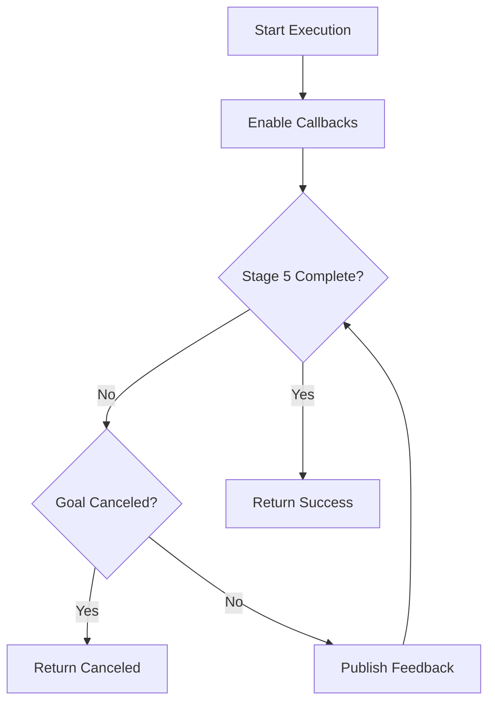
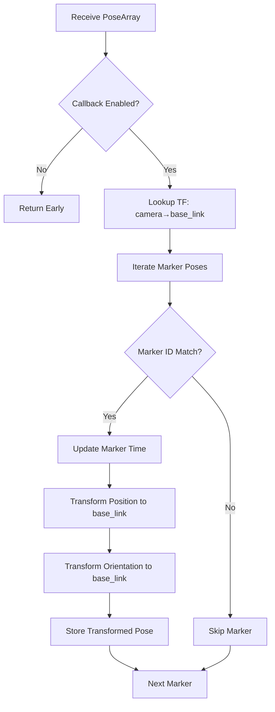
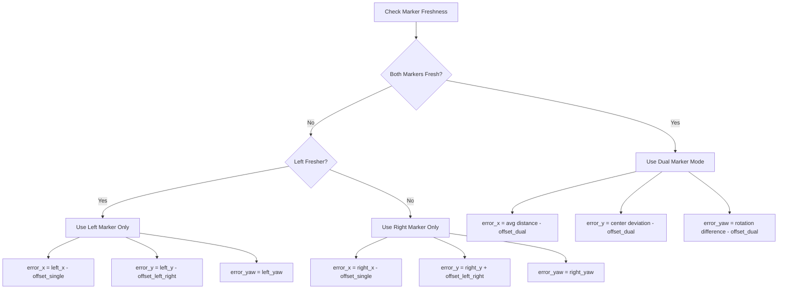
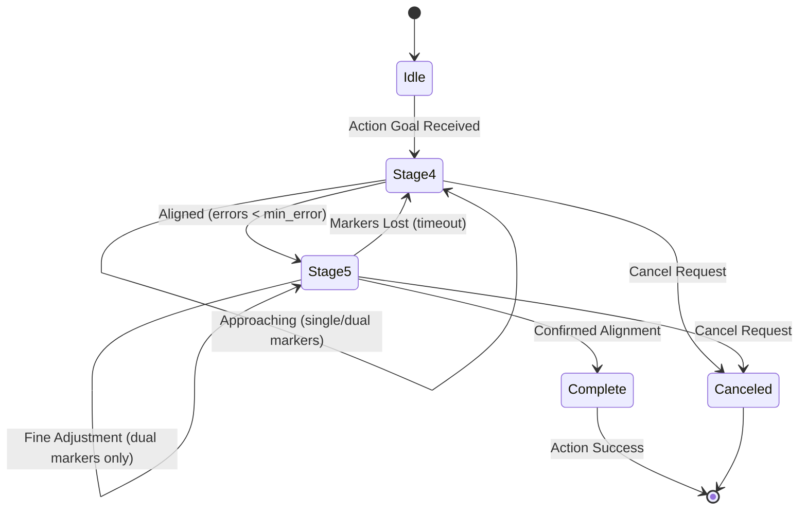

# Navigation Docking Implementation (src/nav_docking/src/nav_docking.cpp)

## Overview

This file implements a ROS2 Action Server for autonomous docking using ArUco marker detection. It controls the robot using PID feedback to approach and dock with a target, supporting both single-marker and dual-marker tracking modes for increased precision.

## Class: Nav_docking

**Namespace:** `nav_docking`

### Constructor

**Location:** Lines 5-107

**Purpose:** Initialize action server, parameters, TF listener, and control timers

#### Action Server Setup (Lines 9-14)
```cpp
action_server_ = rclcpp_action::create_server<Dock>(
    this,
    "dock",
    std::bind(&Nav_docking::handle_goal, this, std::placeholders::_1, std::placeholders::_2),
    std::bind(&Nav_docking::handle_cancel, this, std::placeholders::_1),
    std::bind(&Nav_docking::handle_accepted, this, std::placeholders::_1));
```

**Action Type:** `Dock` (custom action interface)

#### Key Parameters (Lines 19-83)

**Frame Configuration:**
```cpp
this->declare_parameter<std::string>("base_frame", "base_link");
this->declare_parameter<std::string>("camera_left_frame", "camera_left_frame");
this->declare_parameter<std::string>("camera_right_frame", "camera_right_frame");
```

**ArUco Marker IDs:**
```cpp
this->declare_parameter<int>("desired_aruco_marker_id_left", -1);
this->declare_parameter<int>("desired_aruco_marker_id_right", -1);
```

**Docking Offsets:**
```cpp
this->declare_parameter<float>("aruco_distance_offset", -0.5);          // Single marker mode
this->declare_parameter<float>("aruco_left_right_offset_single", 0);
this->declare_parameter<float>("aruco_distance_offset_dual", 0);        // Dual marker mode
this->declare_parameter<float>("aruco_center_offset_dual", 0);
this->declare_parameter<float>("aruco_rotation_offset_dual", 0);
```

**PID Parameters (Lines 53-70):**
```cpp
this->declare_parameter("pid_parameters.kp_x", 0.00);  // X-axis (forward/back)
this->declare_parameter("pid_parameters.ki_x", 0.00);
this->declare_parameter("pid_parameters.kd_x", 0.00);
this->declare_parameter("pid_parameters.kp_y", 0.00);  // Y-axis (left/right)
this->declare_parameter("pid_parameters.ki_y", 0.00);
this->declare_parameter("pid_parameters.kd_y", 0.00);
this->declare_parameter("pid_parameters.kp_z", 0.00);  // Z-axis (rotation)
this->declare_parameter("pid_parameters.ki_z", 0.00);
this->declare_parameter("pid_parameters.kd_z", 0.00);
```

#### Timers (Lines 98-106)
```cpp
front_timer_ = this->create_wall_timer(
    period,
    std::bind(&Nav_docking::frontMarkerCmdVelPublisher, this));

dual_timer_ = this->create_wall_timer(
    period,
    std::bind(&Nav_docking::dualMarkerCmdVelPublisher, this));
```

**Purpose:**
- `front_timer_`: Stage 4 docking (approach phase)
- `dual_timer_`: Stage 5 docking (precise dual-marker alignment)

## Action Server Handlers

### handle_goal()

**Location:** Lines 111-129

**Purpose:** Validate and accept/reject incoming dock requests

```cpp
if (goal->dock_request)
{
    RCLCPP_INFO(this->get_logger(), "Goal accepted.");
    return rclcpp_action::GoalResponse::ACCEPT_AND_EXECUTE;
}
```

### handle_cancel()

**Location:** Lines 131-136

**Purpose:** Allow goal cancellation

### handle_accepted()

**Location:** Lines 138-142

**Purpose:** Spawn execution thread for accepted goal

```cpp
std::thread{std::bind(&Nav_docking::execute, this, goal_handle)}.detach();
```

### execute()

**Location:** Lines 144-183

**Purpose:** Monitor docking progress and provide feedback



**Feedback Loop (Lines 159-173):**
```cpp
while (stage_5_docking_status == false){
    if (goal_handle->is_canceling())
    {
        goal_handle->canceled(result);
        Nav_docking::enable_callback = false;
        return;
    }

    feedback->distance = static_cast<double>(feedback_distance);
    goal_handle->publish_feedback(feedback);
}
```

## PID Controller

### calculate()

**Location:** Lines 187-219

**Purpose:** Compute PID control output for error correction

```cpp
double Nav_docking::calculate(double error, double& prev_error,
                           double kp, double ki, double kd, double callback_duration,
                           double max_output, double min_output, double min_error)
```

**Algorithm:**

```mermaid
flowchart LR
    A[Error Input] --> B{|error| ≤ min_error?}
    B -->|Yes| C[Return 0]
    B -->|No| D[P = kp × error]
    D --> E[I = ki × error × dt]
    E --> F[D = kd × (error - prev_error) / dt]
    F --> G[Output = P + I + D]
    G --> H[Clamp to ±max_output]
    H --> I{|output| < min_output?}
    I -->|Yes| J[Set to ±min_output]
    I -->|No| K[Return Output]
    J --> K
```

**Key Features:**
1. **Dead Zone (Lines 192-194):** Returns 0 if error within `min_error` threshold
2. **Integral Term (Line 197):** `error × dt` (no anti-windup, potential issue)
3. **Derivative Term (Line 200):** `(error - prev_error) / dt`
4. **Output Clamping (Lines 206-211):** Limits to `[-max_output, max_output]`
5. **Minimum Output (Lines 214-216):** Ensures minimum actuation to overcome static friction

## Marker Processing

### extractMarkerIds()

**Location:** Lines 221-238

**Purpose:** Parse marker ID from frame_id using regex

```cpp
std::regex marker_id_regex("aruco_marker_(\\d+)");
std::smatch match;

if (std::regex_search(frame_id, match, marker_id_regex) && match.size() > 1)
{
    marker_id = std::stoi(match[1].str());
}
```

**Example:** `"aruco_marker_23"` → `23`

### arucoPoseLeftCallback() / arucoPoseRightCallback()

**Location:** Lines 240-297 (left), 299-356 (right)

**Purpose:** Process ArUco marker detections from left and right cameras

#### Processing Pipeline



#### Transform Calculation (Example: Left Camera, Lines 266-286)

```cpp
// Get camera-to-base_link transform
cameraToBase_link = tf_buffer_->lookupTransform(base_frame, camera_left_frame, ...);

// Extract camera transform components
tf2::Quaternion camera_q(...)
tf2::Transform camera_transform(camera_q, tf2::Vector3(...));

// Transform marker position
tf2::Vector3 marker_t(marker_tx, marker_ty, marker_tz);
left_transformed_marker_t = camera_transform * marker_t;

// Combine orientations
tf2::Quaternion marker_q(marker_rx, marker_ry, marker_rz, marker_rw);
tf2::Quaternion combined_q = camera_q * marker_q;
tf2::Matrix3x3(final_q).getRPY(left_roll, left_pitch, left_yaw);
```

**Stored Data:**
- `left_transformed_marker_t`: Position in base_link frame
- `left_yaw`: Marker orientation (yaw angle)
- `marker_time_left`: Timestamp for freshness check

## Docking Control

### frontMarkerCmdVelPublisher()

**Location:** Lines 358-474

**Purpose:** Stage 4 docking - approach target using single or dual markers

#### Marker Selection Logic (Lines 379-425)



**Dual Marker Calculations (Lines 381-392):**
```cpp
double distance = (left_marker_x) + (right_marker_x) / 2;        // Average distance
double rotation = (right_marker_x - left_marker_x);              // Rotation from X-difference
double center = (left_marker_y - -right_marker_y);               // Lateral center

error_x = distance - aruco_distance_offset;
error_y = center - aruco_center_offset_dual;
error_yaw = rotation - aruco_rotation_offset_dual;
```

#### Alignment Strategy (Lines 430-446)

```cpp
if (fabs(error_y) < min_y_error)  // Robot aligned?
{
    // Move forward + adjust lateral + rotate
    twist_msg.linear.x = calculate(error_x, ...);
    twist_msg.linear.y = calculate(error_y, ...);
    twist_msg.angular.z = calculate(error_yaw, ...);
}
else  // Not aligned
{
    // Stop forward motion, only align
    twist_msg.linear.x = 0;
    twist_msg.linear.y = calculate(error_y, ...);
    twist_msg.angular.z = calculate(error_yaw, ...);
}
```

**Safety:** Stops forward motion until lateral and rotational alignment achieved

#### Stage Transition (Lines 449-461)

```cpp
if (fabs(error_x) > min_error || fabs(error_y) > min_y_error || fabs(error_yaw > min_error))
{
    cmd_vel_pub->publish(twist_msg);
    stage_4_docking_status = false;  // Still approaching
}
else
{
    // All errors within threshold
    twist_msg = {0, 0, 0};
    cmd_vel_pub->publish(twist_msg);
    stage_4_docking_status = true;  // Proceed to Stage 5
}
```

### dualMarkerCmdVelPublisher()

**Location:** Lines 476-563

**Purpose:** Stage 5 docking - precise final positioning with dual markers required

#### Requirements (Line 490)
```cpp
if (stage_4_docking_status == true)  // Only run after Stage 4 complete
```

#### Reset Condition (Lines 493-494)
```cpp
if (callback_duration_dual > docking_reset_threshold_sec)
    stage_4_docking_status = false;  // Lost markers, return to Stage 4
```

#### Dual Marker Processing (Lines 497-509)

**Same dual-marker error calculations as Stage 4**

#### Completion Confirmation (Lines 534-553)

```cpp
if (fabs(error_dist) > min_docking_error || ...)
{
    // Still adjusting
    cmd_vel_pub->publish(twist_msg);
    stage_5_docking_status = false;
    confirmed_docking_status = false;
}
else
{
    // All errors within tight threshold
    twist_msg = {0, 0, 0};
    cmd_vel_pub->publish(twist_msg);

    if (confirmed_docking_status == true)
    {
        stage_5_docking_status = true;  // DOCKING COMPLETE
    }
    else
    {
        confirmed_docking_status = true;
        rate.sleep();  // Wait 0.5s for confirmation
    }
}
```

**Two-Check Confirmation:** Requires two consecutive successful iterations to prevent false positives

## Docking State Machine



## Main Function

**Location:** Lines 566-572

```cpp
int main(int argc, char *argv[])
{
    rclcpp::init(argc, argv);
    rclcpp::spin(std::make_shared<nav_docking::Nav_docking>());
    rclcpp::shutdown();
    return 0;
}
```

## Performance Considerations

### Computational Complexity
- **Per callback:** O(n) where n = number of detected markers (typically 1-2)
- **TF lookups:** O(1) cached
- **PID calculations:** O(1)

### Timing Characteristics
- **Control rate:** Configurable via `publish_rate` (default appears to be ~30Hz based on line 98)
- **Marker timeout:** `marker_delay_threshold_sec` (not shown, likely 0.5-1.0s)
- **Docking reset:** `docking_reset_threshold_sec` (not shown)

## Dependencies

**ROS2 Packages:**
- `rclcpp`: Core ROS2 C++ library
- `rclcpp_action`: Action server support
- `geometry_msgs`: Twist, PoseArray, TransformStamped
- `tf2_ros`: Transform listener
- `tf2_geometry_msgs`: Geometry message transforms

## Known Limitations

1. **No Integral Anti-Windup** (Line 197)
   - Integral term accumulates indefinitely
   - Can cause overshoot after prolonged errors
   - Solution: Add integral clamping or reset

2. **Hardcoded Timing Constants**
   - `marker_delay_threshold_sec`, `docking_reset_threshold_sec` not visible
   - Should be configurable parameters

3. **Dual Marker Calculation** (Lines 387-389)
   - Assumes symmetric marker placement
   - `rotation` from X-difference may not work for all geometries

4. **No Velocity Smoothing**
   - Instant PID output changes can cause jerk
   - Consider adding acceleration limits

## Troubleshooting

**Robot doesn't approach:**
- Check ArUco marker detection (`marker_topic_left`, `marker_topic_right`)
- Verify marker IDs match `desired_aruco_marker_id_*`
- Check PID gains (especially `kp_x`)

**Oscillation during approach:**
- Reduce derivative gains (`kd_*`)
- Increase `min_error` dead zone
- Check for TF jitter

**Cannot complete Stage 5:**
- Ensure both markers visible
- Reduce `min_docking_error` threshold
- Check dual marker offset calibration

**Action never completes:**
- Monitor `stage_4_docking_status` and `stage_5_docking_status`
- Check for marker visibility loss
- Verify confirmation logic (0.5s sleep)
