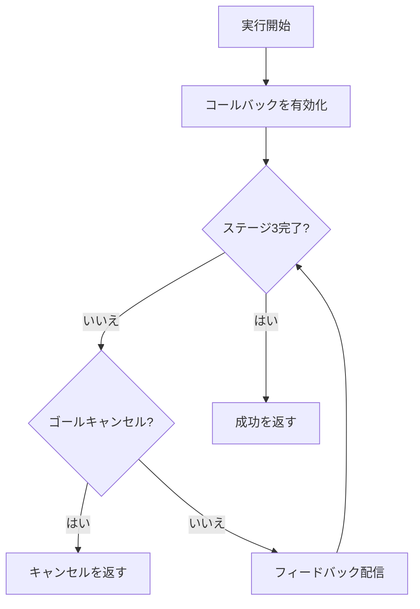
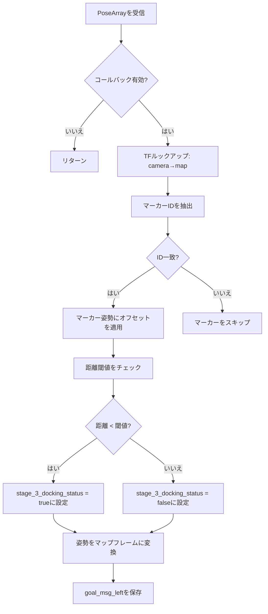
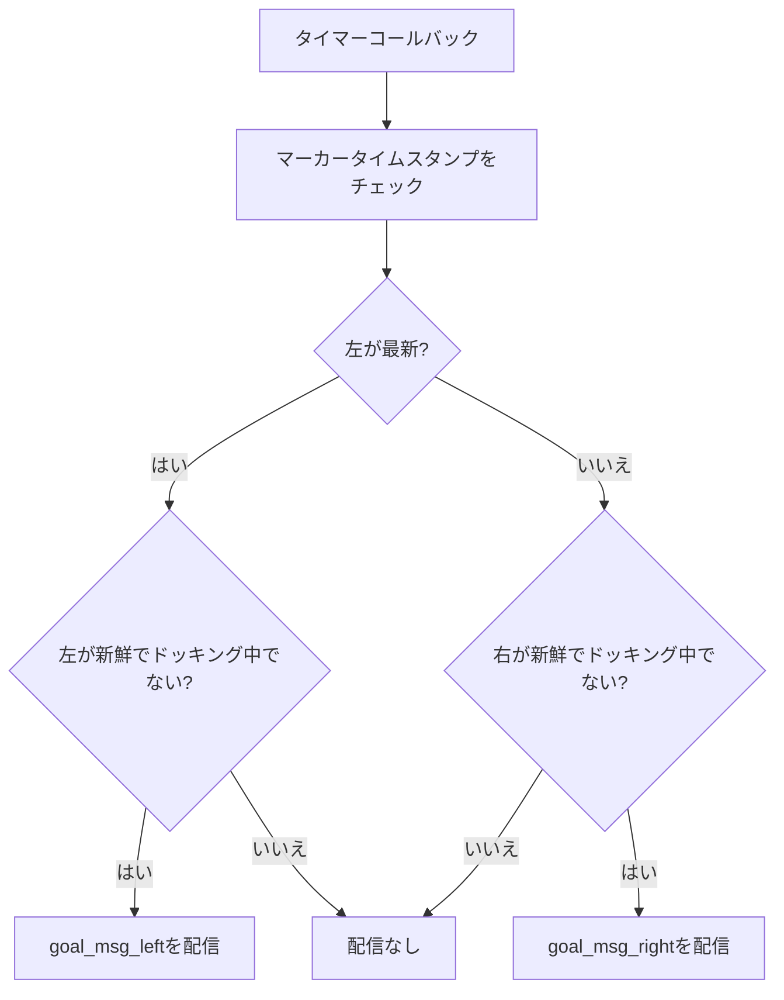
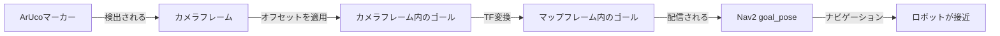
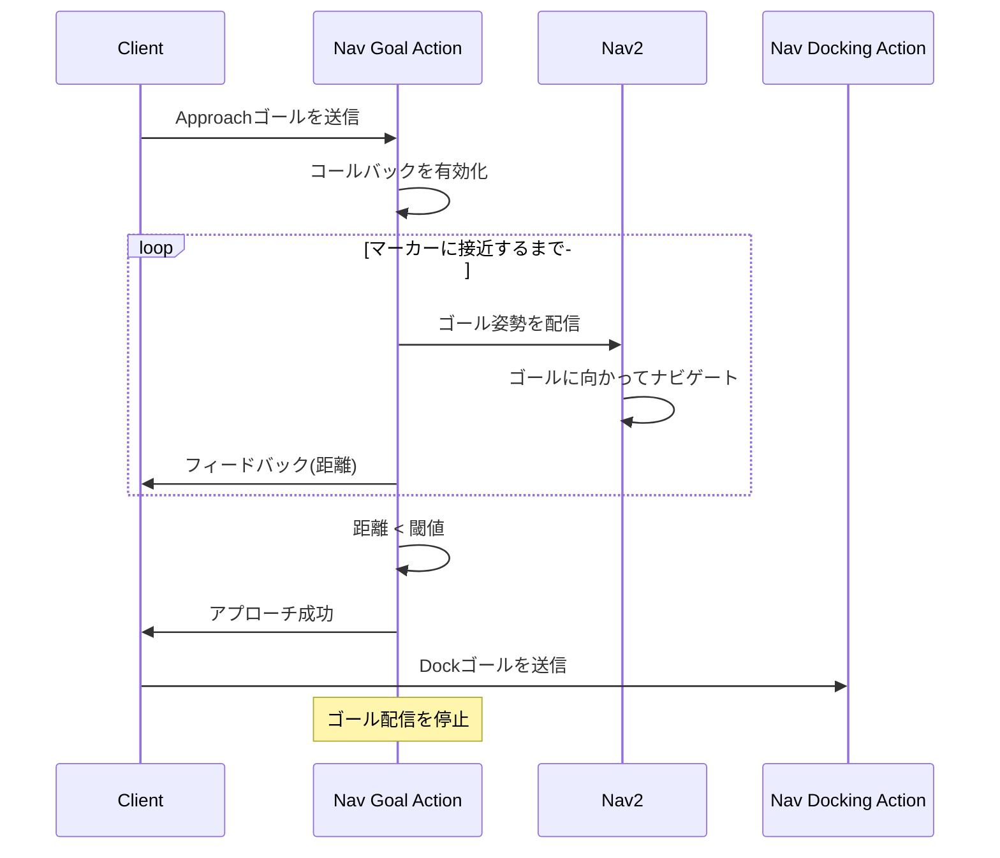

# ナビゲーションゴール実装 (src/nav_goal/src/nav_goal.cpp)

## 概要

このファイルは、ArUcoマーカー検出を使用した自律アプローチ動作のためのROS2アクションサーバーを実装します。ロボットをターゲットマーカーに向けて誘導するためにNav2にゴール姿勢を配信し、閾値距離内に入るとドッキング動作に移行します。

## クラス: Nav_goal

**名前空間:** `nav_goal`

### コンストラクタ

**位置:** 5-60行

**目的:** アクションサーバー、パラメータ、TFリスナー、ゴールパブリッシャーの初期化

#### アクションサーバーのセットアップ (9-14行)
```cpp
action_server_ = rclcpp_action::create_server<Approach>(
    this,
    "approach",
    std::bind(&Nav_goal::handle_goal, this, std::placeholders::_1, std::placeholders::_2),
    std::bind(&Nav_goal::handle_cancel, this, std::placeholders::_1),
    std::bind(&Nav_goal::handle_accepted, this, std::placeholders::_1));
```

**アクション型:** `Approach` (カスタムアクションインターフェース)

#### 主要パラメータ (18-37行)

**フレーム設定:**
```cpp
this->declare_parameter<std::string>("map_frame", "map");
this->declare_parameter<std::string>("camera_front_left_frame", "camera_rgb_frame");
this->declare_parameter<std::string>("camera_front_right_frame", "camera_rgb_frame");
```

**マーカー設定:**
```cpp
this->declare_parameter<int>("desired_aruco_marker_id_left", -1);
this->declare_parameter<int>("desired_aruco_marker_id_right", -1);
this->declare_parameter<float>("aruco_distance_offset", -0.5);
this->declare_parameter<float>("aruco_left_right_offset", 0);
```

**トピック設定:**
```cpp
this->declare_parameter<std::string>("marker_topic_front_left", "aruco_detect/markers_front");
this->declare_parameter<std::string>("marker_topic_front_right", "aruco_detect/markers_front");
```

#### パブリッシャーのセットアップ (53行)
```cpp
goal_pub = this->create_publisher<geometry_msgs::msg::PoseStamped>("goal_pose", 10);
```

Nav2ナビゲーションスタックにゴールを配信します

#### タイマー (55-59行)
```cpp
front_timer = this->create_wall_timer(
    period,
    std::bind(&Nav_goal::frontMarkerGoalPublisher, this));
```

マーカー検出に基づいてゴール更新を定期的に配信します

## アクションサーバーハンドラ

### handle_goal()

**位置:** 64-82行

**目的:** アプローチリクエストの検証と承認/拒否

```cpp
if (goal->approach_request)
{
    RCLCPP_INFO(this->get_logger(), "Goal accepted.");
    return rclcpp_action::GoalResponse::ACCEPT_AND_EXECUTE;
}
```

### handle_cancel()

**位置:** 84-89行

**目的:** ゴールのキャンセルを許可

### handle_accepted()

**位置:** 91-95行

**目的:** 実行スレッドの生成

```cpp
std::thread{std::bind(&Nav_goal::execute, this, goal_handle)}.detach();
```

### execute()

**位置:** 97-134行

**目的:** アプローチの進行状況を監視し、ドッキングに移行



**フィードバックループ (110-124行):**
```cpp
while (stage_3_docking_status == false){
    if (goal_handle->is_canceling())
    {
        goal_handle->canceled(result);
        Nav_goal::enable_callback = false;
        return;
    }

    feedback->wheelchair_distance = static_cast<double>(goal_distance_threshold);
    goal_handle->publish_feedback(feedback);
}
```

**完了:**
- ロボットがマーカーの`goal_distance_threshold`内に入るまで待機
- 成功を返し、ドッキングアクションを開始できるようにします

## マーカー処理

### extractMarkerIds()

**位置:** 139-159行

**目的:** 正規表現を使用してPoseArrayヘッダーからマーカーIDを解析

```cpp
std::regex marker_id_regex("aruco_marker_(\\d+)");
std::smatch match;

if (std::regex_search(frame_id, match, marker_id_regex) && match.size() > 1)
{
    marker_id = std::stoi(match[1].str());
}
```

**例:** `"aruco_marker_23"` → `23`

## ArUco姿勢コールバック

### arucoPoseCallbackLeft()

**位置:** 161-244行

**目的:** 左カメラのマーカー検出を処理し、Nav2ゴールを生成

#### 処理パイプライン



#### 変換計算 (203-233行)

```cpp
// マーカー位置にオフセットを適用(カメラフレーム)
double marker_tx = msg->poses[i].position.x + aruco_distance_offset;
double marker_ty = msg->poses[i].position.y + aruco_left_right_offset;
double marker_tz = msg->poses[i].position.z;

// カメラからマップへの変換を取得
cameraToMap = tf_buffer_->lookupTransform(map_frame, camera_front_left_frame, ...);

// マップフレームに変換
tf2::Transform camera_transform(camera_q, tf2::Vector3(...));
tf2::Vector3 marker_t(marker_tx, marker_ty, marker_tz);
tf2::Vector3 transformed_marker_t = camera_transform * marker_t;

// ゴール位置を設定
goal_msg_left.pose.position.x = transformed_marker_t.x();
goal_msg_left.pose.position.y = transformed_marker_t.y();
goal_msg_left.pose.position.z = transformed_marker_t.z();

// 姿勢を結合
tf2::Quaternion marker_q(marker_rx, marker_ry, marker_rz, marker_rw);
tf2::Quaternion final_q = camera_q * marker_q;
goal_msg_left.pose.orientation = final_q;
```

**重要なポイント:**
1. **カメラフレームでオフセットを適用:** マーカーからオフセットされた位置にゴールを配置
2. **マップへの変換:** Nav2用にグローバルマップフレームでゴールを表現
3. **姿勢の保持:** マーカーの姿勢をカメラの姿勢と結合

#### 距離閾値チェック (190-197行)

```cpp
if (marker_tx < goal_distance_threshold)
{
    stage_3_docking_status = true;  // 十分に接近、ドッキングをトリガー
}
else
{
    stage_3_docking_status = false;  // ナビゲーションを継続
}
```

**目的:** ゴールの配信を停止してドッキングアクションに切り替えるタイミングを決定

### arucoPoseCallbackRight()

**位置:** 246-329行

**目的:** 右カメラのマーカー検出を処理(左カメラのロジックを反映)

**違い:** 反対の横方向オフセットを適用
```cpp
double marker_ty = msg->poses[i].position.y - aruco_left_right_offset;  // 注: プラスではなくマイナス
```

## ゴール配信

### frontMarkerGoalPublisher()

**位置:** 331-364行

**目的:** 最新のマーカーゴールを選択してNav2に配信



#### マーカー選択ロジック (344-363行)

```cpp
if (callback_duration_left < callback_duration_right &&
    callback_duration_left < marker_delay_threshold_sec &&
    stage_3_docking_status == false)
{
    goal_pub->publish(goal_msg_left);  // 左カメラを使用
}
else if (callback_duration_left > callback_duration_right &&
        callback_duration_right < marker_delay_threshold_sec &&
        stage_3_docking_status == false)
{
    goal_pub->publish(goal_msg_right);  // 右カメラを使用
}
```

**選択基準:**
1. **新鮮さ:** 最新の検出を持つマーカーを使用
2. **タイムアウト:** マーカーは`marker_delay_threshold_sec`以内に検出されている必要がある
3. **ドッキングステータス:** `stage_3_docking_status == true`の場合は配信を停止

## メイン関数

**位置:** 368-374行

```cpp
int main(int argc, char *argv[])
{
    rclcpp::init(argc, argv);
    rclcpp::spin(std::make_shared<nav_goal::Nav_goal>());
    rclcpp::shutdown();
    return 0;
}
```

## 座標フレームフロー



**フレームチェーン:**
1. `aruco_marker_N` → マーカー自身のフレーム
2. `camera_front_left_frame` → カメラの光学フレーム
3. `map_frame` → グローバルナビゲーションフレーム
4. `base_link` → ロボットのベースフレーム(Nav2で暗黙的)

## 動作シーケンス

### 典型的な実行フロー



### ステージ遷移

**ステージ3 (アプローチ):**
- Nav2にゴールを配信
- マーカーまでの距離を監視
- `marker_tx < goal_distance_threshold`まで継続

**遷移ポイント:**
```cpp
if (marker_tx < goal_distance_threshold)
{
    stage_3_docking_status = true;  // アプローチ完了を通知
}
```

**ステージ4/5 (ドッキング):**
- `nav_docking`パッケージで処理
- ゴール姿勢の代わりに速度コマンドを使用
- マーカーとの精密な位置合わせ

## パフォーマンスに関する考慮事項

### 計算量
- **コールバックあたり:** O(n) (n = マーカー数、通常1-2)
- **TFルックアップ:** O(log m) (m = TFフレーム数)
- **ゴール配信:** O(1)

### タイミング特性
- **ゴール更新レート:** `publish_rate`で設定可能(おそらく10-30 Hz)
- **マーカータイムアウト:** `marker_delay_threshold_sec` (未表示、通常0.5-1.0秒)
- **距離閾値:** `goal_distance_threshold` (未表示、通常0.5-1.5m)

## 依存関係

**ROS2パッケージ:**
- `rclcpp`: コアROS2 C++ライブラリ
- `rclcpp_action`: アクションサーバーサポート
- `geometry_msgs`: PoseStamped、PoseArray、TransformStamped
- `tf2_ros`: トランスフォームリスナー
- `tf2_geometry_msgs`: ジオメトリトランスフォーム

**統合:**
- **上流:** ArUco検出ノード (`aruco_detect`)
- **下流:** Nav2ナビゲーションスタック (`goal_pose`トピック)
- **順次:** Navドッキングアクション (`nav_docking`)

## 設定例

### シングルフロントカメラ
```yaml
nav_goal:
  ros__parameters:
    map_frame: "map"
    camera_front_left_frame: "camera_rgb_frame"
    camera_front_right_frame: "camera_rgb_frame"  # 左と同じ
    desired_aruco_marker_id_left: 23
    desired_aruco_marker_id_right: 23             # 同じID
    aruco_distance_offset: -0.5                   # マーカーの0.5m手前で停止
    aruco_left_right_offset: 0.0
    marker_topic_front_left: "/aruco_detect/markers"
    marker_topic_front_right: "/aruco_detect/markers"
```

### デュアルフロントカメラ
```yaml
nav_goal:
  ros__parameters:
    camera_front_left_frame: "camera_left_rgb_frame"
    camera_front_right_frame: "camera_right_rgb_frame"
    desired_aruco_marker_id_left: 23
    desired_aruco_marker_id_right: 24              # 異なるマーカー
    aruco_distance_offset: -0.8
    aruco_left_right_offset: 0.1                   # 横方向バイアス
    marker_topic_front_left: "/left/aruco/markers"
    marker_topic_front_right: "/right/aruco/markers"
```

## 既知の制限事項

1. **マーカーID取得** (33行)
   - `desired_aruco_marker_id_left`が2回取得される(32、33行)
   - 2回目の取得は`desired_aruco_marker_id_right`に割り当てられる(おそらくバグ)
   - 正しくは: `this->get_parameter("desired_aruco_marker_id_right", desired_aruco_marker_id_right);`

2. **ゴールスムージングなし**
   - マーカー検出のたびにゴール姿勢がジャンプする
   - Nav2の再計画によって振動が発生する可能性がある
   - マーカー姿勢のローパスフィルタリングを検討

3. **シングルマーカー選択**
   - 最新のマーカーのみを使用し、他方を無視
   - 両方のマーカーを融合してより高い精度を実現できる可能性がある

4. **速度の考慮なし**
   - 距離閾値は静的
   - 高速移動するロボットはオーバーシュートする可能性がある
   - 速度に基づく動的閾値を検討

5. **ハードコードされた定数**
   - `goal_distance_threshold`がパラメータとして表示されない
   - `marker_delay_threshold_sec`が設定不可
   - チューニングのために公開すべき

## トラブルシューティング

**Nav2がゴールを受信しない:**
- トピック名がNav2設定と一致することを確認
- マーカーが検出されていることを確認(`marker_topic_*`)
- `enable_callback`がtrueであることを確認

**マーカーに到達する前にロボットが振動する:**
- `goal_distance_threshold`を増やしてより早く停止させる
- ゴール配信レートを減らす
- Nav2プランナーパラメータを調整

**ドッキングに移行しない:**
- `goal_distance_threshold`の値を確認
- `stage_3_docking_status`が更新されることを確認
- `marker_tx`距離を監視

**間違ったマーカーが追跡される:**
- `desired_aruco_marker_id_*`パラメータを確認
- シーン内のマーカーIDを確認
- RVizを使用して検出されたマーカーを可視化

**ゴールが間違った位置にある:**
- TFツリーを確認(`camera_front_*_frame` → `map_frame`)
- `aruco_distance_offset`の符号を確認
- RVizで`goal_pose`トピックを可視化

## 潜在的な改善点

### 1. デュアルマーカー融合
```cpp
if (both_markers_fresh) {
    avg_pose = (goal_msg_left + goal_msg_right) / 2;
    goal_pub->publish(avg_pose);
}
```

### 2. ゴールフィルタリング
```cpp
// 指数移動平均
filtered_goal = alpha * new_goal + (1 - alpha) * prev_goal;
```

### 3. 適応的閾値
```cpp
dynamic_threshold = base_threshold + k * current_velocity;
```

### 4. マルチマーカートラッキング
```cpp
// 複数のマーカーを追跡し、最も近いまたは最も信頼性の高いものを選択
```
