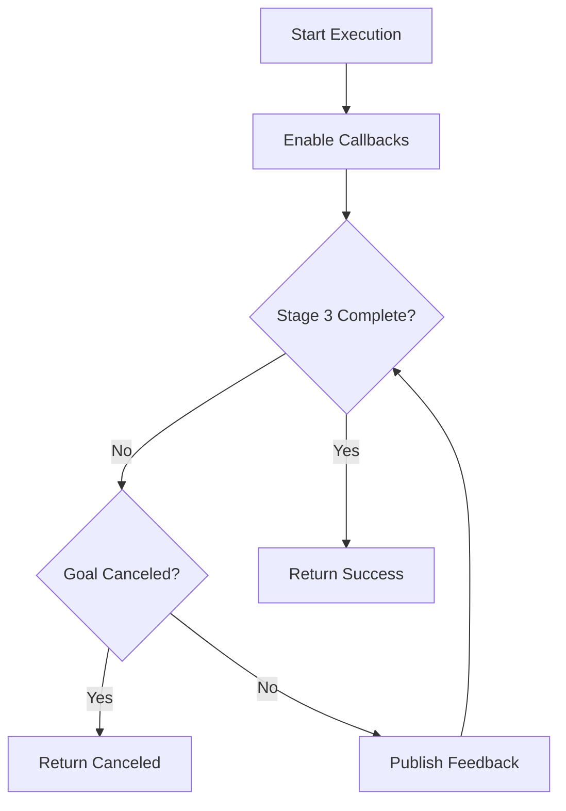
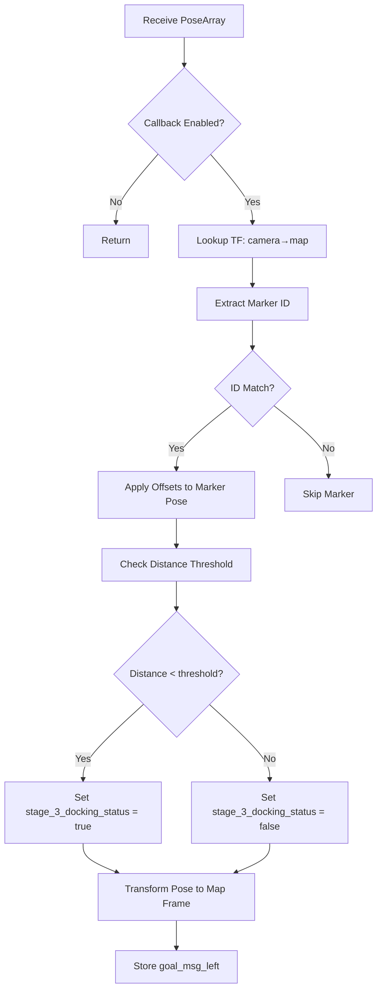
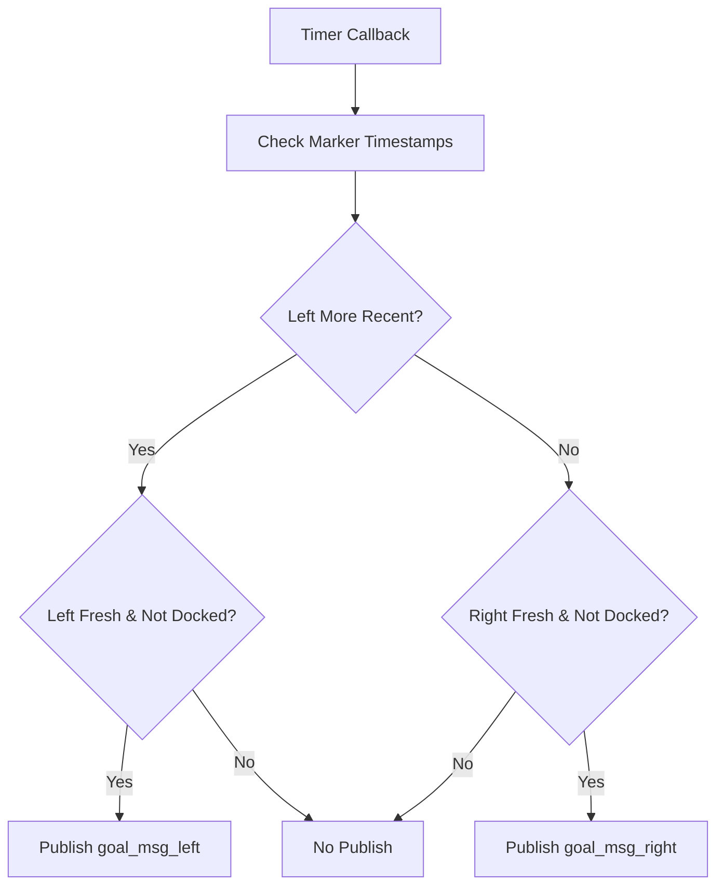
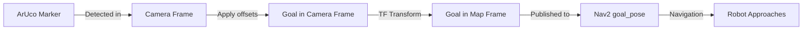
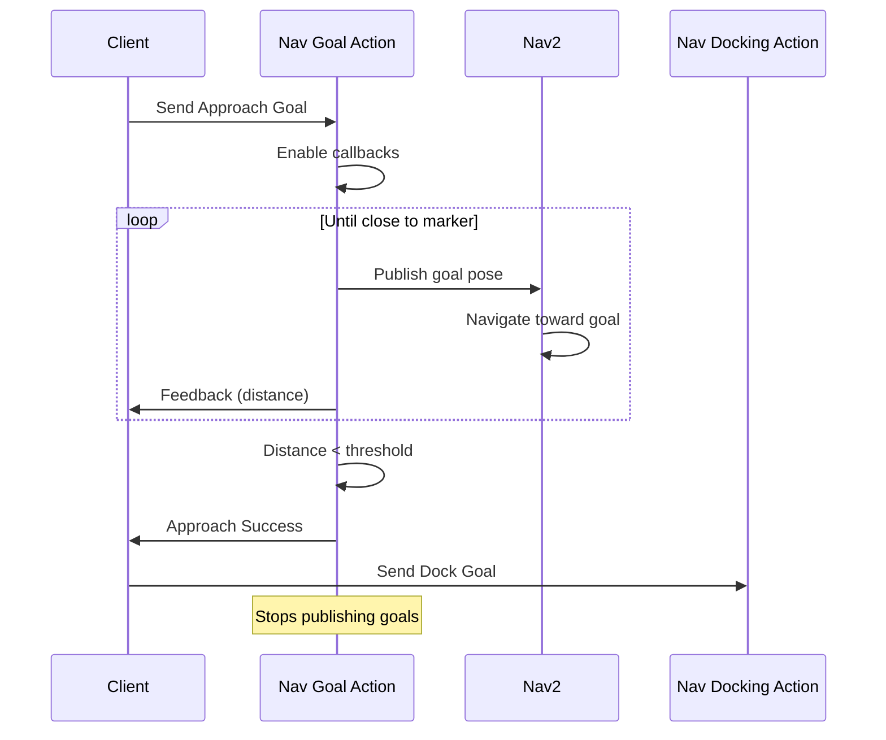

# Navigation Goal Implementation (src/nav_goal/src/nav_goal.cpp)

## Overview

This file implements a ROS2 Action Server for autonomous approach behavior using ArUco marker detection. It publishes goal poses to Nav2 to guide the robot toward a target marker, transitioning to a docking behavior when within a threshold distance.

## Class: Nav_goal

**Namespace:** `nav_goal`

### Constructor

**Location:** Lines 5-60

**Purpose:** Initialize action server, parameters, TF listener, and goal publisher

#### Action Server Setup (Lines 9-14)
```cpp
action_server_ = rclcpp_action::create_server<Approach>(
    this,
    "approach",
    std::bind(&Nav_goal::handle_goal, this, std::placeholders::_1, std::placeholders::_2),
    std::bind(&Nav_goal::handle_cancel, this, std::placeholders::_1),
    std::bind(&Nav_goal::handle_accepted, this, std::placeholders::_1));
```

**Action Type:** `Approach` (custom action interface)

#### Key Parameters (Lines 18-37)

**Frame Configuration:**
```cpp
this->declare_parameter<std::string>("map_frame", "map");
this->declare_parameter<std::string>("camera_front_left_frame", "camera_rgb_frame");
this->declare_parameter<std::string>("camera_front_right_frame", "camera_rgb_frame");
```

**Marker Configuration:**
```cpp
this->declare_parameter<int>("desired_aruco_marker_id_left", -1);
this->declare_parameter<int>("desired_aruco_marker_id_right", -1);
this->declare_parameter<float>("aruco_distance_offset", -0.5);
this->declare_parameter<float>("aruco_left_right_offset", 0);
```

**Topic Configuration:**
```cpp
this->declare_parameter<std::string>("marker_topic_front_left", "aruco_detect/markers_front");
this->declare_parameter<std::string>("marker_topic_front_right", "aruco_detect/markers_front");
```

#### Publisher Setup (Line 53)
```cpp
goal_pub = this->create_publisher<geometry_msgs::msg::PoseStamped>("goal_pose", 10);
```

Publishes goals to Nav2 navigation stack

#### Timer (Lines 55-59)
```cpp
front_timer = this->create_wall_timer(
    period,
    std::bind(&Nav_goal::frontMarkerGoalPublisher, this));
```

Periodically publishes goal updates based on marker detections

## Action Server Handlers

### handle_goal()

**Location:** Lines 64-82

**Purpose:** Validate and accept/reject approach requests

```cpp
if (goal->approach_request)
{
    RCLCPP_INFO(this->get_logger(), "Goal accepted.");
    return rclcpp_action::GoalResponse::ACCEPT_AND_EXECUTE;
}
```

### handle_cancel()

**Location:** Lines 84-89

**Purpose:** Allow goal cancellation

### handle_accepted()

**Location:** Lines 91-95

**Purpose:** Spawn execution thread

```cpp
std::thread{std::bind(&Nav_goal::execute, this, goal_handle)}.detach();
```

### execute()

**Location:** Lines 97-134

**Purpose:** Monitor approach progress and transition to docking



**Feedback Loop (Lines 110-124):**
```cpp
while (stage_3_docking_status == false){
    if (goal_handle->is_canceling())
    {
        goal_handle->canceled(result);
        Nav_goal::enable_callback = false;
        return;
    }

    feedback->wheelchair_distance = static_cast<double>(goal_distance_threshold);
    goal_handle->publish_feedback(feedback);
}
```

**Completion:**
- Waits until robot within `goal_distance_threshold` of marker
- Returns success, allowing docking action to begin

## Marker Processing

### extractMarkerIds()

**Location:** Lines 139-159

**Purpose:** Parse marker ID from PoseArray header using regex

```cpp
std::regex marker_id_regex("aruco_marker_(\\d+)");
std::smatch match;

if (std::regex_search(frame_id, match, marker_id_regex) && match.size() > 1)
{
    marker_id = std::stoi(match[1].str());
}
```

**Example:** `"aruco_marker_23"` → `23`

## ArUco Pose Callbacks

### arucoPoseCallbackLeft()

**Location:** Lines 161-244

**Purpose:** Process left camera marker detections and generate Nav2 goals

#### Processing Pipeline



#### Transform Calculation (Lines 203-233)

```cpp
// Apply offsets to marker position (camera frame)
double marker_tx = msg->poses[i].position.x + aruco_distance_offset;
double marker_ty = msg->poses[i].position.y + aruco_left_right_offset;
double marker_tz = msg->poses[i].position.z;

// Get camera-to-map transform
cameraToMap = tf_buffer_->lookupTransform(map_frame, camera_front_left_frame, ...);

// Transform to map frame
tf2::Transform camera_transform(camera_q, tf2::Vector3(...));
tf2::Vector3 marker_t(marker_tx, marker_ty, marker_tz);
tf2::Vector3 transformed_marker_t = camera_transform * marker_t;

// Set goal position
goal_msg_left.pose.position.x = transformed_marker_t.x();
goal_msg_left.pose.position.y = transformed_marker_t.y();
goal_msg_left.pose.position.z = transformed_marker_t.z();

// Combine orientations
tf2::Quaternion marker_q(marker_rx, marker_ry, marker_rz, marker_rw);
tf2::Quaternion final_q = camera_q * marker_q;
goal_msg_left.pose.orientation = final_q;
```

**Key Points:**
1. **Offset Applied in Camera Frame:** Goal positioned offset from marker
2. **Transform to Map:** Goal expressed in global map frame for Nav2
3. **Orientation Preserved:** Marker orientation combined with camera orientation

#### Distance Threshold Check (Lines 190-197)

```cpp
if (marker_tx < goal_distance_threshold)
{
    stage_3_docking_status = true;  // Close enough, trigger docking
}
else
{
    stage_3_docking_status = false;  // Keep navigating
}
```

**Purpose:** Determine when to stop publishing goals and switch to docking action

### arucoPoseCallbackRight()

**Location:** Lines 246-329

**Purpose:** Process right camera marker detections (mirrors left camera logic)

**Difference:** Applies opposite lateral offset
```cpp
double marker_ty = msg->poses[i].position.y - aruco_left_right_offset;  // Note: minus instead of plus
```

## Goal Publishing

### frontMarkerGoalPublisher()

**Location:** Lines 331-364

**Purpose:** Select and publish most recent marker goal to Nav2



#### Marker Selection Logic (Lines 344-363)

```cpp
if (callback_duration_left < callback_duration_right &&
    callback_duration_left < marker_delay_threshold_sec &&
    stage_3_docking_status == false)
{
    goal_pub->publish(goal_msg_left);  // Use left camera
}
else if (callback_duration_left > callback_duration_right &&
        callback_duration_right < marker_delay_threshold_sec &&
        stage_3_docking_status == false)
{
    goal_pub->publish(goal_msg_right);  // Use right camera
}
```

**Selection Criteria:**
1. **Freshness:** Use marker with most recent detection
2. **Timeout:** Marker must be detected within `marker_delay_threshold_sec`
3. **Docking Status:** Stop publishing when `stage_3_docking_status == true`

## Main Function

**Location:** Lines 368-374

```cpp
int main(int argc, char *argv[])
{
    rclcpp::init(argc, argv);
    rclcpp::spin(std::make_shared<nav_goal::Nav_goal>());
    rclcpp::shutdown();
    return 0;
}
```

## Coordinate Frame Flow



**Frame Chain:**
1. `aruco_marker_N` → Marker's own frame
2. `camera_front_left_frame` → Camera's optical frame
3. `map_frame` → Global navigation frame
4. `base_link` → Robot's base frame (implicit in Nav2)

## Behavior Sequencing

### Typical Execution Flow



### Stage Transition

**Stage 3 (Approach):**
- Publishes goals to Nav2
- Monitors distance to marker
- Continues until `marker_tx < goal_distance_threshold`

**Transition Point:**
```cpp
if (marker_tx < goal_distance_threshold)
{
    stage_3_docking_status = true;  // Signal approach complete
}
```

**Stage 4/5 (Docking):**
- Handled by `nav_docking` package
- Uses velocity commands instead of goal poses
- Precise alignment with marker

## Performance Considerations

### Computational Complexity
- **Per callback:** O(n) where n = number of markers (typically 1-2)
- **TF lookups:** O(log m) where m = number of TF frames
- **Goal publishing:** O(1)

### Timing Characteristics
- **Goal update rate:** Configurable via `publish_rate` (likely 10-30 Hz)
- **Marker timeout:** `marker_delay_threshold_sec` (not shown, typically 0.5-1.0s)
- **Distance threshold:** `goal_distance_threshold` (not shown, typically 0.5-1.5m)

## Dependencies

**ROS2 Packages:**
- `rclcpp`: Core ROS2 C++ library
- `rclcpp_action`: Action server support
- `geometry_msgs`: PoseStamped, PoseArray, TransformStamped
- `tf2_ros`: Transform listener
- `tf2_geometry_msgs`: Geometry transforms

**Integration:**
- **Upstream:** ArUco detection node (`aruco_detect`)
- **Downstream:** Nav2 navigation stack (`goal_pose` topic)
- **Sequential:** Nav docking action (`nav_docking`)

## Configuration Examples

### Single Front Camera
```yaml
nav_goal:
  ros__parameters:
    map_frame: "map"
    camera_front_left_frame: "camera_rgb_frame"
    camera_front_right_frame: "camera_rgb_frame"  # Same as left
    desired_aruco_marker_id_left: 23
    desired_aruco_marker_id_right: 23             # Same ID
    aruco_distance_offset: -0.5                   # Stop 0.5m before marker
    aruco_left_right_offset: 0.0
    marker_topic_front_left: "/aruco_detect/markers"
    marker_topic_front_right: "/aruco_detect/markers"
```

### Dual Front Cameras
```yaml
nav_goal:
  ros__parameters:
    camera_front_left_frame: "camera_left_rgb_frame"
    camera_front_right_frame: "camera_right_rgb_frame"
    desired_aruco_marker_id_left: 23
    desired_aruco_marker_id_right: 24              # Different markers
    aruco_distance_offset: -0.8
    aruco_left_right_offset: 0.1                   # Lateral bias
    marker_topic_front_left: "/left/aruco/markers"
    marker_topic_front_right: "/right/aruco/markers"
```

## Known Limitations

1. **Marker ID Retrieval** (Line 33)
   - `desired_aruco_marker_id_left` retrieved twice (lines 32, 33)
   - Second retrieval assigns to `desired_aruco_marker_id_right` (likely bug)
   - Should be: `this->get_parameter("desired_aruco_marker_id_right", desired_aruco_marker_id_right);`

2. **No Goal Smoothing**
   - Goal pose jumps with each marker detection
   - Nav2 replanning can cause oscillation
   - Consider low-pass filtering marker poses

3. **Single Marker Selection**
   - Uses only freshest marker, ignores the other
   - Could fuse both markers for improved accuracy

4. **No Velocity Consideration**
   - Distance threshold is static
   - Fast-moving robot may overshoot
   - Consider dynamic threshold based on velocity

5. **Hardcoded Constants**
   - `goal_distance_threshold` not visible as parameter
   - `marker_delay_threshold_sec` not configurable
   - Should be exposed for tuning

## Troubleshooting

**Nav2 not receiving goals:**
- Check topic name matches Nav2 configuration
- Verify markers are detected (`marker_topic_*`)
- Check `enable_callback` is true

**Robot oscillates before reaching marker:**
- Increase `goal_distance_threshold` to stop earlier
- Reduce goal publishing rate
- Tune Nav2 planner parameters

**Never transitions to docking:**
- Check `goal_distance_threshold` value
- Verify `stage_3_docking_status` updates
- Monitor `marker_tx` distance

**Wrong marker followed:**
- Verify `desired_aruco_marker_id_*` parameters
- Check marker IDs in scene
- Use RViz to visualize detected markers

**Goals in wrong location:**
- Verify TF tree (`camera_front_*_frame` → `map_frame`)
- Check `aruco_distance_offset` sign
- Visualize `goal_pose` topic in RViz

## Potential Enhancements

### 1. Dual Marker Fusion
```cpp
if (both_markers_fresh) {
    avg_pose = (goal_msg_left + goal_msg_right) / 2;
    goal_pub->publish(avg_pose);
}
```

### 2. Goal Filtering
```cpp
// Exponential moving average
filtered_goal = alpha * new_goal + (1 - alpha) * prev_goal;
```

### 3. Adaptive Threshold
```cpp
dynamic_threshold = base_threshold + k * current_velocity;
```

### 4. Multi-Marker Tracking
```cpp
// Track multiple markers, select closest or most reliable
```
