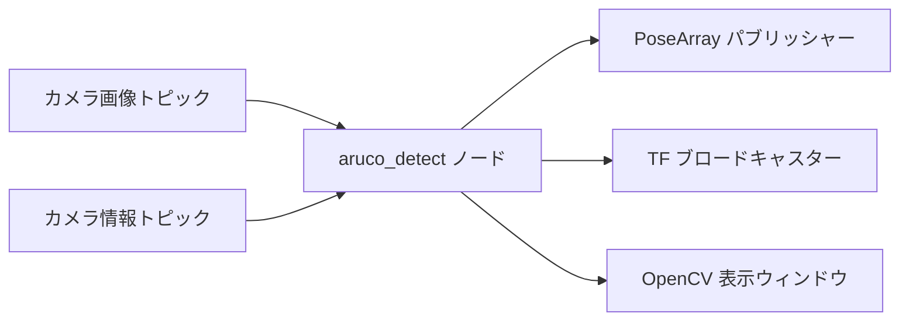

# ArUcoマーカー検出パッケージ (src/aruco_detect)

## 概要

`aruco_detect`パッケージは、Multi-Go自律ナビゲーションシステム向けのArUcoマーカー検出と姿勢推定機能を提供します。カメラ画像を処理してArUcoマーカーを検出し、ロボット座標系における3D姿勢を配信します。

## 目的

- OpenCVのArUcoモジュールを使用してカメラ画像内のArUcoマーカーを検出
- 検出されたマーカーの6自由度姿勢(位置+向き)を推定
- 可視化およびナビゲーション用にマーカー姿勢をTF変換として配信
- 複数のカメラ構成(左右ステレオカメラなど)をサポート

## 主な機能

### マーカー検出
- OpenCVを使用したリアルタイムArUcoマーカー検出
- 辞書: DICT_6X6_250 (aruco_detect.h:44でハードコード)
- 目的のマーカーIDに基づく選択的検出
- 検出されたマーカーを表示するOpenCVウィンドウによる視覚的デバッグ

**注意:** ArUco辞書は現在ヘッダーファイルで`DICT_6X6_250`としてハードコードされており、パラメータで変更できません。別の辞書(例: DICT_4X4_50)を使用するには、`include/aruco_detect/aruco_detect.h`の44行目でコード修正が必要です。

### 姿勢推定
- 単一マーカーからの6自由度姿勢推定
- CameraInfoメッセージによるカメラキャリブレーション統合
- OpenCVからROS規約への座標系変換
- クォータニオンベースの姿勢表現

### 変換の配信
- 検出された各マーカーのTF2変換
- 名前付きフレーム: `aruco_marker_{id}`
- カメラフレームのタイムスタンプと同期

## アーキテクチャ



## ROS2インターフェース

### 購読トピック
- **`/camera/color/image_raw_front`** (`sensor_msgs/Image`)
  - 入力カメラ画像(MONO8エンコーディング)
  - `camera_topic`パラメータで設定可能

- **`/camera/color/camera_info_front`** (`sensor_msgs/CameraInfo`)
  - カメラの内部パラメータ(Kマトリックス、歪み係数)
  - 正確な姿勢推定に使用

### 配信トピック
- **`aruco_detect/markers`** (`geometry_msgs/PoseArray`)
  - 検出されたマーカー姿勢の配列
  - フレームIDはマーカーIDを示す
  - マーカーが検出された時のみ更新

### 配信される変換
- **`camera_frame → aruco_marker_{id}`**
  - カメラから検出された各マーカーへの3D変換
  - マーカー検出とともにリアルタイムで更新

## パラメータ

| パラメータ | 型 | デフォルト | 説明 |
|-----------|------|---------|-------------|
| `desired_aruco_marker_id` | int | 0 | 検出および追跡するマーカーID |
| `marker_width` | double | 0.05 | マーカーの物理的な幅(メートル) |
| `camera_topic` | string | `/camera/color/image_raw_front` | 入力画像トピック |
| `camera_info` | string | `/camera/color/camera_info_front` | カメラキャリブレーショントピック |

## 座標系変換

パッケージはOpenCVのカメラ座標系からROS規約への座標変換を実行します:

**OpenCVカメラフレーム:**
- X: 右
- Y: 下
- Z: 前方(光軸)

**ROSカメラフレーム:**
- X: 前方
- Y: 左
- Z: 上

適用される変換マトリックス:
```
cv_to_ros = [0   0  1]
            [-1  0  0]
            [0  -1  0]
```

さらに、マーカーの向きの規約に合わせるために180°のピッチ回転が適用されます。

## パフォーマンス

- **フレームレート:** 可視化ウィンドウにFPSを表示
- **レイテンシ:** 最小遅延でリアルタイム処理
- **加重平均:** FPS計算のための10フレーム移動平均

## 依存関係

### ROS2パッケージ
- `rclcpp`: ROS2 C++クライアントライブラリ
- `sensor_msgs`: ImageとCameraInfoメッセージ型
- `geometry_msgs`: PoseとTransformメッセージ型
- `tf2_ros`: 変換の配信
- `cv_bridge`: ROS-OpenCV画像変換

### 外部ライブラリ
- **OpenCV 4.x**: ArUco検出とコンピュータビジョン
- **Eigen3**: 座標変換のための行列演算

## 使用方法

### 起動ファイル
```bash
ros2 launch aruco_detect aruco_detect.launch.py
```

起動ファイルは、左右カメラ用の個別インスタンスを持つデュアルカメラ構成をサポートします。

### 可視化
- OpenCVウィンドウ: "Aruco Markers_{id}"が検出結果を表示
- 検出されたマーカーはコーナーのハイライトと軸オーバーレイで表示
- FPSとマーカー位置のテキストオーバーレイ

## 実装の詳細

### 検出アルゴリズム
1. カメラ画像を受信しOpenCV形式(MONO8)に変換
2. `cv::aruco::detectMarkers()`を使用してArUcoマーカーを検出
3. 目的のマーカーIDでフィルタリング
4. `cv::aruco::estimatePoseSingleMarkers()`を使用して姿勢を推定
5. OpenCVからROS規約への座標変換
6. PoseArrayを配信しTF変換を配信

### カメラキャリブレーション
- CameraInfoコールバックを介して起動時に一度カメラパラメータを受信
- 内部マトリックス(K)、歪み係数(D)、補正(R)、投影(P)を保存
- 正確なマーカー姿勢推定に使用

## 関連パッケージ

- **nav_docking**: 自律ドッキングのためにArUco姿勢を使用
- **nav_goal**: ゴールアプローチ動作のためにArUco姿勢を使用
- **camera_publisher**: カメラ画像ストリームを提供

## 参考文献

- [OpenCV ArUcoモジュールドキュメント](https://docs.opencv.org/4.x/d5/dae/tutorial_aruco_detection.html)
- [ArUcoマーカー生成スクリプト](../../src/aruco_detect/scripts/marker_gen.py)
