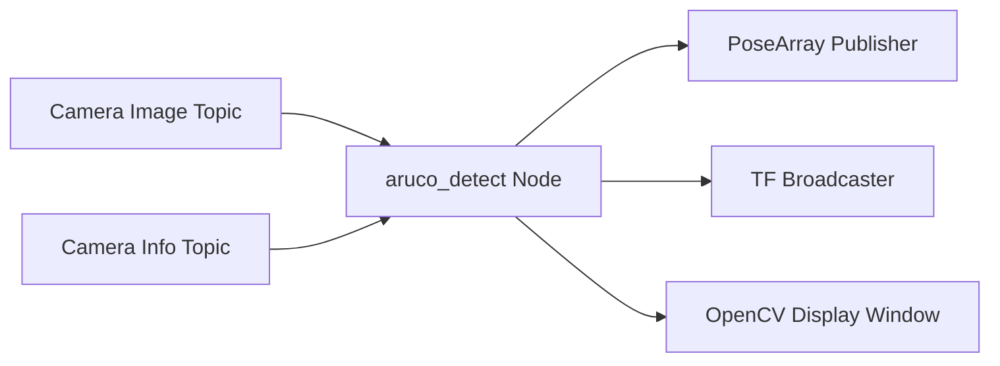

# ArUco Marker Detection Package (src/aruco_detect)

## Overview

The `aruco_detect` package provides ArUco marker detection and pose estimation capabilities for the Multi-Go autonomous navigation system. It processes camera images to detect ArUco markers and publishes their 3D poses in the robot's coordinate frame.

## Purpose

- Detect ArUco markers in camera images using OpenCV's ArUco module
- Estimate 6-DOF pose (position + orientation) of detected markers
- Broadcast marker poses as TF transforms for visualization and navigation
- Support multiple camera configurations (e.g., left/right stereo cameras)

## Key Features

### Marker Detection
- Real-time ArUco marker detection using OpenCV
- Dictionary: DICT_6X6_250 (hardcoded in aruco_detect.h:44)
- Selective detection based on desired marker ID
- Visual debugging with OpenCV windows showing detected markers

**Note:** The ArUco dictionary is currently hardcoded as `DICT_6X6_250` in the header file and cannot be changed via parameters. To use a different dictionary (e.g., DICT_4X4_50), code modification in `include/aruco_detect/aruco_detect.h` line 44 is required.

### Pose Estimation
- 6-DOF pose estimation from single markers
- Camera calibration integration via CameraInfo messages
- Coordinate frame transformation from OpenCV to ROS conventions
- Quaternion-based orientation representation

### Transform Broadcasting
- TF2 transforms for each detected marker
- Named frames: `aruco_marker_{id}`
- Synchronized with camera frame timestamps

## Architecture



## ROS2 Interface

### Subscribed Topics
- **`/camera/color/image_raw_front`** (`sensor_msgs/Image`)
  - Input camera images (MONO8 encoding)
  - Configurable via `camera_topic` parameter

- **`/camera/color/camera_info_front`** (`sensor_msgs/CameraInfo`)
  - Camera intrinsic parameters (K matrix, distortion coefficients)
  - Used for accurate pose estimation

### Published Topics
- **`aruco_detect/markers`** (`geometry_msgs/PoseArray`)
  - Array of detected marker poses
  - Frame ID indicates marker ID
  - Updated only when markers are detected

### Broadcasted Transforms
- **`camera_frame → aruco_marker_{id}`**
  - 3D transform from camera to each detected marker
  - Updated in real-time with marker detection

## Parameters

| Parameter | Type | Default | Description |
|-----------|------|---------|-------------|
| `desired_aruco_marker_id` | int | 0 | Marker ID to detect and track |
| `marker_width` | double | 0.05 | Physical width of marker in meters |
| `camera_topic` | string | `/camera/color/image_raw_front` | Input image topic |
| `camera_info` | string | `/camera/color/camera_info_front` | Camera calibration topic |

## Coordinate Frame Transformations

The package performs coordinate transformations to convert from OpenCV's camera coordinate system to ROS conventions:

**OpenCV Camera Frame:**
- X: Right
- Y: Down
- Z: Forward (optical axis)

**ROS Camera Frame:**
- X: Forward
- Y: Left
- Z: Up

The transformation matrix applied:
```
cv_to_ros = [0   0  1]
            [-1  0  0]
            [0  -1  0]
```

Additionally, a 180° pitch rotation is applied to align with marker orientation conventions.

## Performance

- **Frame Rate:** Displays FPS in visualization window
- **Latency:** Real-time processing with minimal delay
- **Weighted averaging:** 10-frame moving average for FPS calculation

## Dependencies

### ROS2 Packages
- `rclcpp`: ROS2 C++ client library
- `sensor_msgs`: Image and CameraInfo message types
- `geometry_msgs`: Pose and Transform message types
- `tf2_ros`: Transform broadcasting
- `cv_bridge`: ROS-OpenCV image conversion

### External Libraries
- **OpenCV 4.x**: ArUco detection and computer vision
- **Eigen3**: Matrix operations for coordinate transforms

## Usage

### Launch File
```bash
ros2 launch aruco_detect aruco_detect.launch.py
```

The launch file supports dual-camera configurations with separate instances for left and right cameras.

### Visualization
- OpenCV window: "Aruco Markers_{id}" displays detection results
- Detected markers shown with corner highlighting and axis overlay
- FPS and marker position text overlays

## Implementation Details

### Detection Algorithm
1. Receive camera image and convert to OpenCV format (MONO8)
2. Detect ArUco markers using `cv::aruco::detectMarkers()`
3. Filter for desired marker ID
4. Estimate pose using `cv::aruco::estimatePoseSingleMarkers()`
5. Transform coordinates from OpenCV to ROS convention
6. Publish PoseArray and broadcast TF transforms

### Camera Calibration
- Camera parameters received once at startup via CameraInfo callback
- Stores intrinsic matrix (K), distortion coefficients (D), rectification (R), and projection (P)
- Used for accurate marker pose estimation

## Related Packages

- **nav_docking**: Uses ArUco poses for autonomous docking
- **nav_goal**: Uses ArUco poses for goal approach behavior
- **camera_publisher**: Provides camera image stream

## References

- [OpenCV ArUco Module Documentation](https://docs.opencv.org/4.x/d5/dae/tutorial_aruco_detection.html)
- [ArUco Marker Generation Script](../../src/aruco_detect/scripts/marker_gen.py)
