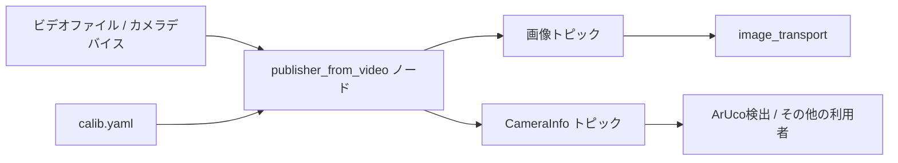

# カメラパブリッシャー (src/camera_publisher)

## 概要

`camera_publisher`パッケージは、ビデオファイルまたはカメラデバイスからカメラ画像データをROS2トピックに配信します。カメラキャリブレーション統合を提供し、効率的なデータストリーミングのためのimage transportをサポートしています。

## 目的

- カメラ画像をROS2 sensor_msgs/Imageメッセージとして配信
- CameraInfoメッセージを介してカメラキャリブレーション情報を提供
- テストおよび開発用のビデオファイル再生をサポート
- 圧縮プラグインを使用した効率的な画像転送を実現

## アーキテクチャ



## ROS2インターフェース

### 配信トピック
- **`/camera/color/image_raw`** (`sensor_msgs/Image`)
  - 生のカメラ画像
  - エンコーディング: BGR8、RGB8、またはMONO8
  - トピック名は設定可能

- **`/camera/color/camera_info`** (`sensor_msgs/CameraInfo`)
  - カメラの内部パラメータ
  - 歪み係数
  - 補正および投影マトリックス

## 主な機能

### ビデオソースのサポート
- **ビデオファイル:** OpenCV VideoCaptureを介してMP4、AVIなど
- **カメラデバイス:** USBカメラ、内蔵ウェブカメラ
- **ネットワークストリーム:** RTSP、HTTPストリーム

### カメラキャリブレーション
- YAMLファイルからキャリブレーションを読み込み
- 内部マトリックス(K)を配信
- 歪み係数(D)を配信
- 補正(R)および投影(P)マトリックスをサポート

### Image Transport
- 効率的な圧縮画像ストリーミング
- `resized_plugins.xml`を介したプラグインアーキテクチャ
- JPEG、PNG圧縮をサポート

## 設定ファイル

### カメラキャリブレーション (calib.yaml)
```yaml
image_width: 640
image_height: 480
camera_name: camera
camera_matrix:
  rows: 3
  cols: 3
  data: [fx, 0, cx, 0, fy, cy, 0, 0, 1]
distortion_coefficients:
  rows: 1
  cols: 5
  data: [k1, k2, p1, p2, k3]
rectification_matrix:
  rows: 3
  cols: 3
  data: [1, 0, 0, 0, 1, 0, 0, 0, 1]
projection_matrix:
  rows: 3
  cols: 4
  data: [fx, 0, cx, 0, 0, fy, cy, 0, 0, 0, 1, 0]
```

## 依存関係

### ROS2パッケージ
- `cv_bridge`: OpenCV-ROS画像変換
- `image_transport`: 効率的な画像配信
- `sensor_msgs`: ImageとCameraInfoメッセージ
- `std_msgs`: 標準メッセージ型

### 外部ライブラリ
- **OpenCV:** ビデオI/Oと画像処理
- **libopencv-dev:** 開発ヘッダー

## カメラキャリブレーションツール

### CamCalibration.py
`src/camera_publisher/config/CamCalibration.py`に配置:

**目的:** チェスボードパターンを使用してキャリブレーションファイルを生成

**使用方法:**
```bash
python3 CamCalibration.py
```

**プロセス:**
1. カメラにチェスボードパターンを表示
2. 複数のビュー(10-20画像)をキャプチャ
3. カメラマトリックスと歪みを計算
4. `calib.yaml`に保存

## プラグイン設定

### resized_plugins.xml
image_transportプラグインを定義:

```xml
<library path="image_transport_plugins">
  <class name="compressed" type="compressed_image_transport::CompressedPublisher" base_class_type="image_transport::PublisherPlugin">
    <description>
      This plugin publishes compressed images using JPEG or PNG.
    </description>
  </class>
</library>
```

## 実装の詳細

### publisher_from_video.cpp

**主要コンポーネント:**
1. **VideoCapture初期化:** ビデオソースを開く
2. **キャリブレーション読み込み:** YAMLキャリブレーションファイルを読む
3. **フレームループ:** フレームをキャプチャして配信
4. **CameraInfo配信:** キャリブレーションデータをブロードキャスト

### フレームの配信

```cpp
while (capture.read(frame)) {
    // OpenCV MatをROS Imageメッセージに変換
    sensor_msgs::msg::Image::SharedPtr img_msg =
        cv_bridge::CvImage(std_msgs::msg::Header(),
                           "bgr8",
                           frame).toImageMsg();

    // 画像とカメラ情報を配信
    image_pub.publish(img_msg);
    camera_info_pub.publish(camera_info_msg);
}
```

## 使用例

```bash
# ビデオファイルから配信
ros2 run camera_publisher publisher_from_video \
  --ros-args -p video_source:=/path/to/video.mp4

# カメラデバイスから配信
ros2 run camera_publisher publisher_from_video \
  --ros-args -p video_source:=0

# 画像を表示
ros2 run rqt_image_view rqt_image_view

# カメラ情報を確認
ros2 topic echo /camera/color/camera_info
```

## 関連パッケージ

- **aruco_detect**: カメラ画像の主要な利用者
- **nav_docking**: ドッキングビジョンにカメラを使用
- **nav_goal**: アプローチガイダンスにカメラを使用

## トラブルシューティング

| 問題 | 考えられる原因 | 解決方法 |
|-------|---------------|----------|
| 画像が配信されない | ビデオソースが無効 | ファイルパスまたはカメラインデックスを確認 |
| 歪んだ画像 | キャリブレーションがない | CamCalibration.pyを実行 |
| 低フレームレート | 高解像度 | 画像解像度を下げる |
| CameraInfoが空 | キャリブレーションファイルが読み込まれていない | calib.yamlのパスを確認 |

## キャリブレーションのベストプラクティス

1. **チェスボードサイズ:** 内側コーナー7x9または9x7を推奨
2. **画像の数:** 最低15-20ビュー
3. **様々なポーズ:** 異なる角度と距離からキャプチャ
4. **良好な照明:** 均一で明るい照明
5. **検証:** 再投影誤差が0.5ピクセル未満であることを確認

## コード構造

```
src/camera_publisher/
├── src/
│   └── publisher_from_video.cpp    # メインパブリッシャーノード
├── config/
│   ├── calib.yaml                  # キャリブレーションパラメータ
│   └── CamCalibration.py           # キャリブレーションツール
├── resized_plugins.xml             # Image transportプラグイン
├── CMakeLists.txt
├── package.xml
└── LICENSE
```
