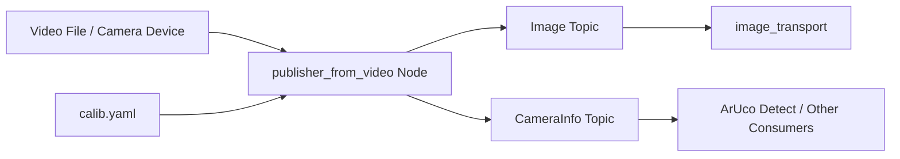

# Camera Publisher (src/camera_publisher)

## Overview

The `camera_publisher` package publishes camera image data from video files or camera devices to ROS2 topics. It provides camera calibration integration and supports image transport for efficient data streaming.

## Purpose

- Publish camera images as ROS2 sensor_msgs/Image messages
- Provide camera calibration information via CameraInfo messages
- Support video file playback for testing and development
- Enable efficient image transport with compression plugins

## Architecture



## ROS2 Interface

### Published Topics
- **`/camera/color/image_raw`** (`sensor_msgs/Image`)
  - Raw camera images
  - Encoding: BGR8, RGB8, or MONO8
  - Configurable topic name

- **`/camera/color/camera_info`** (`sensor_msgs/CameraInfo`)
  - Camera intrinsic parameters
  - Distortion coefficients
  - Rectification and projection matrices

## Key Features

### Video Source Support
- **Video files:** MP4, AVI, etc. via OpenCV VideoCapture
- **Camera devices:** USB cameras, built-in webcams
- **Network streams:** RTSP, HTTP streams

### Camera Calibration
- Loads calibration from YAML files
- Publishes intrinsic matrix (K)
- Publishes distortion coefficients (D)
- Supports rectification (R) and projection (P) matrices

### Image Transport
- Efficient compressed image streaming
- Plugin architecture via `resized_plugins.xml`
- Supports JPEG, PNG compression

## Configuration Files

### Camera Calibration (calib.yaml)
```yaml
image_width: 640
image_height: 480
camera_name: camera
camera_matrix:
  rows: 3
  cols: 3
  data: [fx, 0, cx, 0, fy, cy, 0, 0, 1]
distortion_coefficients:
  rows: 1
  cols: 5
  data: [k1, k2, p1, p2, k3]
rectification_matrix:
  rows: 3
  cols: 3
  data: [1, 0, 0, 0, 1, 0, 0, 0, 1]
projection_matrix:
  rows: 3
  cols: 4
  data: [fx, 0, cx, 0, 0, fy, cy, 0, 0, 0, 1, 0]
```

## Dependencies

### ROS2 Packages
- `cv_bridge`: OpenCV-ROS image conversion
- `image_transport`: Efficient image publication
- `sensor_msgs`: Image and CameraInfo messages
- `std_msgs`: Standard message types

### External Libraries
- **OpenCV:** Video I/O and image processing
- **libopencv-dev:** Development headers

## Camera Calibration Tool

### CamCalibration.py
Located at `src/camera_publisher/config/CamCalibration.py`:

**Purpose:** Generate calibration files using checkerboard patterns

**Usage:**
```bash
python3 CamCalibration.py
```

**Process:**
1. Display checkerboard pattern to camera
2. Capture multiple views (10-20 images)
3. Compute camera matrix and distortion
4. Save to `calib.yaml`

## Plugin Configuration

### resized_plugins.xml
Defines image_transport plugins:

```xml
<library path="image_transport_plugins">
  <class name="compressed" type="compressed_image_transport::CompressedPublisher" base_class_type="image_transport::PublisherPlugin">
    <description>
      This plugin publishes compressed images using JPEG or PNG.
    </description>
  </class>
</library>
```

## Implementation Details

### publisher_from_video.cpp

**Key components:**
1. **VideoCapture initialization:** Opens video source
2. **Calibration loading:** Reads YAML calibration file
3. **Frame loop:** Captures and publishes frames
4. **CameraInfo publishing:** Broadcasts calibration data

### Frame Publishing

```cpp
while (capture.read(frame)) {
    // Convert OpenCV Mat to ROS Image message
    sensor_msgs::msg::Image::SharedPtr img_msg =
        cv_bridge::CvImage(std_msgs::msg::Header(),
                           "bgr8",
                           frame).toImageMsg();

    // Publish image and camera info
    image_pub.publish(img_msg);
    camera_info_pub.publish(camera_info_msg);
}
```

## Usage Example

```bash
# Publish from video file
ros2 run camera_publisher publisher_from_video \
  --ros-args -p video_source:=/path/to/video.mp4

# Publish from camera device
ros2 run camera_publisher publisher_from_video \
  --ros-args -p video_source:=0

# View images
ros2 run rqt_image_view rqt_image_view

# Inspect camera info
ros2 topic echo /camera/color/camera_info
```

## Related Packages

- **aruco_detect**: Primary consumer of camera images
- **nav_docking**: Uses camera for docking vision
- **nav_goal**: Uses camera for approach guidance

## Troubleshooting

| Issue | Possible Cause | Solution |
|-------|---------------|----------|
| No images published | Video source invalid | Check file path or camera index |
| Distorted images | Missing calibration | Run CamCalibration.py |
| Low frame rate | High resolution | Reduce image resolution |
| CameraInfo empty | Calibration file not loaded | Verify calib.yaml path |

## Calibration Best Practices

1. **Checkerboard size:** 7x9 or 9x7 inner corners recommended
2. **Number of images:** Minimum 15-20 views
3. **Varied poses:** Capture from different angles and distances
4. **Good lighting:** Uniform, bright illumination
5. **Validation:** Check reprojection error < 0.5 pixels

## Code Structure

```
src/camera_publisher/
├── src/
│   └── publisher_from_video.cpp    # Main publisher node
├── config/
│   ├── calib.yaml                  # Calibration parameters
│   └── CamCalibration.py           # Calibration tool
├── resized_plugins.xml             # Image transport plugins
├── CMakeLists.txt
├── package.xml
└── LICENSE
```
