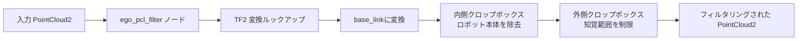
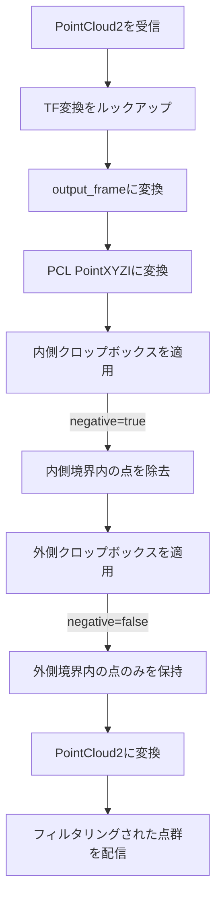

# エゴセントリック点群フィルタ (src/ego_pcl_filter)

## 概要

`ego_pcl_filter`パッケージは、デュアルクロップボックスフィルタリングを使用して点群データからロボット自身の本体を除去します。これにより、自己衝突検出を防ぎ、ナビゲーションの精度を向上させます。

## 目的

- ロボットの物理的構造に対応する点を除去
- 障害物検出を妨げるエゴセントリックな測定値を削除
- 関連領域に知覚を制限するための空間境界を適用
- 一貫したフィルタリングのためにロボットベースフレームに点群を変換

## アーキテクチャ



## ROS2インターフェース

### 購読トピック
- **`input`** (`sensor_msgs/PointCloud2`)
  - pcl_mergeからのマージされた点群
  - `input_topic`パラメータで設定可能

### 配信トピック
- **`output`** (`sensor_msgs/PointCloud2`)
  - エゴが除去されたフィルタリングされた点群
  - 型: `pcl::PointXYZI`
  - `output_topic`パラメータで設定可能

## パラメータ

### 内側クロップボックス (ロボット本体除去)
| パラメータ | 型 | デフォルト | 説明 |
|-----------|------|---------|-------------|
| `inner_min_x` | float | 0.0 | 最小X境界(メートル) |
| `inner_max_x` | float | 0.0 | 最大X境界(メートル) |
| `inner_min_y` | float | 0.0 | 最小Y境界(メートル) |
| `inner_max_y` | float | 0.0 | 最大Y境界(メートル) |
| `inner_min_z` | float | 0.0 | 最小Z境界(メートル) |
| `inner_max_z` | float | 0.0 | 最大Z境界(メートル) |

### 外側クロップボックス (知覚範囲制限)
| パラメータ | 型 | デフォルト | 説明 |
|-----------|------|---------|-------------|
| `outer_min_x` | float | -50.0 | 最小X境界(メートル) |
| `outer_max_x` | float | 50.0 | 最大X境界(メートル) |
| `outer_min_y` | float | -50.0 | 最小Y境界(メートル) |
| `outer_max_y` | float | 50.0 | 最大Y境界(メートル) |
| `outer_min_z` | float | 0.0 | 最小Z境界(メートル) |
| `outer_max_z` | float | 5.5 | 最大Z境界(メートル) |

### その他のパラメータ
| パラメータ | 型 | デフォルト | 説明 |
|-----------|------|---------|-------------|
| `keep_organized` | bool | false | 組織化された点群構造を維持 |
| `negative` | bool | true | 内側ボックス反転フラグ(内側を除去) |
| `output_frame` | string | `"base_link"` | ターゲット座標フレーム |
| `input_topic` | string | `"input"` | 入力点群トピック名 |
| `output_topic` | string | `"output"` | 出力点群トピック名 |

## フィルタリングアルゴリズム



## デュアルクロップボックス戦略

### ステージ1: 内側クロップボックス (エゴ除去)
- **目的:** ロボット本体の点を除去
- **モード:** ネガティブフィルタリング(`negative = true`)
- **効果:** 内側境界**内**の点が**除去**される
- **典型的な設定:**
  ```yaml
  inner_min_x: -0.3  # ロボット中心の後ろ
  inner_max_x:  0.5  # ロボットの前方
  inner_min_y: -0.25 # ロボットの左側
  inner_max_y:  0.25 # ロボットの右側
  inner_min_z: -0.1  # base_linkの下
  inner_max_z:  1.0  # ロボットの高さ
  ```

### ステージ2: 外側クロップボックス (範囲制限)
- **目的:** 関連範囲に知覚を制限
- **モード:** ポジティブフィルタリング(`negative = false`)
- **効果:** 外側境界**内**の点のみが**保持**される
- **典型的な設定:**
  ```yaml
  outer_min_x: -5.0  # 5m後方
  outer_max_x: 10.0  # 10m前方
  outer_min_y: -5.0  # 5m左側
  outer_max_y:  5.0  # 5m右側
  outer_min_z:  0.0  # 地面レベル
  outer_max_z:  2.5  # 天井の高さ
  ```

## 座標フレームの取り扱い

### 変換パイプライン
1. **入力:** 任意のセンサフレーム内の点群
2. **ルックアップ:** `msg->header.frame_id`から`output_frame`へのTF2変換
3. **変換:** `pcl_ros::transformPointCloud()`を使用して変換を適用
4. **フィルタ:** `output_frame`座標でクロップボックスを適用
5. **配信:** `output_frame`でフィルタリングされた点群

### フレームに関する考慮事項
- **output_frame** は通常、ロボット中心フィルタリングのために`base_link`に設定
- センサ取り付け方向に関係なく一貫したフィルタリングを保証
- TFを介したセンサポーズの動的再構成を可能にする

## 点群タイプ

- **入力:** `sensor_msgs/PointCloud2`(任意の形式)
- **内部:** `pcl::PointXYZI`
- **出力:** `sensor_msgs/PointCloud2`(PointXYZI形式)

注: 強度値はフィルタリングプロセス全体を通じて保持されます。

## パフォーマンスに関する考慮事項

- **計算コスト:** 点群ごとに2つのPCL CropBoxフィルタ
- **メモリ:** 各ステージの一時的なPCL点群
- **レイテンシ:** 最小(典型的な点群サイズで約5-10ms)
- **スループット:** 30Hz以上の入力レートでリアルタイム処理可能

## 依存関係

### ROS2パッケージ
- `rclcpp`: ROS2 C++クライアントライブラリ
- `sensor_msgs`: PointCloud2メッセージ型
- `tf2_ros`: 変換バッファとリスナー
- `tf2_geometry_msgs`: TF2ジオメトリユーティリティ
- `pcl_ros`: PCL-ROS変換ユーティリティ

### 外部ライブラリ
- **PCL:** CropBoxフィルタと点群構造
- **Eigen3:** ベクトル演算(PCL経由)

## 使用例

```bash
# デフォルトパラメータで実行
ros2 run ego_pcl_filter crop_box_filter_node

# カスタム設定で実行
ros2 run ego_pcl_filter crop_box_filter_node \
  --ros-args \
  -p input_topic:=/pcl_merged \
  -p output_topic:=/pcl_filtered \
  -p inner_min_x:=-0.3 -p inner_max_x:=0.5 \
  -p inner_min_y:=-0.25 -p inner_max_y:=0.25 \
  -p inner_min_z:=-0.1 -p inner_max_z:=1.0 \
  -p outer_min_x:=-5.0 -p outer_max_x:=10.0 \
  -p outer_min_y:=-5.0 -p outer_max_y:=5.0 \
  -p outer_min_z:=0.0 -p outer_max_z:=2.5
```

## 設定ガイドライン

### 内側境界の決定
1. ロボットの物理的寸法を測定
2. 5-10cmの安全マージンを追加
3. base_linkフレーム座標に変換
4. 有効なデータをブロックしないようにセンサ取り付け位置を考慮

### 外側境界の決定
1. ナビゲーション要件を考慮(例: 最大計画距離)
2. 知覚範囲と計算コストのバランスを取る
3. 典型的な値:
   - 都市ナビゲーション: ±5-10m
   - オープンスペース: ±10-50m
   - 屋内: ±2-5m

### 垂直境界
- **`outer_min_z`:** 通常は0.0で地面平面をフィルタ(不要な場合)
- **`outer_max_z`:** 天井の高さまたは空中障害物の高さに基づいて設定

## 関連パッケージ

- **pcl_merge**: 入力マージ点群を提供
- **nav2**: コストマップ生成のためにフィルタリングされた点群を使用
- **rtabmap_ros**: SLAMのためにフィルタリングされた点群を使用

## トラブルシューティング

| 問題 | 考えられる原因 | 解決方法 |
|-------|---------------|----------|
| ロボットが自分自身を検出 | 内側境界が小さすぎる | 内側クロップボックスのマージンを増加 |
| 障害物が欠落 | 外側境界が制限的すぎる | 外側クロップボックスの範囲を増加 |
| 空の出力点群 | 変換失敗 | 入力フレームからoutput_frameへのTFツリーを確認 |
| 高レイテンシ | 大きな点群 | pcl_mergeのボクセルグリッドサイズまたは外側境界を減少 |

## 可視化

RViz2を使用してフィルタリングされた出力を可視化:
```bash
ros2 run rviz2 rviz2
# PointCloud2ディスプレイを追加
# トピックを/output(またはyour output_topic)に設定
# フレームをbase_linkに設定
```

ロボット本体が除去された「影」のある点群が表示されます。
