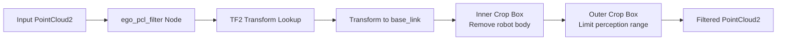
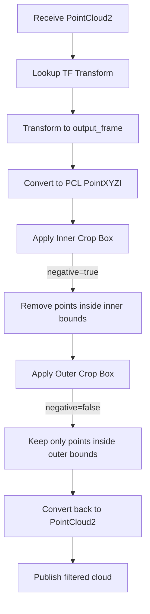

# Egocentric Point Cloud Filter (src/ego_pcl_filter)

## Overview

The `ego_pcl_filter` package removes the robot's own body from point cloud data using dual crop box filtering. This prevents self-collision detection and improves navigation accuracy.

## Purpose

- Filter out points corresponding to the robot's physical structure
- Remove ego-centric measurements that would interfere with obstacle detection
- Apply spatial bounds to limit perception to relevant regions
- Transform point clouds to robot base frame for consistent filtering

## Architecture



## ROS2 Interface

### Subscribed Topics
- **`input`** (`sensor_msgs/PointCloud2`)
  - Merged point cloud from pcl_merge
  - Configurable via `input_topic` parameter

### Published Topics
- **`output`** (`sensor_msgs/PointCloud2`)
  - Filtered point cloud with ego removed
  - Type: `pcl::PointXYZI`
  - Configurable via `output_topic` parameter

## Parameters

### Inner Crop Box (Robot Body Removal)
| Parameter | Type | Default | Description |
|-----------|------|---------|-------------|
| `inner_min_x` | float | 0.0 | Minimum X bound (meters) |
| `inner_max_x` | float | 0.0 | Maximum X bound (meters) |
| `inner_min_y` | float | 0.0 | Minimum Y bound (meters) |
| `inner_max_y` | float | 0.0 | Maximum Y bound (meters) |
| `inner_min_z` | float | 0.0 | Minimum Z bound (meters) |
| `inner_max_z` | float | 0.0 | Maximum Z bound (meters) |

### Outer Crop Box (Perception Range Limiting)
| Parameter | Type | Default | Description |
|-----------|------|---------|-------------|
| `outer_min_x` | float | -50.0 | Minimum X bound (meters) |
| `outer_max_x` | float | 50.0 | Maximum X bound (meters) |
| `outer_min_y` | float | -50.0 | Minimum Y bound (meters) |
| `outer_max_y` | float | 50.0 | Maximum Y bound (meters) |
| `outer_min_z` | float | 0.0 | Minimum Z bound (meters) |
| `outer_max_z` | float | 5.5 | Maximum Z bound (meters) |

### Other Parameters
| Parameter | Type | Default | Description |
|-----------|------|---------|-------------|
| `keep_organized` | bool | false | Maintain organized cloud structure |
| `negative` | bool | true | Inner box negative flag (remove inside) |
| `output_frame` | string | `"base_link"` | Target coordinate frame |
| `input_topic` | string | `"input"` | Input cloud topic name |
| `output_topic` | string | `"output"` | Output cloud topic name |

## Filtering Algorithm



## Dual Crop Box Strategy

### Stage 1: Inner Crop Box (Ego Removal)
- **Purpose:** Remove robot body points
- **Mode:** Negative filtering (`negative = true`)
- **Effect:** Points **inside** inner bounds are **removed**
- **Typical configuration:**
  ```yaml
  inner_min_x: -0.3  # Behind robot center
  inner_max_x:  0.5  # In front of robot
  inner_min_y: -0.25 # Left of robot
  inner_max_y:  0.25 # Right of robot
  inner_min_z: -0.1  # Below base_link
  inner_max_z:  1.0  # Robot height
  ```

### Stage 2: Outer Crop Box (Range Limiting)
- **Purpose:** Limit perception to relevant range
- **Mode:** Positive filtering (`negative = false`)
- **Effect:** Only points **inside** outer bounds are **kept**
- **Typical configuration:**
  ```yaml
  outer_min_x: -5.0  # 5m behind
  outer_max_x: 10.0  # 10m ahead
  outer_min_y: -5.0  # 5m left
  outer_max_y:  5.0  # 5m right
  outer_min_z:  0.0  # Ground level
  outer_max_z:  2.5  # Ceiling height
  ```

## Coordinate Frame Handling

### Transform Pipeline
1. **Input:** Point cloud in arbitrary sensor frame
2. **Lookup:** TF2 transform from `msg->header.frame_id` to `output_frame`
3. **Transform:** Apply transform using `pcl_ros::transformPointCloud()`
4. **Filter:** Apply crop boxes in `output_frame` coordinates
5. **Publish:** Filtered cloud in `output_frame`

### Frame Considerations
- **output_frame** typically set to `base_link` for robot-centric filtering
- Ensures consistent filtering regardless of sensor mounting orientation
- Allows dynamic reconfiguration of sensor poses via TF

## Point Cloud Type

- **Input:** `sensor_msgs/PointCloud2` (any format)
- **Internal:** `pcl::PointXYZI`
- **Output:** `sensor_msgs/PointCloud2` (PointXYZI format)

Note: Intensity values are preserved through the filtering process.

## Performance Considerations

- **Computational Cost:** Two PCL CropBox filters per cloud
- **Memory:** Temporary PCL clouds for each stage
- **Latency:** Minimal (~5-10ms for typical cloud sizes)
- **Throughput:** Real-time capable at 30Hz+ input rates

## Dependencies

### ROS2 Packages
- `rclcpp`: ROS2 C++ client library
- `sensor_msgs`: PointCloud2 message type
- `tf2_ros`: Transform buffer and listener
- `tf2_geometry_msgs`: TF2 geometry utilities
- `pcl_ros`: PCL-ROS transformation utilities

### External Libraries
- **PCL:** CropBox filter and point cloud structures
- **Eigen3:** Vector operations (via PCL)

## Usage Example

```bash
# Run with default parameters
ros2 run ego_pcl_filter crop_box_filter_node

# Run with custom configuration
ros2 run ego_pcl_filter crop_box_filter_node \
  --ros-args \
  -p input_topic:=/pcl_merged \
  -p output_topic:=/pcl_filtered \
  -p inner_min_x:=-0.3 -p inner_max_x:=0.5 \
  -p inner_min_y:=-0.25 -p inner_max_y:=0.25 \
  -p inner_min_z:=-0.1 -p inner_max_z:=1.0 \
  -p outer_min_x:=-5.0 -p outer_max_x:=10.0 \
  -p outer_min_y:=-5.0 -p outer_max_y:=5.0 \
  -p outer_min_z:=0.0 -p outer_max_z:=2.5
```

## Configuration Guidelines

### Determining Inner Bounds
1. Measure robot physical dimensions
2. Add 5-10cm safety margin
3. Convert to base_link frame coordinates
4. Consider sensor mounting positions to avoid blocking valid data

### Determining Outer Bounds
1. Consider navigation requirements (e.g., max planning distance)
2. Balance between perception range and computational cost
3. Typical values:
   - Urban navigation: ±5-10m
   - Open spaces: ±10-50m
   - Indoor: ±2-5m

### Vertical Bounds
- **`outer_min_z`:** Typically 0.0 to filter ground plane (if not needed)
- **`outer_max_z`:** Set based on ceiling height or aerial obstacle height

## Related Packages

- **pcl_merge**: Provides input merged point cloud
- **nav2**: Consumes filtered cloud for costmap generation
- **rtabmap_ros**: Uses filtered cloud for SLAM

## Troubleshooting

| Issue | Possible Cause | Solution |
|-------|---------------|----------|
| Robot sees itself | Inner bounds too small | Increase inner crop box margins |
| Missing obstacles | Outer bounds too restrictive | Increase outer crop box range |
| Empty output cloud | Transform failure | Verify TF tree from input frame to output_frame |
| High latency | Large point clouds | Reduce pcl_merge voxel grid size or outer bounds |

## Visualization

Use RViz2 to visualize filtered output:
```bash
ros2 run rviz2 rviz2
# Add PointCloud2 display
# Set topic to /output (or your output_topic)
# Set frame to base_link
```

You should see the point cloud with a "shadow" where the robot body is removed.
