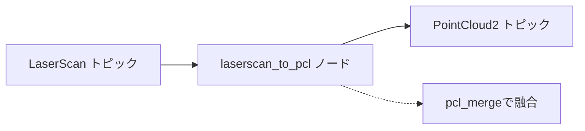
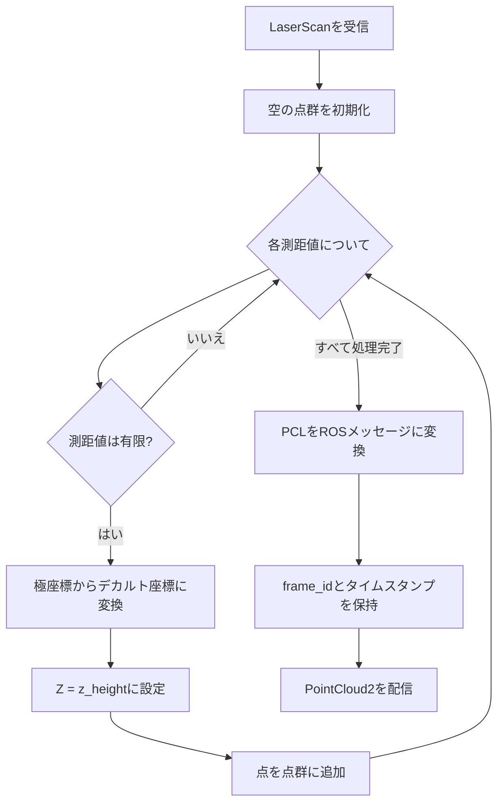

# LaserScan→Point Cloud変換器 (src/laserscan_to_pcl)

## 概要

`laserscan_to_pcl`パッケージは、2Dレーザスキャンデータ(`sensor_msgs/LaserScan`)を3D点群(`sensor_msgs/PointCloud2`)に変換します。これにより、2D LIDARデータを3D知覚パイプラインと融合できます。

## 目的

- 2Dレーザ測距データを3D点群形式に変換
- 2D LIDARセンサを3Dマッピングおよびナビゲーションシステムに統合可能に
- センサ融合のための一貫した点群インターフェースを提供

## アーキテクチャ



## ROS2インターフェース

### 購読トピック
- **`/scan`** (`sensor_msgs/LaserScan`)
  - 入力2Dレーザスキャンデータ
  - `input_topic`パラメータで設定可能

### 配信トピック
- **`/scan_pointcloud`** (`sensor_msgs/PointCloud2`)
  - 強度付き出力3D点群
  - 型: `pcl::PointXYZI`
  - `output_topic`パラメータで設定可能

## パラメータ

| パラメータ | 型 | デフォルト | 説明 |
|-----------|------|---------|-------------|
| `input_topic` | string | `/scan` | LaserScan入力トピック名 |
| `output_topic` | string | `/scan_pointcloud` | PointCloud2出力トピック名 |
| `z_height` | double | 0.2 | スキャン平面の高さ(Z軸)メートル単位 |

## 変換アルゴリズム



### 座標変換

**極座標からデカルト座標への変換:**
```
x = range * cos(angle)
y = range * sin(angle)
z = z_height (定数)
intensity = 1.0 (デフォルト)
```

ここで:
- `angle = angle_min + (i * angle_increment)`
- `range` = LaserScanからの距離測定値
- `z_height` = 設定可能な高さパラメータ

## 点群フォーマット

- **点タイプ:** `pcl::PointXYZI`
  - `x, y, z`: メートル単位の3D位置
  - `intensity`: すべての点に対して1.0に設定
- **点群プロパティ:**
  - `width`: 有効な点の数
  - `height`: 1(非組織化点群)
  - `is_dense`: true(無効な点なし)

## Quality of Service (QoS)

購読に`rclcpp::SensorDataQoS()`を使用:
- **信頼性:** ベストエフォート
- **耐久性:** Volatile
- **履歴:** 最新を保持
- リアルタイムセンサデータストリーミング用に最適化

## フレームの保持

コンバータは元のLaserScanメタデータを保持します:
- **フレームID:** 入力LaserScanからコピー
- **タイムスタンプ:** スキャンヘッダーから保持
- 時間的および空間的一貫性を保証

## ユースケース

### センサ融合
主な用途は、2D LIDARデータを`pcl_merge`ノードに供給し、以下との複数センサ融合を実現:
- 深度カメラ点群
- その他の3Dセンサ

### ナビゲーション
- ナビゲーションスタックでの障害物検出
- 占有マッピング
- ローカリゼーション

## パフォーマンスに関する考慮事項

- **計算コスト:** 最小(単純な三角関数変換)
- **メモリ:** スキャン点数に比例
- **レイテンシ:** リアルタイム、処理遅延はほぼゼロ

## 依存関係

### ROS2パッケージ
- `rclcpp`: ROS2 C++クライアントライブラリ
- `sensor_msgs`: LaserScanとPointCloud2メッセージ型
- `pcl_conversions`: PCL ↔ ROSメッセージ変換
- `pcl_ros`: 点群ユーティリティ

### 外部ライブラリ
- **PCL (Point Cloud Library):** 点群データ構造と変換

## 使用例

```bash
# デフォルトパラメータで起動
ros2 run laserscan_to_pcl laserscan_to_pcl_node

# カスタムパラメータで起動
ros2 run laserscan_to_pcl laserscan_to_pcl_node \
  --ros-args \
  -p input_topic:=/scan_front \
  -p output_topic:=/scan_front_cloud \
  -p z_height:=0.25
```

## 関連パッケージ

- **pcl_merge**: 変換されたスキャンを他の点群とマージ
- **ego_pcl_filter**: マージされた点群をフィルタリング
- **nav2**: コストマップ生成のために点群データを使用

## 実装ノート

- 無効/無限の測距測定値をフィルタリング
- 入力スキャンとの時間同期を維持
- リアルタイム操作に適したシングルスレッド処理
