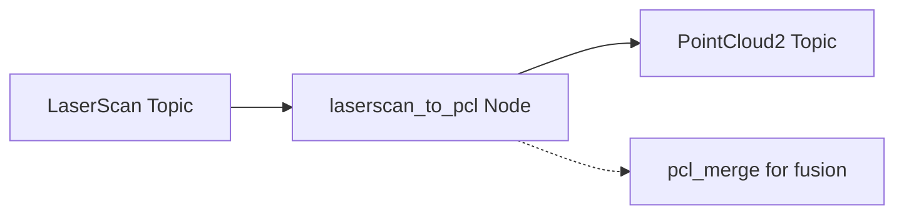
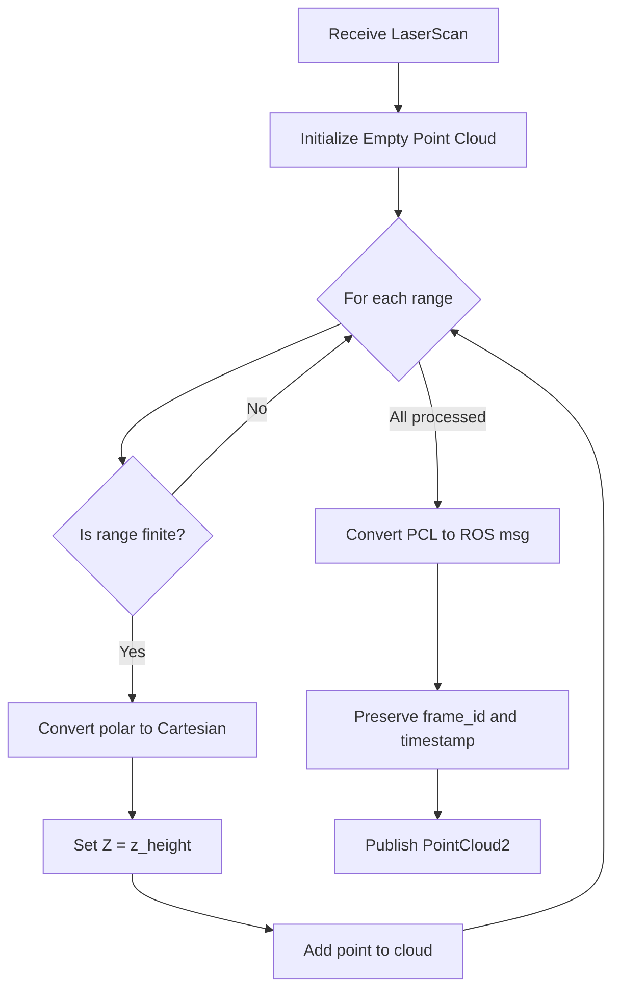

# LaserScan to Point Cloud Converter (src/laserscan_to_pcl)

## Overview

The `laserscan_to_pcl` package converts 2D laser scan data (`sensor_msgs/LaserScan`) into 3D point clouds (`sensor_msgs/PointCloud2`). This enables fusion of 2D LIDAR data with 3D perception pipelines.

## Purpose

- Convert 2D laser range data to 3D point cloud format
- Enable integration of 2D LIDAR sensors into 3D mapping and navigation systems
- Provide consistent point cloud interface for sensor fusion

## Architecture



## ROS2 Interface

### Subscribed Topics
- **`/scan`** (`sensor_msgs/LaserScan`)
  - Input 2D laser scan data
  - Configurable via `input_topic` parameter

### Published Topics
- **`/scan_pointcloud`** (`sensor_msgs/PointCloud2`)
  - Output 3D point cloud with intensity
  - Type: `pcl::PointXYZI`
  - Configurable via `output_topic` parameter

## Parameters

| Parameter | Type | Default | Description |
|-----------|------|---------|-------------|
| `input_topic` | string | `/scan` | LaserScan input topic name |
| `output_topic` | string | `/scan_pointcloud` | PointCloud2 output topic name |
| `z_height` | double | 0.2 | Height (Z-axis) of scan plane in meters |

## Conversion Algorithm



### Coordinate Transformation

**Polar to Cartesian conversion:**
```
x = range * cos(angle)
y = range * sin(angle)
z = z_height (constant)
intensity = 1.0 (default)
```

Where:
- `angle = angle_min + (i * angle_increment)`
- `range` = distance measurement from LaserScan
- `z_height` = configurable elevation parameter

## Point Cloud Format

- **Point Type:** `pcl::PointXYZI`
  - `x, y, z`: 3D position in meters
  - `intensity`: Set to 1.0 for all points
- **Cloud Properties:**
  - `width`: Number of valid points
  - `height`: 1 (unorganized cloud)
  - `is_dense`: true (no invalid points)

## Quality of Service (QoS)

Uses `rclcpp::SensorDataQoS()` for subscription:
- **Reliability:** Best effort
- **Durability:** Volatile
- **History:** Keep last
- Optimized for real-time sensor data streaming

## Frame Preservation

The converter preserves the original LaserScan metadata:
- **Frame ID:** Copied from input LaserScan
- **Timestamp:** Preserved from scan header
- Ensures temporal and spatial consistency

## Use Cases

### Sensor Fusion
Primary use is feeding 2D LIDAR data into the `pcl_merge` node for multi-sensor fusion with:
- Depth camera point clouds
- Other 3D sensors

### Navigation
- Obstacle detection in navigation stack
- Occupancy mapping
- Localization

## Performance Considerations

- **Computational Cost:** Minimal (simple trigonometric conversions)
- **Memory:** Proportional to number of scan points
- **Latency:** Real-time, negligible processing delay

## Dependencies

### ROS2 Packages
- `rclcpp`: ROS2 C++ client library
- `sensor_msgs`: LaserScan and PointCloud2 message types
- `pcl_conversions`: PCL ↔ ROS message conversion
- `pcl_ros`: Point cloud utilities

### External Libraries
- **PCL (Point Cloud Library):** Point cloud data structures and conversion

## Usage Example

```bash
# Launch with default parameters
ros2 run laserscan_to_pcl laserscan_to_pcl_node

# Launch with custom parameters
ros2 run laserscan_to_pcl laserscan_to_pcl_node \
  --ros-args \
  -p input_topic:=/scan_front \
  -p output_topic:=/scan_front_cloud \
  -p z_height:=0.25
```

## Related Packages

- **pcl_merge**: Merges converted scan with other point clouds
- **ego_pcl_filter**: Filters merged point clouds
- **nav2**: Uses point cloud data for costmap generation

## Implementation Notes

- Filters invalid/infinite range measurements
- Maintains temporal synchronization with input scans
- Single-threaded processing suitable for real-time operation
