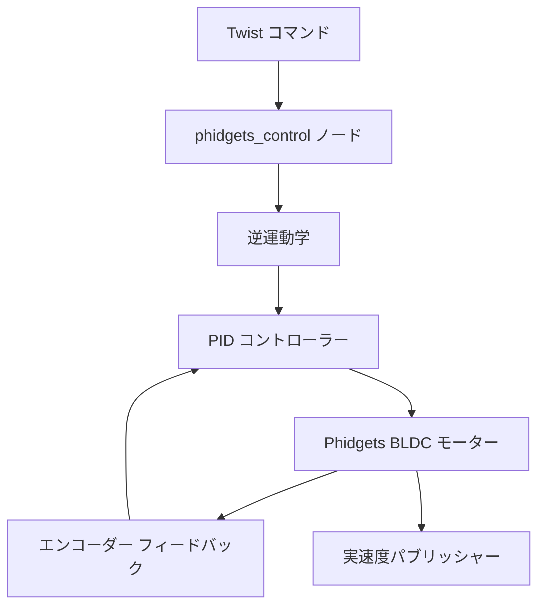

# メカナムホイール駆動制御 (src/mecanum_wheels)

## 概要

`mecanum_wheels`パッケージは、Phidgets BLDCモーターコントローラーを使用したメカナムホイール全方向移動ロボットの低レベルモーター制御を提供します。PIDによる閉ループ速度制御を実装し、複数の駆動モードをサポートします。

## 目的

- 高レベルTwistコマンドを個別のホイール速度に変換
- BLDC モーター制御用のPhidgetsハードウェアとインターフェース
- 精密な位置決めのための閉ループPID速度制御を実装
- 複数のロボット構成(SOLO、DOCKING、COMBINE_CHAIR)をサポート
- 実際のホイール速度フィードバックを配信

## アーキテクチャ



## ROS2インターフェース

### 購読トピック
- **`/cmd_vel`** (`geometry_msgs/Twist`)
  - 指令された線形および角速度
  - nav_controlによる変換後

### 配信トピック
- **`/real_speed`** (`geometry_msgs/Twist`)
  - エンコーダーフィードバックからの実際のロボット速度
  - ホイールオドメトリから計算
  - オプション(`REAL_SPEED_PUBLISH`フラグで有効化)

### サービス
- **`/stop_motors`** (`std_srvs/Empty`)
  - 緊急停止サービス
  - すべてのモーター速度をゼロに設定

## 主な機能

### メカナムホイール運動学

**逆運動学**はロボット速度をホイール速度に変換:

```
vFL = (vx - vy - ω*R) / r
vFR = (vx + vy + ω*R) / r
vBL = (vx + vy - ω*R) / r
vBR = (vx - vy + ω*R) / r
```

ここで:
- `vx, vy`: 線形速度(前進、横移動)
- `ω`: 角速度(回転)
- `R`: ホイールジオメトリ定数(0.35m)
- `r`: ホイール半径(0.0762m)

### PID速度制御

閉ループ制御は指令速度を維持:

**PID方程式:**
```
output = kp*error + ki*∫error + kd*d(velocity)/dt
```

**デフォルトゲイン:**
- `kp = 0.2`: 比例ゲイン
- `ki = 4.2`: 積分ゲイン(`ENABLE_I = True`の場合)
- `kd = 0.1`: 微分ゲイン(`ENABLE_D = True`の場合)

**アンチワインドアップ:** 過度な蓄積を防ぐために積分項を飽和:
```python
if ||error_sum|| > 0.5:
    error_sum = error_sum * (0.5 / ||error_sum||)
```

## ロボットパラメータ

### 物理定数

```python
WHEEL_SEPARATION_WIDTH = 0.40   # 40cm (メートル)
WHEEL_SEPARATION_LENGTH = 0.30  # 30cm (メートル)
WHEEL_GEOMETRY = 0.35           # 幅と長さの平均
WHEEL_RADIUS = 0.0762           # 7.62cm (3インチ)
```

## 依存関係

### ROS2パッケージ
- `rclpy`: Python ROS2クライアントライブラリ
- `geometry_msgs`: Twistメッセージ型
- `std_srvs`: Emptyサービス型

### 外部ライブラリ
- **Phidget22:** Phidgetsハードウェア SDK
  ```bash
  pip3 install Phidget22
  ```
- **NumPy:** 配列演算と運動学
  ```bash
  pip3 install numpy
  ```

## 使用例

```bash
# コントローラーを起動
ros2 run mecanum_wheels phidgets_control

# テストコマンドを送信
ros2 topic pub /cmd_vel geometry_msgs/Twist \
  "{linear: {x: 0.5, y: 0.0, z: 0.0}, angular: {x: 0.0, y: 0.0, z: 0.0}}"

# 緊急停止
ros2 service call /stop_motors std_srvs/Empty
```

## トラブルシューティング

| 問題 | 考えられる原因 | 解決策 |
|-------|---------------|----------|
| モーターが応答しない | Phidgetsが接続されていない | USB接続を確認しsudoで実行 |
| 振動する動き | PIDゲインが高すぎる | `kp`と`kd`を減らす |
| 緩慢な応答 | 積分ゲインが低すぎる | `ki`を増やす |
| ロボットがドリフトする | ホイールキャリブレーションエラー | `WHEEL_GEOMETRY`と`WHEEL_RADIUS`を検証 |
| 接続タイムアウト | ハブの電源が入っていない | Phidgetsハブの電源を確認 |
