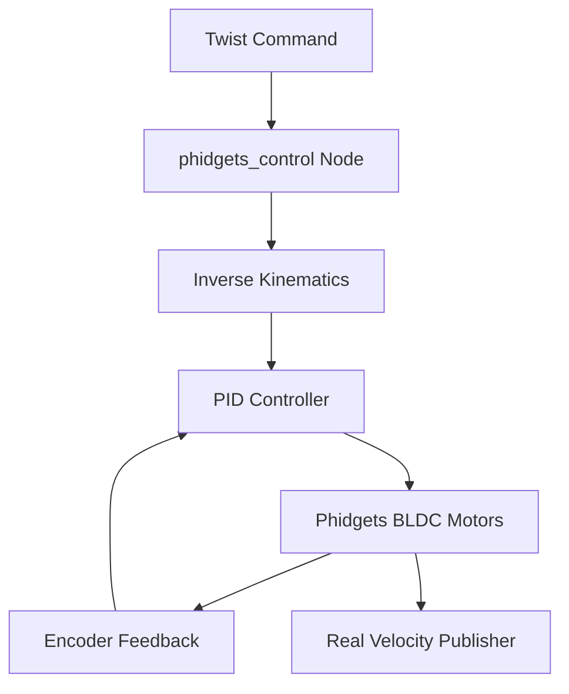
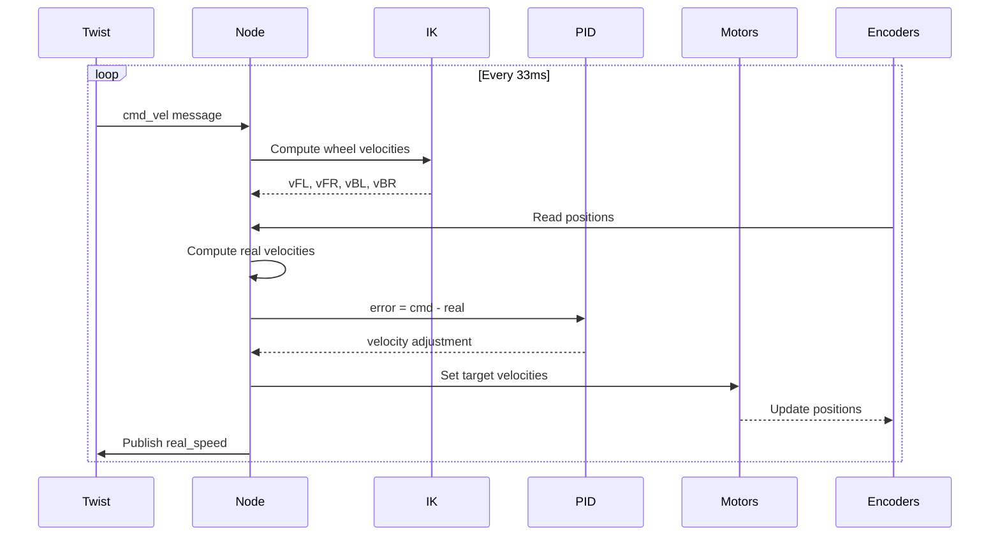

# Mecanum Wheel Drive Control (src/mecanum_wheels)

## Overview

The `mecanum_wheels` package provides low-level motor control for mecanum wheel omnidirectional robots using Phidgets BLDC motor controllers. It implements closed-loop velocity control with PID and supports multiple drive modes.

## Purpose

- Convert high-level Twist commands to individual wheel velocities
- Interface with Phidgets hardware for BLDC motor control
- Implement closed-loop PID velocity control
- Support multiple robot configurations (SOLO, DOCKING, COMBINE_CHAIR)
- Publish real wheel velocity feedback

## Architecture



## ROS2 Interface

### Subscribed Topics
- **`/cmd_vel`** (`geometry_msgs/Twist`)
  - Commanded linear and angular velocities
  - After transformation by nav_control

### Published Topics
- **`/real_speed`** (`geometry_msgs/Twist`)
  - Actual robot velocity from encoder feedback
  - Computed from wheel odometry
  - Optional (enabled via `REAL_SPEED_PUBLISH` flag)

### Services
- **`/stop_motors`** (`std_srvs/Empty`)
  - Emergency stop service
  - Sets all motor velocities to zero

## Key Features

### Mecanum Wheel Kinematics

**Inverse kinematics** converts robot velocity to wheel velocities:

```
vFL = (vx - vy - ω*R) / r
vFR = (vx + vy + ω*R) / r
vBL = (vx + vy - ω*R) / r
vBR = (vx - vy + ω*R) / r
```

Where:
- `vx, vy`: Linear velocity (forward, lateral)
- `ω`: Angular velocity (rotation)
- `R`: Wheel geometry constant (0.35m)
- `r`: Wheel radius (0.0762m)

**Forward kinematics** reconstructs robot velocity from wheel speeds:

```
vx = (vFL + vFR + vBL + vBR) / 4
vy = (-vFL + vFR + vBL - vBR) / 4
ω = (-vFL + vFR - vBL + vBR) / (4*R)
```

### PID Velocity Control

Closed-loop control maintains commanded velocities:

**PID equation:**
```
output = kp*error + ki*∫error + kd*d(velocity)/dt
```

**Default gains:**
- `kp = 0.2`: Proportional gain
- `ki = 4.2`: Integral gain (when `ENABLE_I = True`)
- `kd = 0.1`: Derivative gain (when `ENABLE_D = True`)

**Anti-windup:** Integral term saturated to prevent excessive accumulation:
```python
if ||error_sum|| > 0.5:
    error_sum = error_sum * 0.5 / ||error_sum||
```

### Drive Modes

Three operational modes supported:

| Mode | Value | Description | Use Case |
|------|-------|-------------|----------|
| `STAND_ALONE` | 0 | Independent robot operation | Normal navigation |
| `COMBINE_CHAIR` | 1 | Attached to wheelchair | Patient transport |

Mode selection handled by nav_control package via rotation center parameter.

## Hardware Interface

### Phidgets BLDC Motor Configuration

**Motor assignments:**
- **lf_motor:** Left front wheel
- **rf_motor:** Right front wheel
- **lr_motor:** Left rear wheel
- **rr_motor:** Right rear wheel

**Motor initialization:**
```python
motor.setTargetVelocity(0)
motor.setAcceleration(1.5)
motor.setDataInterval(100)  # 100ms
motor.setDataRate(10)       # 10 Hz
```

**Connection retry logic:** Automatically reconnects on failure with 5-second timeout.

## Robot Parameters

### Physical Constants

```python
WHEEL_SEPARATION_WIDTH = 0.40   # 40cm (meters)
WHEEL_SEPARATION_LENGTH = 0.30  # 30cm (meters)
WHEEL_GEOMETRY = 0.35           # Average of width and length
WHEEL_RADIUS = 0.0762           # 7.62cm (3 inches)
```

### Unit Conversion

**Phidgets duty cycle to rad/s:**
```
CONSTANT = 33.5  # rad/s per 1.0 duty
```
Derived from: 320 RPM = 320 * 2π / 60 ≈ 33.5 rad/s

## Control Loop

### Main Loop Timing
- **Frequency:** 30 Hz
- **Period:** 33.33ms (`TimerPeriod = 1.0 / 30.0`)

### Processing Pipeline



## Configuration Flags

### Debug and Feature Toggles

```python
ON_LINE_HUB = True          # Enable Phidgets hardware communication
CLOSED_LOOP = True          # Enable PID control
REAL_SPEED_PUBLISH = True   # Publish real velocity feedback
ENABLE_I = True             # Enable integral term
ENABLE_D = True             # Enable derivative term
```

For testing without hardware, set `ON_LINE_HUB = False`.

## Dependencies

### ROS2 Packages
- `rclpy`: Python ROS2 client library
- `geometry_msgs`: Twist message type
- `std_srvs`: Empty service type

### External Libraries
- **Phidget22:** Phidgets hardware SDK
  ```bash
  pip3 install Phidget22
  ```
- **NumPy:** Array operations and kinematics
  ```bash
  pip3 install numpy
  ```

## Installation

```bash
# Install Phidgets libraries
wget https://www.phidgets.com/downloads/phidget22/libraries/linux/libphidget22.tar.gz
tar -xzf libphidget22.tar.gz
cd libphidget22-*
./configure && make && sudo make install

# Install Python module
pip3 install Phidget22

# Verify installation
python3 -c "from Phidget22.Devices.BLDCMotor import BLDCMotor; print('OK')"
```

## Usage Example

```bash
# Launch the controller
ros2 run mecanum_wheels phidgets_control

# Send test command
ros2 topic pub /cmd_vel geometry_msgs/Twist \
  "{linear: {x: 0.5, y: 0.0, z: 0.0}, angular: {x: 0.0, y: 0.0, z: 0.0}}"

# Emergency stop
ros2 service call /stop_motors std_srvs/Empty
```

## Performance Tuning

### PID Gain Tuning

Ziegler-Nichols method:
1. Set `ki = kd = 0`, increase `kp` until oscillation
2. Record critical gain `Kc` and period `Tc`
3. Apply formulas:
   - `kp = 0.6 * Kc`
   - `ki = 1.2 * Kc / Tc`
   - `kd = 0.075 * Kc * Tc`

### Velocity Limits

Set maximum velocities to prevent hardware damage:
```python
# In ControlLoopUtils or main node
MAX_LINEAR_VELOCITY = 1.0    # m/s
MAX_ANGULAR_VELOCITY = 1.0   # rad/s
```

## Related Packages

- **nav_control**: Provides rotation center-adjusted Twist commands
- **nav_docking**: Uses mecanum capabilities for precise docking
- **nav2**: Provides high-level navigation goals

## Troubleshooting

| Issue | Possible Cause | Solution |
|-------|---------------|----------|
| Motors not responding | Phidgets not connected | Check USB connection and run with sudo |
| Oscillating motion | PID gains too high | Reduce `kp` and `kd` |
| Sluggish response | Integral gain too low | Increase `ki` |
| Robot drifts | Wheel calibration error | Verify `WHEEL_GEOMETRY` and `WHEEL_RADIUS` |
| Connection timeout | Hub not powered | Check Phidgets hub power supply |

## Safety Considerations

- **Emergency stop:** Always implement `/stop_motors` service in safety systems
- **Acceleration limits:** `setAcceleration(1.5)` prevents abrupt starts
- **Velocity saturation:** Ensure nav_control clamps commands to safe limits
- **Integral windup:** Anti-windup prevents runaway behavior

## Code Structure

```
src/mecanum_wheels/
├── mecanum_wheels/
│   ├── __init__.py
│   └── phidgets_control.py      # Main controller node
├── test/
│   ├── test_copyright.py
│   ├── test_flake8.py
│   └── test_pep257.py
├── package.xml
└── setup.py
```
