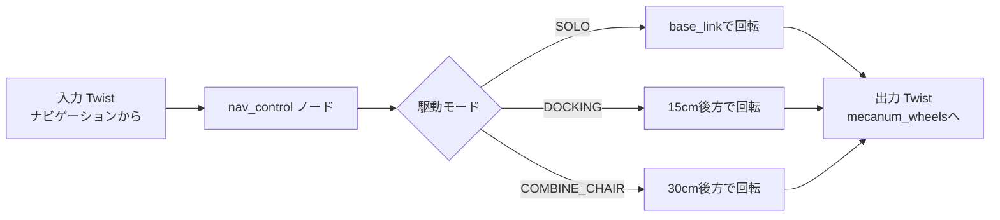
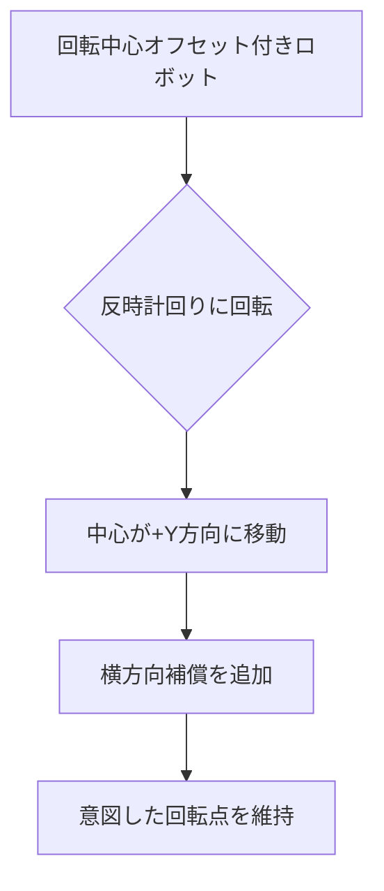

# ナビゲーション制御 - 速度変換 (src/nav_control)

## 概要

`nav_control`パッケージは、異なるロボット構成と回転中心を補償するために速度コマンドを変換します。ロボットの動作モード(単独、ドッキング、または車椅子との組み合わせ)に基づいて横方向速度を調整します。

## 目的

- 異なる回転中心位置に対する速度コマンドを変換
- 設定可能な回転中心を持つ複数の駆動モードをサポート
- 安全のための速度クランプを適用
- 制約された環境での正確な操縦を可能に

## アーキテクチャ



## ROS2インターフェース

### 購読トピック
- **`input_topic`** (`geometry_msgs/Twist`)
  - ナビゲーションスタックからの高レベル速度コマンド
  - パラメータで設定可能(デフォルト: `"input_topic"`)

### 配信トピック
- **`output_topic`** (`geometry_msgs/Twist`)
  - モータコントローラ用の変換された速度コマンド
  - パラメータで設定可能(デフォルト: `"output_topic"`)

## パラメータ

| パラメータ | 型 | デフォルト | 説明 |
|-----------|------|---------|-------------|
| `input_topic` | string | `"input_topic"` | 速度コマンド入力トピック |
| `output_topic` | string | `"output_topic"` | 変換された速度出力トピック |
| `mode_drive` | string | `"DOCKING"` | 駆動モード: SOLO、DOCKING、またはCOMBINE_CHAIR |
| `LENGTH_ROTATION_CENTER_SOLO` | float | 0.0 | SOLOモードの回転中心(メートル) |
| `LENGTH_ROTATION_CENTER_DOCKING` | float | 0.15 | DOCKINGモードの回転中心(メートル) |
| `LENGTH_ROTATION_CENTER_COMBINE_CHAIR` | float | 0.3 | COMBINE_CHAIRモードの回転中心(メートル) |

## 駆動モード

### SOLOモード
- **回転中心:** `base_link`原点(0.0m)
- **ユースケース:** 独立したロボットナビゲーション
- **動作:** 標準的なメカナムホイール運動学

### DOCKINGモード(デフォルト)
- **回転中心:** `base_link`から0.15m後方
- **ユースケース:** 外部オブジェクトへの接近とドッキング
- **動作:** 正確な位置合わせのための後方重視回転

### COMBINE_CHAIRモード
- **回転中心:** `base_link`から0.30m後方
- **ユースケース:** 車椅子に取り付けられたロボット
- **動作:** 組み合わせシステムを考慮した遠方後方回転

## 速度変換

### 変換方程式

```
v_out.x = v_in.x
v_out.y = v_in.y + (ω * LENGTH_ROTATION_CENTER)
ω_out = ω
```

ここで:
- `v_in`: 入力線速度(前後/横方向)
- `ω`: 角速度(不変)
- `LENGTH_ROTATION_CENTER`: 駆動モードに基づくオフセット距離

### 物理的解釈



ロボットの後方の点を中心に回転する場合:
- 角速度が実効的な横方向速度を生成
- 補償: `Δv_y = -ω * offset`
- 意図した物理的位置での回転を保証

## 速度クランプ

### 安全制限

```cpp
max_speed = /* 設定可能、通常1.0 m/s */

double clamp_velocity(double value) {
    if (value == 0.0) return 0.0;
    return std::max(-max_speed, std::min(max_speed, value));
}
```

3つの速度成分すべてに適用:
- `linear.x`: 前後
- `linear.y`: 横方向(左右)
- `angular.z`: 回転

### エッジケース
- **ゼロ速度:** 正確に保持(クランプなし)
- **オーバーフロー:** ±max_speedに飽和
- **モード遷移:** ヒステリシスなし(即座に切り替え)

## 動的モード切り替え

### ランタイム再構成

```cpp
void cmd_velCallback(const Twist::SharedPtr msg) {
    this->get_parameter("mode_drive", mode_drive);

    if (previous_mode_drive != mode_drive) {
        LENGTH_ROTATION_CENTER = rotationCenter(mode_drive);
        previous_mode_drive = mode_drive;
        RCLCPP_INFO("Mode changed to %s", mode_drive.c_str());
    }

    // 変換を適用...
}
```

モードは実行時に変更可能:
```bash
ros2 param set /nav_control mode_drive SOLO
```

## 例のシナリオ

### シナリオ1: ドッキング操作
```yaml
mode_drive: DOCKING
LENGTH_ROTATION_CENTER: 0.15

入力:  vx=0.1, vy=0.0, ω=0.5
出力: vx=0.1, vy=0.075, ω=0.5
```
横方向補償により、ロボットの後部がドッキングポイントを中心に回転できます。

### シナリオ2: 車椅子輸送
```yaml
mode_drive: COMBINE_CHAIR
LENGTH_ROTATION_CENTER: 0.30

入力:  vx=0.0, vy=0.0, ω=0.3
出力: vx=0.0, vy=0.09, ω=0.3
```
より大きなオフセットにより、回転中心が車椅子接続点にあることを保証します。

### シナリオ3: 自由ナビゲーション
```yaml
mode_drive: SOLO
LENGTH_ROTATION_CENTER: 0.0

入力:  vx=0.5, vy=0.2, ω=0.0
出力: vx=0.5, vy=0.2, ω=0.0
```
標準的な全方向移動には変換が適用されません。

## 設定ファイル

`src/nav_control/config/docking_pid_params.yaml`に配置:

```yaml
nav_control:
  ros__parameters:
    mode_drive: "DOCKING"
    input_topic: "/nav_docking/cmd_vel"
    output_topic: "/cmd_vel"
    LENGTH_ROTATION_CENTER_SOLO: 0.0
    LENGTH_ROTATION_CENTER_DOCKING: 0.15
    LENGTH_ROTATION_CENTER_COMBINE_CHAIR: 0.3
```

## 依存関係

### ROS2パッケージ
- `rclcpp`: ROS2 C++クライアントライブラリ
- `geometry_msgs`: Twistメッセージ型

### 外部ライブラリ
なし(標準C++のみ)

## 使用例

```bash
# デフォルト設定で起動
ros2 run nav_control nav_control

# パラメータ付きで起動
ros2 run nav_control nav_control \
  --ros-args \
  -p mode_drive:=SOLO \
  -p input_topic:=/cmd_vel_nav \
  -p output_topic:=/cmd_vel_hw

# 実行時にモードを変更
ros2 param set /nav_control mode_drive COMBINE_CHAIR
```

## パフォーマンス

- **レイテンシ:** < 1ms(単純な算術演算)
- **頻度:** 入力トピックレートで処理(通常10-30 Hz)
- **CPU使用率:** 無視できるレベル

## 関連パッケージ

- **nav_docking**: ドッキング中に速度コマンドを提供
- **nav_goal**: アプローチ中に速度コマンドを提供
- **mecanum_wheels**: 変換された速度コマンドを使用
- **nav2**: 自律ナビゲーション速度コマンドを提供

## トラブルシューティング

| 問題 | 考えられる原因 | 解決方法 |
|-------|---------------|----------|
| ロボットが間違った点を中心に回転 | 誤ったモード選択 | `mode_drive`パラメータを確認 |
| 過度な横方向移動 | 回転中心が大きすぎる | `LENGTH_ROTATION_CENTER`を減少 |
| 緩慢な応答 | max_speedが低すぎる | 速度制限を増加 |
| モードが変わらない | パラメータが更新されていない | `ros2 param set`コマンドを使用 |

## 設計の理論的根拠

### なぜ速度を変換するのか?

メカナムホイールは全方向移動を可能にしますが、回転点が重要です:
- **物理的制約:** ロボットが外部オブジェクトに取り付けられている可能性
- **精度要件:** ドッキングは特定の点を中心とした回転が必要
- **運動学的補償:** ネイティブメカナム運動学はbase_linkでの回転を仮定

### 代替アプローチ
1. **ナビゲーションゴールを調整:** より複雑、再計画が必要
2. **メカナムコントローラを修正:** 柔軟性が低く、ハードウェア固有
3. **速度コマンドを変換:** ✅ 選択 - シンプル、柔軟、再利用可能

## コード構造

```
src/nav_control/
├── src/
│   └── nav_control.cpp          # メイン実装
├── include/
│   └── nav_control/
│       └── nav_control.h        # ヘッダーファイル
├── launch/
│   └── nav_control.launch.py   # 起動設定
├── config/
│   └── docking_pid_params.yaml # パラメータファイル
├── CMakeLists.txt
└── package.xml
```

## 将来の拡張

- [ ] 補間による滑らかなモード遷移
- [ ] センサフィードバックに基づく動的回転中心
- [ ] よりスムーズな加速のための速度プロファイリング
- [ ] より複雑な運動学モデルのサポート
