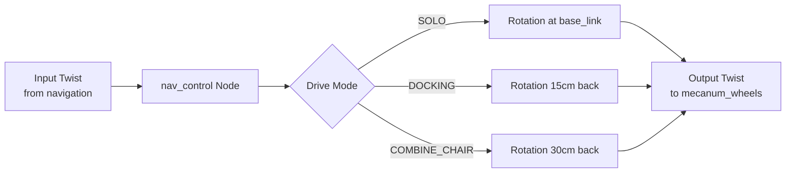
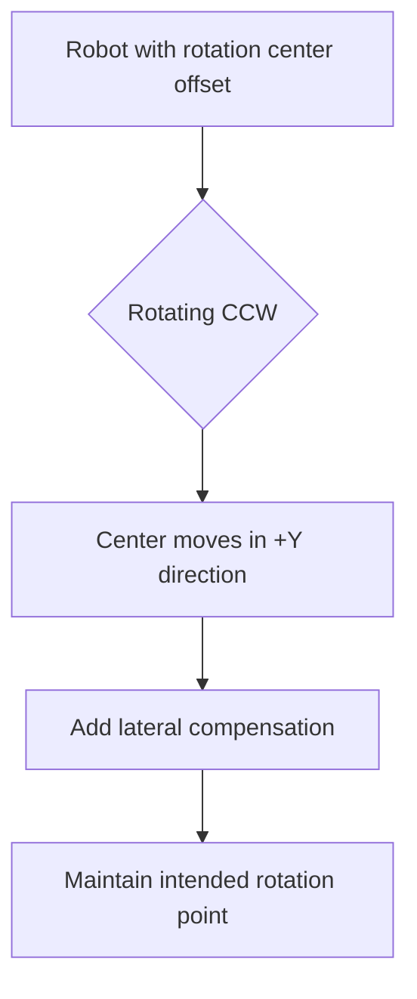

# Navigation Control - Velocity Transform (src/nav_control)

## Overview

The `nav_control` package transforms velocity commands to compensate for different robot configurations and rotation centers. It adjusts lateral velocity based on the robot's operational mode (standalone, docking, or combined with wheelchair).

## Purpose

- Transform velocity commands for different rotation center positions
- Support multiple drive modes with configurable rotation centers
- Apply velocity clamping for safety
- Enable precise maneuvering in constrained environments

## Architecture



## ROS2 Interface

### Subscribed Topics
- **`input_topic`** (`geometry_msgs/Twist`)
  - High-level velocity commands from navigation stack
  - Configurable via parameter (default: `"input_topic"`)

### Published Topics
- **`output_topic`** (`geometry_msgs/Twist`)
  - Transformed velocity commands for motor controller
  - Configurable via parameter (default: `"output_topic"`)

## Parameters

| Parameter | Type | Default | Description |
|-----------|------|---------|-------------|
| `input_topic` | string | `"input_topic"` | Velocity command input topic |
| `output_topic` | string | `"output_topic"` | Transformed velocity output topic |
| `mode_drive` | string | `"DOCKING"` | Drive mode: SOLO, DOCKING, or COMBINE_CHAIR |
| `LENGTH_ROTATION_CENTER_SOLO` | float | 0.0 | Rotation center for SOLO mode (meters) |
| `LENGTH_ROTATION_CENTER_DOCKING` | float | 0.15 | Rotation center for DOCKING mode (meters) |
| `LENGTH_ROTATION_CENTER_COMBINE_CHAIR` | float | 0.3 | Rotation center for COMBINE_CHAIR mode (meters) |

## Drive Modes

### SOLO Mode
- **Rotation center:** At `base_link` origin (0.0m)
- **Use case:** Independent robot navigation
- **Behavior:** Standard mecanum wheel kinematics

### DOCKING Mode (Default)
- **Rotation center:** 0.15m behind `base_link`
- **Use case:** Approaching and docking with external objects
- **Behavior:** Rear-biased rotation for precise alignment

### COMBINE_CHAIR Mode
- **Rotation center:** 0.30m behind `base_link`
- **Use case:** Robot attached to wheelchair
- **Behavior:** Far rear rotation to account for combined system

## Velocity Transformation

### Transform Equation

```
v_out.x = v_in.x
v_out.y = v_in.y + (ω * LENGTH_ROTATION_CENTER)
ω_out = ω
```

Where:
- `v_in`: Input linear velocity (forward/lateral)
- `ω`: Angular velocity (unchanged)
- `LENGTH_ROTATION_CENTER`: Offset distance based on drive mode

### Physical Interpretation



When rotating about a point behind the robot:
- Angular velocity creates an effective lateral velocity
- Compensation: `Δv_y = -ω * offset`
- Ensures rotation occurs at intended physical location

## Velocity Clamping

### Safety Limits

```cpp
max_speed = /* configurable, typically 1.0 m/s */

double clamp_velocity(double value) {
    if (value == 0.0) return 0.0;
    return std::max(-max_speed, std::min(max_speed, value));
}
```

Applied to all three velocity components:
- `linear.x`: Forward/backward
- `linear.y`: Lateral (left/right)
- `angular.z`: Rotation

### Edge Cases
- **Zero velocity:** Preserved exactly (no clamping)
- **Overflow:** Saturated to ±max_speed
- **Mode transitions:** No hysteresis (instantaneous switch)

## Dynamic Mode Switching

### Runtime Reconfiguration

```cpp
void cmd_velCallback(const Twist::SharedPtr msg) {
    this->get_parameter("mode_drive", mode_drive);

    if (previous_mode_drive != mode_drive) {
        LENGTH_ROTATION_CENTER = rotationCenter(mode_drive);
        previous_mode_drive = mode_drive;
        RCLCPP_INFO("Mode changed to %s", mode_drive.c_str());
    }

    // Apply transformation...
}
```

Mode can be changed at runtime:
```bash
ros2 param set /nav_control mode_drive SOLO
```

## Example Scenarios

### Scenario 1: Docking Maneuver
```yaml
mode_drive: DOCKING
LENGTH_ROTATION_CENTER: 0.15

Input:  vx=0.1, vy=0.0, ω=0.5
Output: vx=0.1, vy=0.075, ω=0.5
```
Lateral compensation allows rear of robot to rotate about docking point.

### Scenario 2: Wheelchair Transport
```yaml
mode_drive: COMBINE_CHAIR
LENGTH_ROTATION_CENTER: 0.30

Input:  vx=0.0, vy=0.0, ω=0.3
Output: vx=0.0, vy=0.09, ω=0.3
```
Larger offset ensures rotation center is at wheelchair connection point.

### Scenario 3: Free Navigation
```yaml
mode_drive: SOLO
LENGTH_ROTATION_CENTER: 0.0

Input:  vx=0.5, vy=0.2, ω=0.0
Output: vx=0.5, vy=0.2, ω=0.0
```
No transformation applied for standard omnidirectional motion.

## Configuration File

Located at `src/nav_control/config/docking_pid_params.yaml`:

```yaml
nav_control:
  ros__parameters:
    mode_drive: "DOCKING"
    input_topic: "/nav_docking/cmd_vel"
    output_topic: "/cmd_vel"
    LENGTH_ROTATION_CENTER_SOLO: 0.0
    LENGTH_ROTATION_CENTER_DOCKING: 0.15
    LENGTH_ROTATION_CENTER_COMBINE_CHAIR: 0.3
```

## Dependencies

### ROS2 Packages
- `rclcpp`: ROS2 C++ client library
- `geometry_msgs`: Twist message type

### External Libraries
None (standard C++ only)

## Usage Example

```bash
# Launch with default configuration
ros2 run nav_control nav_control

# Launch with parameters
ros2 run nav_control nav_control \
  --ros-args \
  -p mode_drive:=SOLO \
  -p input_topic:=/cmd_vel_nav \
  -p output_topic:=/cmd_vel_hw

# Change mode at runtime
ros2 param set /nav_control mode_drive COMBINE_CHAIR
```

## Performance

- **Latency:** < 1ms (simple arithmetic)
- **Frequency:** Processes at input topic rate (typically 10-30 Hz)
- **CPU usage:** Negligible

## Related Packages

- **nav_docking**: Provides velocity commands during docking
- **nav_goal**: Provides velocity commands during approach
- **mecanum_wheels**: Consumes transformed velocity commands
- **nav2**: Provides autonomous navigation velocity commands

## Troubleshooting

| Issue | Possible Cause | Solution |
|-------|---------------|----------|
| Robot rotates around wrong point | Incorrect mode selected | Verify `mode_drive` parameter |
| Excessive lateral motion | Rotation center too large | Reduce `LENGTH_ROTATION_CENTER` |
| Sluggish response | max_speed too low | Increase velocity limits |
| Mode not changing | Parameter not updating | Use `ros2 param set` command |

## Design Rationale

### Why Transform Velocity?

Mecanum wheels allow omnidirectional motion, but rotation point matters:
- **Physical constraint:** Robot may be attached to external objects
- **Precision requirement:** Docking requires rotation about specific points
- **Kinematic compensation:** Native mecanum kinematics assume rotation at base_link

### Alternative Approaches
1. **Adjust navigation goals:** More complex, requires replanning
2. **Modify mecanum controller:** Less flexible, hardware-specific
3. **Transform velocity commands:** ✅ Chosen - simple, flexible, reusable

## Code Structure

```
src/nav_control/
├── src/
│   └── nav_control.cpp          # Main implementation
├── include/
│   └── nav_control/
│       └── nav_control.h        # Header file
├── launch/
│   └── nav_control.launch.py   # Launch configuration
├── config/
│   └── docking_pid_params.yaml # Parameter file
├── CMakeLists.txt
└── package.xml
```

## Future Enhancements

- [ ] Smooth mode transitions with interpolation
- [ ] Dynamic rotation center based on sensor feedback
- [ ] Velocity profiling for smoother acceleration
- [ ] Support for more complex kinematic models
