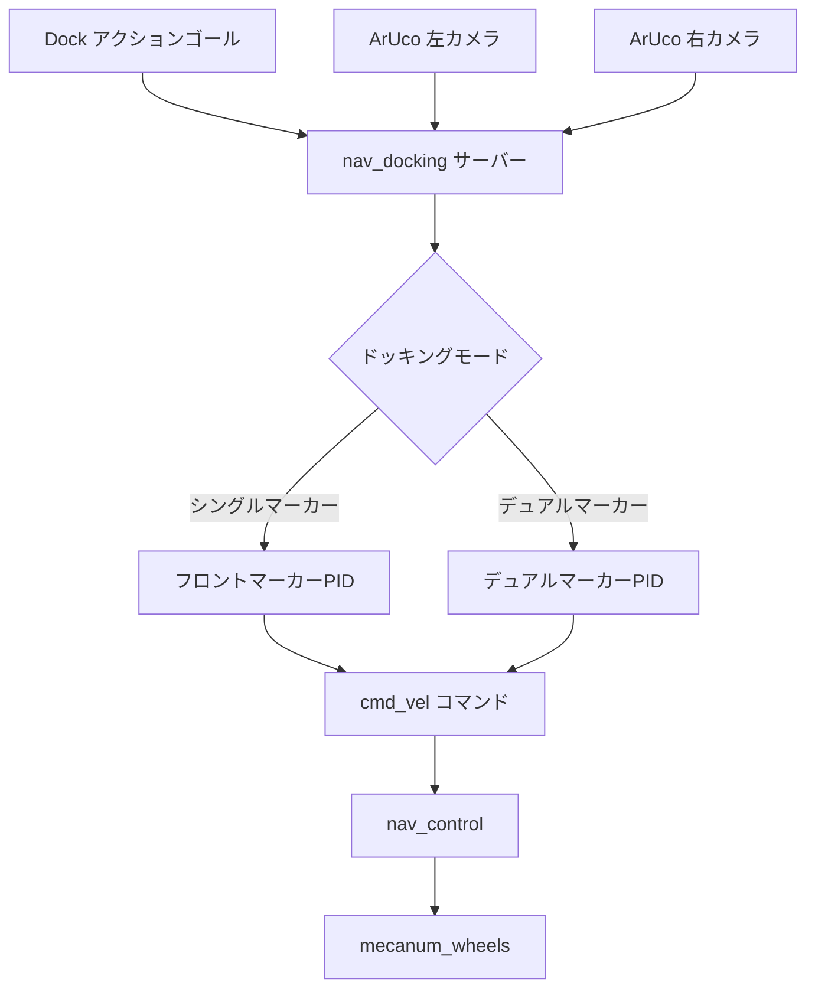
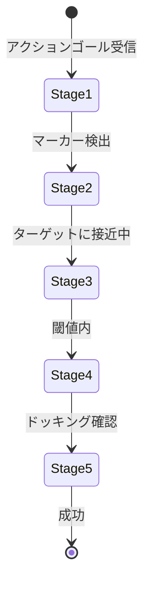

# ナビゲーションドッキング (src/nav_docking)

## 概要

`nav_docking`パッケージは、ArUcoマーカー検出とPID制御を使用した自律ドッキング動作を実装します。車椅子などの外部オブジェクトへのロボット接続のための正確なドッキング操作を実行するROS2アクションサーバーを提供します。

## 目的

- ArUcoマーカー装備ターゲットへの自律ドッキングを実行
- 正確な位置合わせのためのクローズドループPID制御を提供
- 精度向上のためのデュアルカメラ構成をサポート
- 安全で再現性のあるドッキング操作を可能に

## アーキテクチャ



## ROS2インターフェース

### アクションサーバー
- **`dock`** (`nav_interface/Dock`)
  - **ゴール:** `dock_request` (bool) - ドッキングを開始
  - **フィードバック:** `distance` (double) - ターゲットまでの現在の距離
  - **結果:** `success` (bool) - ドッキング完了ステータス

### 購読トピック
- **`marker_topic_left`** (`geometry_msgs/PoseArray`)
  - 左カメラからのArUcoマーカー姿勢
  - デフォルト: パラメータで設定可能

- **`marker_topic_right`** (`geometry_msgs/PoseArray`)
  - 右カメラからのArUcoマーカー姿勢
  - デフォルト: パラメータで設定可能

### 配信トピック
- **`cmd_vel_final`** (`geometry_msgs/Twist`)
  - ドッキング操作のための速度コマンド
  - 変換のためにnav_controlに供給

## パラメータ

### フレーム設定
| パラメータ | 型 | デフォルト | 説明 |
|-----------|------|---------|-------------|
| `base_frame` | string | `"base_link"` | ロボットベースフレーム |
| `camera_left_frame` | string | `"camera_left_frame"` | 左カメラフレーム |
| `camera_right_frame` | string | `"camera_right_frame"` | 右カメラフレーム |

### マーカー設定
| パラメータ | 型 | デフォルト | 説明 |
|-----------|------|---------|-------------|
| `desired_aruco_marker_id_left` | int | -1 | 追跡する左マーカーID |
| `desired_aruco_marker_id_right` | int | -1 | 追跡する右マーカーID |
| `marker_topic_left` | string | - | 左カメラマーカートピック |
| `marker_topic_right` | string | - | 右カメラマーカートピック |

### ドッキングオフセット
| パラメータ | 型 | デフォルト | 説明 |
|-----------|------|---------|-------------|
| `aruco_distance_offset` | float | -0.5 | シングルマーカー用の距離オフセット(m) |
| `aruco_left_right_offset_single` | float | 0.0 | シングルマーカー用の横方向オフセット(m) |
| `aruco_distance_offset_dual` | float | 0.0 | デュアルマーカー用の距離オフセット(m) |
| `aruco_center_offset_dual` | float | 0.0 | デュアルマーカー用の中心オフセット(m) |
| `aruco_rotation_offset_dual` | float | 0.0 | デュアルマーカー用の回転オフセット(rad) |

### エラー閾値
| パラメータ | 型 | デフォルト | 説明 |
|-----------|------|---------|-------------|
| `min_error` | float | 0.0 | PID出力の最小エラー(m) |
| `min_docking_error` | float | 0.0 | ドッキング完了閾値(m) |

### PIDゲイン
| パラメータ | 型 | デフォルト | 説明 |
|-----------|------|---------|-------------|
| `pid_parameters.kp_x` | float | 0.0 | X軸比例ゲイン |
| `pid_parameters.ki_x` | float | 0.0 | X軸積分ゲイン |
| `pid_parameters.kd_x` | float | 0.0 | X軸微分ゲイン |
| `pid_parameters.kp_y` | float | 0.0 | Y軸比例ゲイン |
| `pid_parameters.ki_y` | float | 0.0 | Y軸積分ゲイン |
| `pid_parameters.kd_y` | float | 0.0 | Y軸微分ゲイン |
| `pid_parameters.kp_z` | float | 0.0 | Z軸(回転)比例ゲイン |
| `pid_parameters.ki_z` | float | 0.0 | Z軸積分ゲイン |
| `pid_parameters.kd_z` | float | 0.0 | Z軸微分ゲイン |

## ドッキングモード

### シングルマーカーモード
- **アクティベーション:** 1つのカメラのみがマーカーを検出
- **制御:** フロントマーカーPIDコントローラ
- **ユースケース:** 初期接近、非対称構成

### デュアルマーカーモード
- **アクティベーション:** 両方のカメラがそれぞれのマーカーを検出
- **制御:** 中心整列付きデュアルマーカーPIDコントローラ
- **ユースケース:** 最終精密ドッキング、対称ターゲット

## PID制御アルゴリズム

### 制御ループ
```
出力 = kp * エラー + ki * ∫エラー * dt + kd * (エラー - 前回エラー) / dt
```

**機能:**
- デッドゾーン: `|エラー| ≤ min_error`の場合、出力 = 0
- 飽和: `[min_output, max_output]`にクランプ
- 軸ごとの調整: X、Y、Z用の個別PIDゲイン

### ドッキングステージ



- **ステージ4:** `stage_4_docking_status` - ターゲット近く
- **ステージ5:** `stage_5_docking_status` - ドッキング完了
- **確認済み:** `confirmed_docking_status` - 最終検証

## TF2変換

座標フレームを通じて変換されるマーカー姿勢:

```
camera_frame → base_link → 制御コマンド
```

信頼性のある変換のために2秒タイムアウトで`tf2_ros::Buffer`を使用。

## 設定ファイル

`src/nav_docking/config/docking_pid_params.yaml`に配置:

```yaml
nav_docking:
  ros__parameters:
    base_frame: "base_link"
    desired_aruco_marker_id_left: 10
    desired_aruco_marker_id_right: 11
    aruco_distance_offset: -0.5

    pid_parameters:
      kp_x: 1.0
      ki_x: 0.1
      kd_x: 0.05
      kp_y: 1.2
      ki_y: 0.15
      kd_y: 0.08
      kp_z: 0.8
      ki_z: 0.05
      kd_z: 0.02
```

## 依存関係

### ROS2パッケージ
- `rclcpp`: ROS2 C++クライアントライブラリ
- `rclcpp_action`: アクションサーバー実装
- `rclcpp_components`: コンポーネントサポート
- `geometry_msgs`: PoseとTwistメッセージ
- `sensor_msgs`: カメラデータ
- `tf2_ros`: 変換管理
- `cv_bridge`: OpenCV-ROSブリッジ
- `nav_interface`: カスタムDockアクション定義

### 外部ライブラリ
- **OpenCV:** 画像処理
- **Eigen3:** 線形代数

## 使用例

```bash
# ドッキングサーバーを起動
ros2 launch nav_docking nav_docking.launch.py

# ドッキングゴールを送信(アクションクライアント経由)
ros2 action send_goal /dock nav_interface/action/Dock "{dock_request: true}"

# フィードバックを監視
ros2 topic echo /dock/_action/feedback
```

## 関連パッケージ

- **aruco_detect**: マーカー姿勢検出を提供
- **nav_control**: 速度コマンドを変換
- **nav_goal**: ドッキング前の接近を調整
- **mecanum_wheels**: 速度コマンドを実行

## トラブルシューティング

| 問題 | 考えられる原因 | 解決方法 |
|-------|---------------|----------|
| ドッキング失敗 | PIDゲインが攻撃的すぎる | kp、kd値を減少 |
| 振動 | 減衰が不十分 | kdゲインを増加 |
| オフセットドッキング | マーカーオフセットが間違っている | aruco_distance_offsetをキャリブレーション |
| マーカー検出なし | カメラが遮られている | aruco_detectが実行中であることを確認 |
| アクションが完了しない | 閾値が厳しすぎる | min_docking_errorを増加 |
