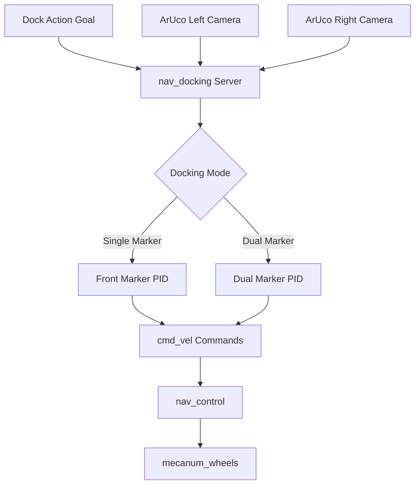
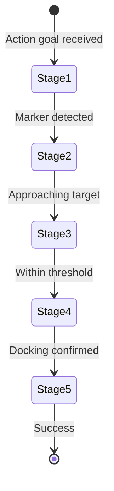

# Navigation Docking (src/nav_docking)

## Overview

The `nav_docking` package implements autonomous docking behavior using ArUco marker detection and PID control. It provides a ROS2 action server that executes precise docking maneuvers for connecting the robot to external objects like wheelchairs.

## Purpose

- Execute autonomous docking with ArUco marker-equipped targets
- Provide closed-loop PID control for precise alignment
- Support dual-camera configurations for improved accuracy
- Enable safe and repeatable docking operations

## Architecture



## ROS2 Interface

### Action Server
- **`dock`** (`nav_interface/Dock`)
  - **Goal:** `dock_request` (bool) - Initiate docking
  - **Feedback:** `distance` (double) - Current distance to target
  - **Result:** `success` (bool) - Docking completion status

### Subscribed Topics
- **`marker_topic_left`** (`geometry_msgs/PoseArray`)
  - ArUco marker poses from left camera
  - Default: configurable via parameter

- **`marker_topic_right`** (`geometry_msgs/PoseArray`)
  - ArUco marker poses from right camera
  - Default: configurable via parameter

### Published Topics
- **`cmd_vel_final`** (`geometry_msgs/Twist`)
  - Velocity commands for docking maneuver
  - Fed to nav_control for transformation

## Parameters

### Frame Configuration
| Parameter | Type | Default | Description |
|-----------|------|---------|-------------|
| `base_frame` | string | `"base_link"` | Robot base frame |
| `camera_left_frame` | string | `"camera_left_frame"` | Left camera frame |
| `camera_right_frame` | string | `"camera_right_frame"` | Right camera frame |

### Marker Configuration
| Parameter | Type | Default | Description |
|-----------|------|---------|-------------|
| `desired_aruco_marker_id_left` | int | -1 | Left marker ID to track |
| `desired_aruco_marker_id_right` | int | -1 | Right marker ID to track |
| `marker_topic_left` | string | - | Left camera marker topic |
| `marker_topic_right` | string | - | Right camera marker topic |

### Docking Offsets
| Parameter | Type | Default | Description |
|-----------|------|---------|-------------|
| `aruco_distance_offset` | float | -0.5 | Distance offset for single marker (m) |
| `aruco_left_right_offset_single` | float | 0.0 | Lateral offset for single marker (m) |
| `aruco_distance_offset_dual` | float | 0.0 | Distance offset for dual marker (m) |
| `aruco_center_offset_dual` | float | 0.0 | Center offset for dual marker (m) |
| `aruco_rotation_offset_dual` | float | 0.0 | Rotation offset for dual marker (rad) |

### Error Thresholds
| Parameter | Type | Default | Description |
|-----------|------|---------|-------------|
| `min_error` | float | 0.0 | Minimum error for PID output (m) |
| `min_docking_error` | float | 0.0 | Docking completion threshold (m) |

### PID Gains
| Parameter | Type | Default | Description |
|-----------|------|---------|-------------|
| `pid_parameters.kp_x` | float | 0.0 | X-axis proportional gain |
| `pid_parameters.ki_x` | float | 0.0 | X-axis integral gain |
| `pid_parameters.kd_x` | float | 0.0 | X-axis derivative gain |
| `pid_parameters.kp_y` | float | 0.0 | Y-axis proportional gain |
| `pid_parameters.ki_y` | float | 0.0 | Y-axis integral gain |
| `pid_parameters.kd_y` | float | 0.0 | Y-axis derivative gain |
| `pid_parameters.kp_z` | float | 0.0 | Z-axis (rotation) proportional gain |
| `pid_parameters.ki_z` | float | 0.0 | Z-axis integral gain |
| `pid_parameters.kd_z` | float | 0.0 | Z-axis derivative gain |

## Docking Modes

### Single Marker Mode
- **Activation:** Only one camera detects marker
- **Control:** Front marker PID controller
- **Use case:** Initial approach, asymmetric configurations

### Dual Marker Mode
- **Activation:** Both cameras detect their respective markers
- **Control:** Dual marker PID controller with center alignment
- **Use case:** Final precision docking, symmetric targets

## PID Control Algorithm

### Control Loop
```
output = kp * error + ki * ∫error * dt + kd * (error - prev_error) / dt
```

**Features:**
- Dead-zone: Output = 0 if `|error| ≤ min_error`
- Saturation: Clamped to `[min_output, max_output]`
- Per-axis tuning: Separate PID gains for X, Y, Z

### Docking Stages



- **Stage 4:** `stage_4_docking_status` - Near target
- **Stage 5:** `stage_5_docking_status` - Docking complete
- **Confirmed:** `confirmed_docking_status` - Final verification

## TF2 Transformations

Marker poses transformed through coordinate frames:

```
camera_frame → base_link → control commands
```

Uses `tf2_ros::Buffer` with 2-second timeout for reliable transforms.

## Configuration File

Located at `src/nav_docking/config/docking_pid_params.yaml`:

```yaml
nav_docking:
  ros__parameters:
    base_frame: "base_link"
    desired_aruco_marker_id_left: 10
    desired_aruco_marker_id_right: 11
    aruco_distance_offset: -0.5

    pid_parameters:
      kp_x: 1.0
      ki_x: 0.1
      kd_x: 0.05
      kp_y: 1.2
      ki_y: 0.15
      kd_y: 0.08
      kp_z: 0.8
      ki_z: 0.05
      kd_z: 0.02
```

## Dependencies

### ROS2 Packages
- `rclcpp`: ROS2 C++ client library
- `rclcpp_action`: Action server implementation
- `rclcpp_components`: Component support
- `geometry_msgs`: Pose and Twist messages
- `sensor_msgs`: Camera data
- `tf2_ros`: Transform management
- `cv_bridge`: OpenCV-ROS bridge
- `nav_interface`: Custom Dock action definition

### External Libraries
- **OpenCV:** Image processing
- **Eigen3:** Linear algebra

## Usage Example

```bash
# Launch docking server
ros2 launch nav_docking nav_docking.launch.py

# Send docking goal (via action client)
ros2 action send_goal /dock nav_interface/action/Dock "{dock_request: true}"

# Monitor feedback
ros2 topic echo /dock/_action/feedback
```

## Related Packages

- **aruco_detect**: Provides marker pose detection
- **nav_control**: Transforms velocity commands
- **nav_goal**: Coordinates approach before docking
- **mecanum_wheels**: Executes velocity commands

## Troubleshooting

| Issue | Possible Cause | Solution |
|-------|---------------|----------|
| Docking fails | PID gains too aggressive | Reduce kp, kd values |
| Oscillation | Insufficient damping | Increase kd gain |
| Offset docking | Wrong marker offsets | Calibrate aruco_distance_offset |
| No marker detection | Camera obstructed | Verify aruco_detect is running |
| Action doesn't complete | Threshold too strict | Increase min_docking_error |
