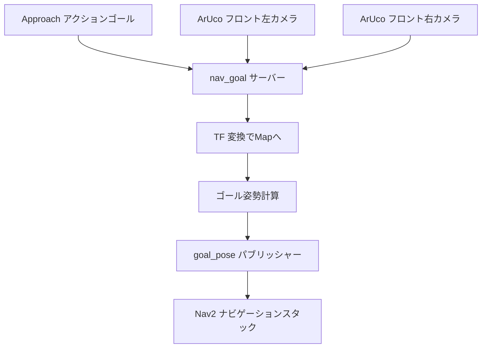
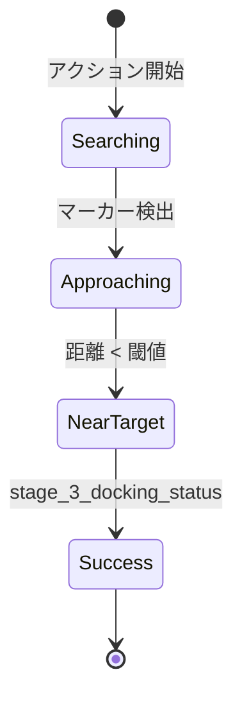
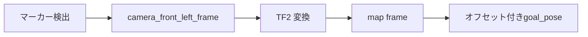

# ナビゲーションゴールアプローチ (src/nav_goal)

## 概要

`nav_goal`パッケージは、ArUcoマーカー検出を使用した自律アプローチ動作を実装します。ArUcoマーカーが装備された車椅子またはターゲットの場所にロボットを誘導するROS2アクションサーバーを提供します。

## 目的

- ArUcoマーク付きターゲットへの自律アプローチを実行
- 経路計画のためにNav2にナビゲーションゴールを配信
- 距離ベースのアプローチ完了を提供
- 完全なピックアップシーケンスのためにnav_dockingと連携

## アーキテクチャ



## ROS2インターフェース

### アクションサーバー
- **`approach`** (`nav_interface/Approach`)
  - **ゴール:** `approach_request` (bool) - アプローチを開始
  - **フィードバック:** `wheelchair_distance` (double) - ターゲットまでの距離
  - **結果:** `approach_success` (bool) - アプローチ完了ステータス

### 購読トピック
- **`marker_topic_front_left`** (`geometry_msgs/PoseArray`)
  - フロント左カメラからのArUcoマーカー姿勢
  - デフォルト: `"aruco_detect/markers_front"`

- **`marker_topic_front_right`** (`geometry_msgs/PoseArray`)
  - フロント右カメラからのArUcoマーカー姿勢
  - デフォルト: `"aruco_detect/markers_front"`

### 配信トピック
- **`goal_pose`** (`geometry_msgs/PoseStamped`)
  - Nav2用のナビゲーションゴール
  - マップフレームで配信
  - 配信レート: 10 Hz(設定可能)

## パラメータ

| パラメータ | 型 | デフォルト | 説明 |
|-----------|------|---------|-------------|
| `map_frame` | string | `"map"` | グローバル参照フレーム |
| `camera_front_left_frame` | string | `"camera_rgb_frame"` | フロント左カメラフレーム |
| `camera_front_right_frame` | string | `"camera_rgb_frame"` | フロント右カメラフレーム |
| `desired_aruco_marker_id_left` | int | -1 | 追跡する左マーカーID |
| `desired_aruco_marker_id_right` | int | -1 | 追跡する右マーカーID |
| `aruco_distance_offset` | float | -0.5 | マーカーからの距離オフセット(m) |
| `aruco_left_right_offset` | float | 0.0 | マーカーからの横方向オフセット(m) |
| `marker_topic_front_left` | string | - | 左カメラマーカートピック |
| `marker_topic_front_right` | string | - | 右カメラマーカートピック |

## アプローチ動作

### ゴール計算

**変換チェーン:**
```
aruco_marker → camera_frame → map_frame → goal_pose
```

**オフセット適用:**
```
goal_x = marker_x + aruco_distance_offset
goal_y = marker_y + aruco_left_right_offset
```

### アプローチステージ



**ステージ3:** `marker_tx < goal_distance_threshold`のとき`stage_3_docking_status = true`

### 距離閾値

ロボットが設定可能な距離内にあるときにアプローチが完了:
```cpp
if (marker_tx < goal_distance_threshold) {
    stage_3_docking_status = true;  // アクション成功をトリガー
}
```

## マーカーID抽出

PoseArray frame_idからマーカーIDを解析するために正規表現を使用:

```cpp
std::regex marker_id_regex("aruco_marker_(\\d+)");
// 例: "aruco_marker_10" → marker_id = 10
```

## TF2統合

### 変換ルックアップ
```cpp
cameraToMap = tf_buffer->lookupTransform(
    map_frame,                 // ターゲットフレーム
    camera_front_left_frame,   // ソースフレーム
    tf2::TimePointZero,        // 最新の利用可能
    tf2::durationFromSec(2)    // 2秒タイムアウト
);
```

### ゴールフレーム
すべての配信されたゴールは、グローバルナビゲーション用の**mapフレーム**内にあります。

## デュアルカメラサポート

### 左カメラ優先
- プライマリマーカー検出
- 左カメラマーカーからのゴール計算

### 右カメラバックアップ
- セカンダリ検出(実装プレースホルダー)
- 将来: センサ融合またはフェイルオーバー

## ワークフロー統合

**典型的なシーケンス:**
1. **Nav2自律ナビゲーション** → 一般的な近傍に接近
2. **nav_goalアクション** → マーカーへのビジュアルサーボイング
3. **nav_dockingアクション** → 精密ドッキング操作

## 依存関係

### ROS2パッケージ
- `rclcpp`: ROS2 C++クライアントライブラリ
- `rclcpp_action`: アクションサーバー
- `rclcpp_components`: コンポーネントサポート
- `geometry_msgs`: Poseメッセージ
- `tf2_ros`: 変換管理
- `nav_interface`: カスタムApproachアクション定義

### 外部ライブラリ
- **Regex (C++11):** マーカーID解析

## 使用例

```bash
# アプローチサーバーを起動
ros2 launch nav_goal nav_goal.launch.py

# アプローチゴールを送信
ros2 action send_goal /approach nav_interface/action/Approach \
  "{approach_request: true}"

# アプローチ距離を監視
ros2 topic echo /approach/_action/feedback

# 配信されたナビゲーションゴールを表示
ros2 topic echo /goal_pose
```

## 設定ガイドライン

### 距離オフセットの設定

**aruco_distance_offset:** マーカーの前でどれだけ離れて停止するか
- **負の値:** ロボットはマーカーに到達する前に停止
  - 例: `-0.5` → マーカーの0.5m手前で停止
- **正の値:** ロボットはマーカーを通過
  - 例: `0.2` → マーカーの0.2m先で停止

**典型的な値:**
- 車椅子アプローチ: `-0.5m` から `-1.0m`
- ドッキングハンドオフ: `-0.2m` から `-0.5m`

### 横方向オフセットの設定

**aruco_left_right_offset:** 横方向の位置決め
- **正のY:** ロボットの左側にオフセット
- **負のY:** ロボットの右側にオフセット

非対称アプローチまたはクリアランス要件に使用。

## 座標フレーム



すべての計算は、正確なナビゲーションのために適切なフレーム変換を維持します。

## パフォーマンス

- **配信レート:** 10 Hzゴール更新
- **TFタイムアウト:** 変換ルックアップに2秒
- **レイテンシ:** リアルタイムマーカーからゴールへの変換

## 関連パッケージ

- **aruco_detect**: マーカー検出を提供
- **nav2**: 経路計画のためにgoal_poseを使用
- **nav_docking**: アプローチ完了後に実行
- **tf2_ros**: 座標変換を管理

## トラブルシューティング

| 問題 | 考えられる原因 | 解決方法 |
|-------|---------------|----------|
| ゴールが配信されない | マーカーが検出されていない | aruco_detectが実行中であることを確認 |
| ゴール位置が間違っている | オフセットの設定ミス | aruco_distance_offsetを調整 |
| TFエラー | 変換が欠落 | TFツリーを確認: `ros2 run tf2_tools view_frames` |
| アクションが完了しない | 閾値が小さすぎる | goal_distance_thresholdを増加 |
| ゴールが間違ったフレームにある | マップフレームが不正確 | map_frameパラメータがNav2と一致することを確認 |

## コード構造

```
src/nav_goal/
├── src/
│   └── nav_goal.cpp             # メイン実装
├── include/
│   └── nav_goal/
│       └── nav_goal.h           # ヘッダーファイル
├── launch/
│   └── nav_goal.launch.py      # 起動設定
├── CMakeLists.txt
└── package.xml
```

## 将来の拡張

- デュアルカメラからのセンサ融合
- 予測的ゴール投稿(モーション補償)
- マーカー信頼度に基づく動的閾値
- グローバルプランナーコストマップとの統合
