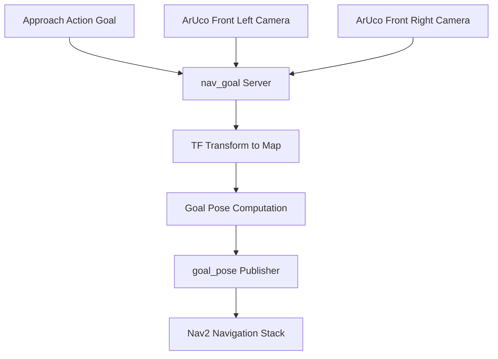
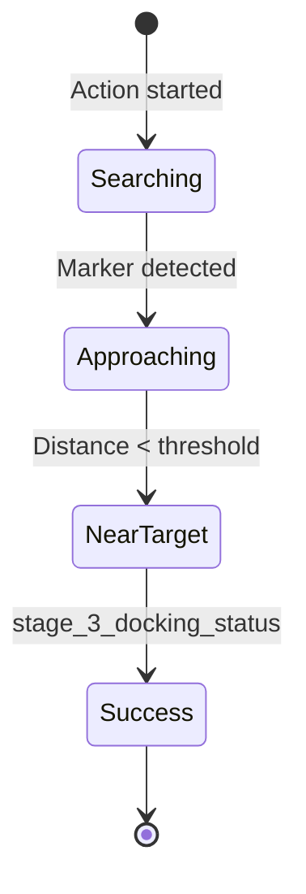
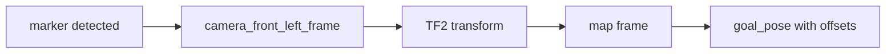

# Navigation Goal Approach (src/nav_goal)

## Overview

The `nav_goal` package implements autonomous approach behavior using ArUco marker detection. It provides a ROS2 action server that guides the robot to approach wheelchair or target locations equipped with ArUco markers.

## Purpose

- Execute autonomous approach to ArUco-marked targets
- Publish navigation goals to Nav2 for path planning
- Provide distance-based approach completion
- Coordinate with nav_docking for complete pickup sequence

## Architecture



## ROS2 Interface

### Action Server
- **`approach`** (`nav_interface/Approach`)
  - **Goal:** `approach_request` (bool) - Initiate approach
  - **Feedback:** `wheelchair_distance` (double) - Distance to target
  - **Result:** `approach_success` (bool) - Approach completion status

### Subscribed Topics
- **`marker_topic_front_left`** (`geometry_msgs/PoseArray`)
  - ArUco marker poses from front left camera
  - Default: `"aruco_detect/markers_front"`

- **`marker_topic_front_right`** (`geometry_msgs/PoseArray`)
  - ArUco marker poses from front right camera
  - Default: `"aruco_detect/markers_front"`

### Published Topics
- **`goal_pose`** (`geometry_msgs/PoseStamped`)
  - Navigation goal for Nav2
  - Published in map frame
  - Publish rate: 10 Hz (configurable)

## Parameters

| Parameter | Type | Default | Description |
|-----------|------|---------|-------------|
| `map_frame` | string | `"map"` | Global reference frame |
| `camera_front_left_frame` | string | `"camera_rgb_frame"` | Front left camera frame |
| `camera_front_right_frame` | string | `"camera_rgb_frame"` | Front right camera frame |
| `desired_aruco_marker_id_left` | int | -1 | Left marker ID to track |
| `desired_aruco_marker_id_right` | int | -1 | Right marker ID to track |
| `aruco_distance_offset` | float | -0.5 | Distance offset from marker (m) |
| `aruco_left_right_offset` | float | 0.0 | Lateral offset from marker (m) |
| `marker_topic_front_left` | string | - | Left camera marker topic |
| `marker_topic_front_right` | string | - | Right camera marker topic |

## Approach Behavior

### Goal Computation

**Transform chain:**
```
aruco_marker → camera_frame → map_frame → goal_pose
```

**Offset application:**
```
goal_x = marker_x + aruco_distance_offset
goal_y = marker_y + aruco_left_right_offset
```

### Approach Stages



**Stage 3:** `stage_3_docking_status = true` when `marker_tx < goal_distance_threshold`

### Distance Threshold

Approach completes when robot is within configurable distance:
```cpp
if (marker_tx < goal_distance_threshold) {
    stage_3_docking_status = true;  // Trigger action success
}
```

## Marker ID Extraction

Uses regex to parse marker ID from PoseArray frame_id:

```cpp
std::regex marker_id_regex("aruco_marker_(\\d+)");
// Example: "aruco_marker_10" → marker_id = 10
```

## TF2 Integration

### Transform Lookup
```cpp
cameraToMap = tf_buffer->lookupTransform(
    map_frame,                 // Target frame
    camera_front_left_frame,   // Source frame
    tf2::TimePointZero,        // Latest available
    tf2::durationFromSec(2)    // 2s timeout
);
```

### Goal Frame
All published goals are in the **map frame** for global navigation.

## Dual Camera Support

### Left Camera Priority
- Primary marker detection
- Goal computation from left camera marker

### Right Camera Backup
- Secondary detection (implementation placeholder)
- Future: sensor fusion or failover

## Workflow Integration

**Typical sequence:**
1. **Nav2 autonomous navigation** → Approaches general vicinity
2. **nav_goal action** → Visual servoing to marker
3. **nav_docking action** → Precision docking maneuver

## Dependencies

### ROS2 Packages
- `rclcpp`: ROS2 C++ client library
- `rclcpp_action`: Action server
- `rclcpp_components`: Component support
- `geometry_msgs`: Pose messages
- `tf2_ros`: Transform management
- `nav_interface`: Custom Approach action definition

### External Libraries
- **Regex (C++11):** Marker ID parsing

## Usage Example

```bash
# Launch approach server
ros2 launch nav_goal nav_goal.launch.py

# Send approach goal
ros2 action send_goal /approach nav_interface/action/Approach \
  "{approach_request: true}"

# Monitor approach distance
ros2 topic echo /approach/_action/feedback

# View published navigation goals
ros2 topic echo /goal_pose
```

## Configuration Guidelines

### Setting Distance Offset

**aruco_distance_offset:** How far in front of marker to stop
- **Negative values:** Robot stops before reaching marker
  - Example: `-0.5` → Stop 0.5m before marker
- **Positive values:** Robot moves past marker
  - Example: `0.2` → Stop 0.2m past marker

**Typical values:**
- Wheelchair approach: `-0.5m` to `-1.0m`
- Docking handoff: `-0.2m` to `-0.5m`

### Setting Lateral Offset

**aruco_left_right_offset:** Lateral positioning
- **Positive Y:** Offset to robot's left
- **Negative Y:** Offset to robot's right

Used for asymmetric approach or clearance requirements.

## Coordinate Frames



All computations maintain proper frame transformations for accurate navigation.

## Performance

- **Publish rate:** 10 Hz goal updates
- **TF timeout:** 2 seconds for transform lookup
- **Latency:** Real-time marker-to-goal conversion

## Related Packages

- **aruco_detect**: Provides marker detections
- **nav2**: Consumes goal_pose for path planning
- **nav_docking**: Executes after approach completes
- **tf2_ros**: Manages coordinate transforms

## Troubleshooting

| Issue | Possible Cause | Solution |
|-------|---------------|----------|
| No goals published | Marker not detected | Verify aruco_detect is running |
| Wrong goal location | Offset misconfigured | Adjust aruco_distance_offset |
| TF errors | Missing transforms | Check TF tree: `ros2 run tf2_tools view_frames` |
| Action never completes | Threshold too small | Increase goal_distance_threshold |
| Goals in wrong frame | Map frame incorrect | Verify map_frame parameter matches Nav2 |

## Code Structure

```
src/nav_goal/
├── src/
│   └── nav_goal.cpp             # Main implementation
├── include/
│   └── nav_goal/
│       └── nav_goal.h           # Header file
├── launch/
│   └── nav_goal.launch.py      # Launch configuration
├── CMakeLists.txt
└── package.xml
```

## Future Enhancements

- Sensor fusion from dual cameras
- Predictive goal posting (motion compensation)
- Dynamic threshold based on marker confidence
- Integration with global planner costmaps
