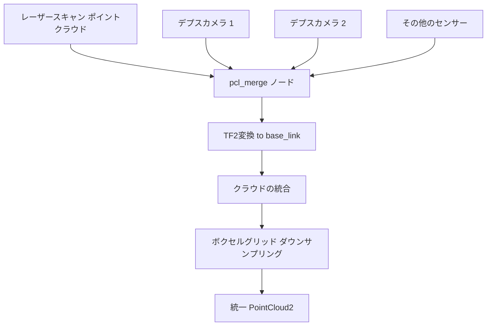
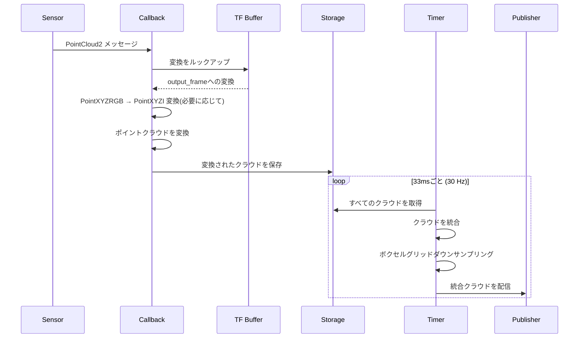

# ポイントクラウド統合 (src/pcl_merge)

## 概要

`pcl_merge`パッケージは、異なるセンサーからの複数のポイントクラウドを単一の統一された3D表現に融合します。すべての入力クラウドを共通の参照フレームに変換し、効率的な処理のためにボクセルグリッドダウンサンプリングを適用します。

## 目的

- 異種センサー(LIDAR、デプスカメラなど)からのポイントクラウドを統合
- TF2を使用してすべてのクラウドを共通座標フレームに変換
- 計算効率のために統合クラウドをダウンサンプリング
- ナビゲーションとマッピングのための統一3D認識を提供

## アーキテクチャ



## ROS2インターフェース

### 購読トピック
`input_topics`パラメータに基づく動的購読。デフォルト:
- **`/scan_pointcloud`** (`sensor_msgs/PointCloud2`)
  - 変換された2D LIDARデータ
- **`/camera_depth_top/camera_depth/points`** (`sensor_msgs/PointCloud2`)
  - デプスカメラのポイントクラウド

### 配信トピック
- **`/pcl_merged`** (`sensor_msgs/PointCloud2`)
  - 出力フレームでの統一、ダウンサンプリングされたポイントクラウド
  - 型: `pcl::PointXYZI`
  - 配信レート: 約30 Hz
  - `output_topic`パラメータで設定可能

## パラメータ

| パラメータ | 型 | デフォルト | 説明 |
|-----------|------|---------|-------------|
| `input_topics` | string[] | `["scan_pointcloud", "/camera_depth_top/camera_depth/points"]` | 入力ポイントクラウドトピックのリスト |
| `output_topic` | string | `"pcl_merged"` | 統合クラウド出力トピック |
| `output_frame` | string | `"base_link"` | 統合のためのターゲット座標フレーム |
| `keep_organized` | bool | false | 構造化クラウド構造を維持 |
| `negative` | bool | true | 未使用(レガシークロップボックスパラメータ) |

## 処理パイプライン



## 主な機能

### マルチセンサー融合
- **動的購読:** 任意の数の入力トピックをサポート
- **異種センサー:** 異なるポイントクラウドタイプを処理
- **自動レジストレーション:** 座標アラインメントにTF2を使用

### ポイントタイプ変換
複数のポイントクラウドフォーマットをインテリジェントに処理:

1. **PointXYZI → PointXYZI:** 直接変換
2. **PointXYZRGB → PointXYZI:** RGBから強度への変換
   ```
   intensity = 0.299*R + 0.587*G + 0.114*B
   ```

### ボクセルグリッドダウンサンプリング
- **リーフサイズ:** 5cm × 5cm × 5cm (0.05m)
- **目的:** ナビゲーションの計算負荷を削減
- **アルゴリズム:** PCL VoxelGridフィルター
- 空間分布を保持しながらポイント数を削減

## 依存関係

### ROS2パッケージ
- `rclcpp`: ROS2 C++クライアントライブラリ
- `sensor_msgs`: PointCloud2メッセージ型
- `tf2_ros`: 変換バッファとリスナー
- `tf2_geometry_msgs`: TF2ジオメトリユーティリティ
- `pcl_ros`: PCL-ROS統合

### 外部ライブラリ
- **PCL:** ポイントクラウド処理とフィルタリング
- **Eigen3:** 行列演算(PCL経由)

## 使用例

```bash
# デフォルト設定
ros2 run pcl_merge pcl_merge_node

# カスタム設定
ros2 run pcl_merge pcl_merge_node \
  --ros-args \
  -p input_topics:="['/scan_cloud', '/camera_1/points', '/camera_2/points']" \
  -p output_topic:=/perception/merged_cloud \
  -p output_frame:=base_footprint
```

## 関連パッケージ

- **laserscan_to_pcl**: LIDARポイントクラウド入力を提供
- **ego_pcl_filter**: ロボット本体を削除するために統合クラウドをフィルタリング
- **rtabmap_ros**: SLAMのために統合クラウドを使用

## トラブルシューティング

| 問題 | 考えられる原因 | 解決策 |
|-------|---------------|----------|
| 出力なし | 有効な変換がない | TFツリーを確認: `ros2 run tf2_tools view_frames` |
| まばらなクラウド | 積極的なダウンサンプリング | ボクセルリーフサイズを削減 |
| 高CPU使用率 | 入力クラウドが多すぎる | 入力トピックを減らすかリーフサイズを増やす |
| クラウドのミスアライメント | 不正確なTFキャリブレーション | センサーの外部キャリブレーションを検証 |
