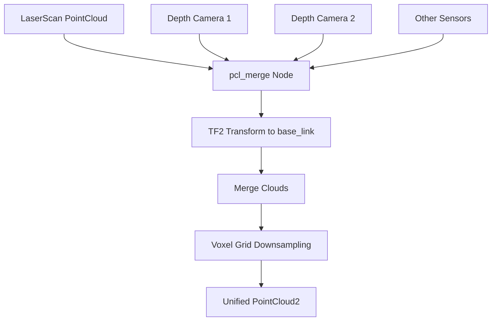
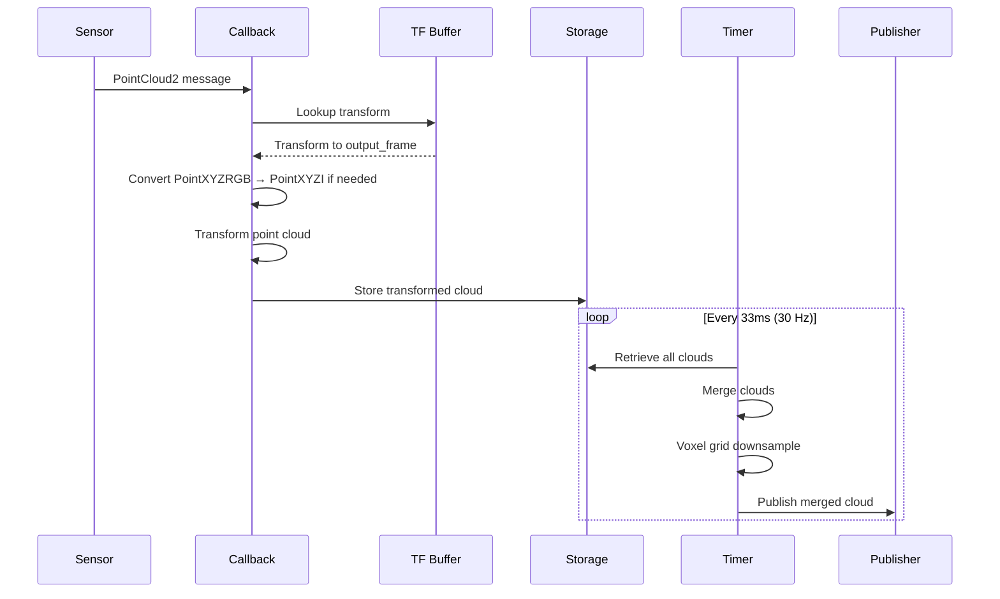
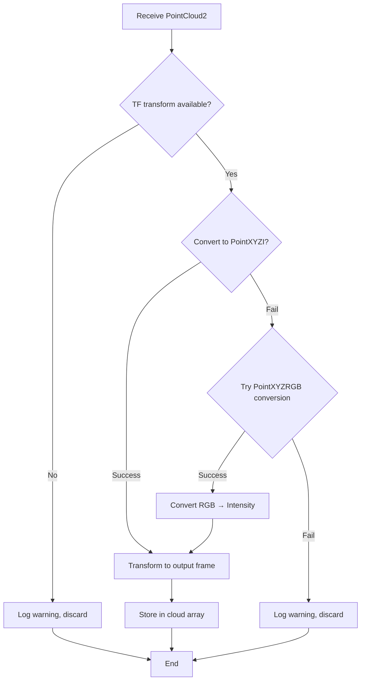

# Point Cloud Merge (src/pcl_merge)

## Overview

The `pcl_merge` package fuses multiple point clouds from different sensors into a single unified 3D representation. It transforms all input clouds to a common reference frame and applies voxel grid downsampling for efficient processing.

## Purpose

- Merge point clouds from heterogeneous sensors (LIDAR, depth cameras, etc.)
- Transform all clouds to a common coordinate frame using TF2
- Downsample merged cloud for computational efficiency
- Provide unified 3D perception for navigation and mapping

## Architecture



## ROS2 Interface

### Subscribed Topics
Dynamic subscription based on `input_topics` parameter. Default:
- **`/scan_pointcloud`** (`sensor_msgs/PointCloud2`)
  - Converted 2D LIDAR data
- **`/camera_depth_top/camera_depth/points`** (`sensor_msgs/PointCloud2`)
  - Depth camera point cloud

### Published Topics
- **`/pcl_merged`** (`sensor_msgs/PointCloud2`)
  - Unified, downsampled point cloud in output frame
  - Type: `pcl::PointXYZI`
  - Publish rate: ~30 Hz
  - Configurable via `output_topic` parameter

## Parameters

| Parameter | Type | Default | Description |
|-----------|------|---------|-------------|
| `input_topics` | string[] | `["scan_pointcloud", "/camera_depth_top/camera_depth/points"]` | List of input point cloud topics |
| `output_topic` | string | `"pcl_merged"` | Merged cloud output topic |
| `output_frame` | string | `"base_link"` | Target coordinate frame for merging |
| `keep_organized` | bool | false | Maintain organized cloud structure |
| `negative` | bool | true | Unused (legacy crop box parameter) |

## Processing Pipeline



## Key Features

### Multi-Sensor Fusion
- **Dynamic subscription:** Supports arbitrary number of input topics
- **Heterogeneous sensors:** Handles different point cloud types
- **Automatic registration:** Uses TF2 for coordinate alignment

### Point Type Conversion
Intelligently handles multiple point cloud formats:

1. **PointXYZI → PointXYZI:** Direct conversion
2. **PointXYZRGB → PointXYZI:** RGB-to-intensity conversion
   ```
   intensity = 0.299*R + 0.587*G + 0.114*B
   ```

### Voxel Grid Downsampling
- **Leaf size:** 5cm × 5cm × 5cm (0.05m)
- **Purpose:** Reduce computational load for navigation
- **Algorithm:** PCL VoxelGrid filter
- Preserves spatial distribution while reducing point count

### Transform Management
- Uses `tf2_ros::Buffer` and `tf2_ros::TransformListener`
- Waits for transform availability with timeout
- Handles dynamic TF tree updates
- Graceful failure with warning messages

## Publishing Strategy

### Timer-Based Publishing
- **Frequency:** 30 Hz (33ms period)
- **Rationale:** Balance between responsiveness and computational cost
- **Behavior:** Publishes even if some sensors have no data

### Data Synchronization
- **No explicit sync:** Uses latest available data from each sensor
- **Individual timestamps:** Each cloud stored with latest transform
- **Lazy publishing:** Only publishes if at least one cloud is valid

## Implementation Details

### Error Handling


### Memory Management
- Stores one cloud per input topic
- Uses `std::vector<pcl::PointCloud<pcl::PointXYZI>::Ptr>` for storage
- Overwrites old data with latest from each sensor
- Merged cloud created fresh each cycle

## Performance

- **Latency:** Minimal (< 33ms total pipeline)
- **Throughput:** 30 Hz publishing rate
- **Scalability:** Linear with number of input clouds
- **Downsampling ratio:** Typically 5-10x reduction in point count

## Dependencies

### ROS2 Packages
- `rclcpp`: ROS2 C++ client library
- `sensor_msgs`: PointCloud2 message type
- `tf2_ros`: Transform buffer and listener
- `tf2_geometry_msgs`: TF2 geometry utilities
- `pcl_ros`: PCL-ROS integration

### External Libraries
- **PCL:** Point cloud processing and filtering
- **Eigen3:** Matrix operations (via PCL)

## Usage Example

```bash
# Default configuration
ros2 run pcl_merge pcl_merge_node

# Custom configuration
ros2 run pcl_merge pcl_merge_node \
  --ros-args \
  -p input_topics:="['/scan_cloud', '/camera_1/points', '/camera_2/points']" \
  -p output_topic:=/perception/merged_cloud \
  -p output_frame:=base_footprint
```

## Related Packages

- **laserscan_to_pcl**: Provides LIDAR point cloud input
- **ego_pcl_filter**: Filters merged cloud to remove robot body
- **rtabmap_ros**: Uses merged cloud for SLAM

## Configuration Tips

### Adding New Sensors
1. Ensure sensor publishes `sensor_msgs/PointCloud2`
2. Add topic name to `input_topics` parameter
3. Verify TF transform from sensor frame to `output_frame` exists
4. Node will automatically subscribe and integrate

### Frame Selection
- **base_link:** Robot-centric view (recommended for navigation)
- **map:** Global reference (for mapping applications)
- **odom:** For odometric filtering

### Voxel Grid Tuning
Modify leaf size in source code (pcl_merge.cpp:144):
- **Smaller leaf (< 0.05m):** Higher detail, more computation
- **Larger leaf (> 0.05m):** Faster processing, lower detail

## Troubleshooting

| Issue | Possible Cause | Solution |
|-------|---------------|----------|
| No output | No valid transforms | Check TF tree with `ros2 run tf2_tools view_frames` |
| Sparse cloud | Aggressive downsampling | Reduce voxel leaf size |
| High CPU usage | Too many input clouds | Reduce input topics or increase leaf size |
| Misaligned clouds | Incorrect TF calibration | Verify sensor extrinsic calibration |
